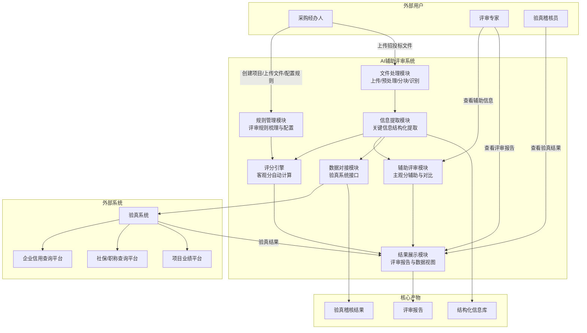
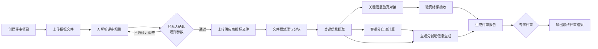
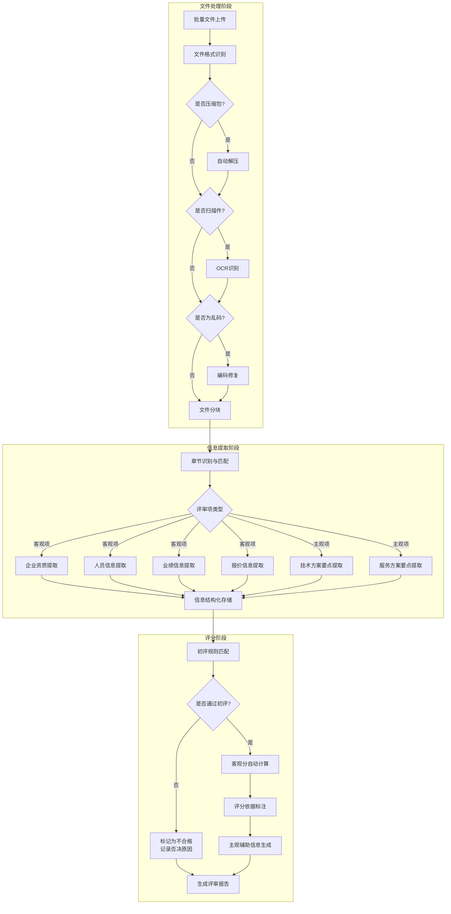
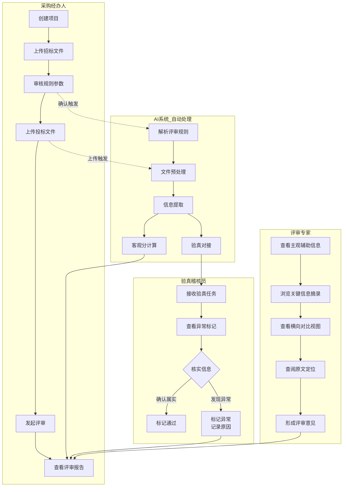
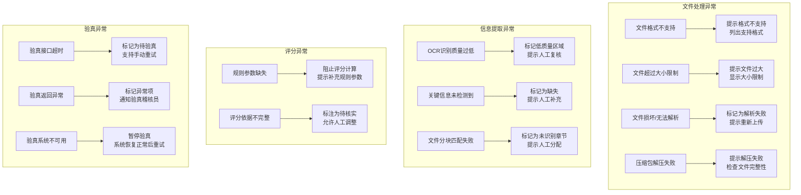

# AI辅助评审系统 需求分析文档

---

## 文档说明

| 项目 | 内容 |
|------|------|
| **文档名称** | AI辅助评审系统 需求分析文档 |
| **版本号** | V1.0 |
| **编写日期** | 2026-05-07 |
| **编写人** | RA-agent（调研分析智能体） |
| **文档密级** | 内部 |

### 修订记录

| 版本 | 日期 | 修订内容 | 修订人 |
|------|------|---------|--------|
| V1.0 | 2026-05-07 | 初稿，基于原始需求梳理 | RA-agent |

---

## 1. 项目背景

### 1.1 业务痛点

当前招投标评审工作存在以下核心痛点：

- **评审效率低下**：专家需逐份翻阅投标文件，手工提取、比对关键信息，评审周期长、人力成本高。
- **客观分评分不一致**：不同专家对同一客观评审项（如业绩数量、资质等级、人员配置）可能存在评分偏差，缺乏统一的自动计算机制。
- **主观分缺少参考依据**：专家对技术方案、服务方案等主观项的评审，缺少结构化的关键信息摘录和横向对比支撑，依赖个人经验判断。
- **信息验真困难**：投标文件中企业资质、人员证书、业绩合同等关键信息的真实性核验，目前主要依赖人工抽查，效率低且存在遗漏风险。
- **非结构化文件处理难度大**：投标文件格式多样（PDF扫描件、Word、图片），信息散落在不同章节，人工结构化整理耗时费力。

### 1.2 建设契机

随着大模型技术的成熟，利用AI能力对非结构化文档进行语义理解、关键信息提取和自动化评分已具备技术可行性。本项目旨在将AI技术深度融入招投标评审流程，实现评审工作的智能化、标准化和高效化。

---

## 2. 建设目标

### 2.1 效率提升

- **评审效率提升**：通过AI自动提取关键信息、自动计算客观分，大幅缩短专家评审时间，将单个项目的评审周期压缩 **50% 以上**。
- **文件处理自动化**：实现投标文件自动分块、关键信息自动结构化提取，替代人工逐页翻阅和手工录入。

### 2.2 质量与一致性

- **客观分自动评分**：基于统一的评审规则自动计算客观分，消除人为评分偏差，确保评分一致性。
- **主观分辅助评审**：为专家提供结构化的关键信息摘录和横向对比视图，提升主观评分的客观性和依据性。

### 2.3 风险防控

- **初评刚性筛查**：自动匹配初评否决规则（如未提供有效营业执照、资质不满足要求），避免不合规供应商进入后续评审。
- **信息验真稽核**：将提取的关键信息自动对接验真系统，实现企业资质、人员证书、业绩合同的自动化核验，降低虚假材料风险。

### 2.4 管理支撑

- **全流程可追溯**：评审过程、评分依据、验真结果全程记录，支撑审计和合规检查。
- **数据复用**：将投标文件的结构化信息沉淀为数据资产，支撑后续的供应商管理和采购分析。

---

## 3. 用户角色与使用场景

| 角色名称 | 核心职责 | 在系统中的关键动作 |
|---------|---------|------------------|
| **采购经办人** | 发起评审项目，上传招标文件和投标文件，配置评审规则 | 创建项目 → 上传文件 → 审核规则参数 → 发起评审 → 查看评审报告 |
| **评审专家** | 对主观评审项进行评分，参考AI辅助信息进行决策 | 查看关键信息摘录 → 查阅投标文件原文 → 参考横向对比视图 → 输入主观评分 |
| **系统管理员** | 管理系统配置、规则模板、用户权限 | 配置规则模板 → 管理用户权限 → 监控系统运行状态 |
| **验真稽核员** | 对关键信息进行验真稽核，处理异常情况 | 查看验真结果 → 处理异常 → 确认或修正验真结论 |

---

## 4. 业务范围

### 4.1 本期范围

| 序号 | 能力模块 | 说明 |
|------|---------|------|
| 1 | 评审规则梳理 | 将招标文件中的初评、客观评审项、主观评审项进行结构化拆解，转化为系统可识别的规则参数 |
| 2 | 文件上传与预处理 | 支持PDF、Word、JPG、PNG、压缩包等格式的批量上传，自动解压、格式识别、标准化处理 |
| 3 | 文件结构化拆分 | 利用大模型对投标文件进行自动分块和章节识别 |
| 4 | 关键信息提取 | 提取客观项（企业资质、人员、业绩、报价）和主观项（技术方案、服务方案）的关键信息 |
| 5 | 客观分自动评分 | 基于提取的关键信息自动计算客观分，并标注得分依据 |
| 6 | 主观分辅助评审 | 为专家提供关键信息摘录、横向对比视图和评审提示 |
| 7 | 验真稽核数据对接 | 将关键信息对接至验真系统，接收并展示验真结果 |
| 8 | 评审结果展示 | 结构化展示评审结果，支持多供应商横向对比、原文溯源 |

### 4.2 非本期范围

| 序号 | 不在本期内容 | 说明 |
|------|-------------|------|
| 1 | 专家在线评分交互 | 本期聚焦AI辅助评审和结果输出，专家在线评分的交互界面后续迭代 |
| 2 | 报价自动计算与价格分评分 | 本期暂不包含报价自动比价、报价合理性分析及价格分计算 |
| 3 | 验真系统自身建设 | 验真系统为外部系统，本期仅实现数据对接接口 |
| 4 | 移动端 | 本期仅支持PC网页端 |
| 5 | 供应商管理系统集成 | 本期暂不深度集成外部供应商管理平台 |

---

## 5. 总体业务架构

本节说明系统的核心能力模块、外部用户与外部系统的整体关系。

**关键节点说明：**

- **规则管理模块**：采购经办人上传招标文件后，系统自动解析评审规则，经人工审核确认后生效，作为后续评分的依据。
- **文件处理模块**：接收招投标文件上传，完成格式标准化、分块和章节识别，为信息提取做准备。
- **信息提取模块**：核心AI能力层，采用OCR+大模型语义提取相结合的方式，从非结构化文件中提取关键信息。
- **评分引擎**：基于提取的结构化信息和评审规则，自动计算客观分并标注得分依据。
- **辅助评审模块**：为评审专家提供主观项关键信息摘录、多供应商横向对比和评审提示。
- **数据对接模块**：将提取的关键信息发送至验真系统，接收并展示验真结果。
- **结果展示模块**：汇聚所有评审结果，以结构化视图呈现评审报告。

**产品映射关系：**

| 模块 | 匹配产品 | 覆盖方式 |
|------|---------|---------|
| 规则管理模块 | 知识助理（分级分域知识管理） | 已有产品覆盖 |
| 文件处理模块 | 齐鲁智聚平台（智能体）+ 知识助理（多模态文档解析） | 已有产品覆盖+定制适配 |
| 信息提取模块 | 齐鲁智聚平台（大模型推理/智能体）+ 智慧云眼（OCR） | 已有产品覆盖+定制开发 |
| 评分引擎 | 齐鲁智聚平台（工作流编排） | 定制开发 |
| 辅助评审模块 | 齐鲁智聚平台（智能体）+ 智能问数（数据分析） | 定制开发 |
| 数据对接模块 | 齐鲁智聚平台（API网关） | 定制开发 |
| 结果展示模块 | 齐鲁智聚平台（智能体） | 定制开发 |
| 信创部署 | 芯合一体机 | 已有产品覆盖 |

---

## 6. 业务流程

### 6.1 端到端业务流程

本节说明从项目创建到评审报告输出的完整业务流程。

**关键节点说明：**

- **创建评审项目**：录入项目基础信息（项目名称、采购编号、评审类型等）。
- **AI解析评审规则**：系统自动从招标文件中提取初评规则、客观评分项、主观评分项，并转化为结构化规则参数。
- **经办人确认规则参数**：人工审核AI生成的规则参数，必要时调整后确认生效。
- **上传供应商投标文件**：支持多供应商批量上传，支持压缩包自动解压。
- **文件预处理与分块**：自动识别文件格式，扫描件OCR处理，按章节自动分块。
- **关键信息提取**：利用大模型从各分块中提取客观项和主观项的关键信息。
- **客观分自动计算**：匹配评审规则，自动计算各供应商的客观得分。
- **关键信息验真对接**：将提取的关键信息发送至外部验真系统。
- **生成评审报告**：汇聚客观分、主观辅助信息、验真结果，生成结构化评审报告。

**业务规则：**

- 规则参数确认通过后，方可进入文件上传阶段。
- 文件预处理完成后，方可进行关键信息提取。
- 关键信息提取完成后，方可进行客观分计算和验真对接。
- 评审报告生成后，方可进入专家评审环节。

### 6.2 核心评审主流程

本节说明从文件上传到评分完成的核心评审处理流程，聚焦系统内部自动处理逻辑。

**关键节点说明：**

- **文件格式识别**：自动识别PDF、Word、JPG、PNG等格式。
- **压缩包处理**：自动解压ZIP/RAR等压缩包，递归处理其中所有文件。
- **OCR识别**：对扫描件进行OCR文字识别，生成可解析的PDF或文本。
- **编码修复**：检测并修复乱码文件，确保文件可正常解析。
- **文件分块**：根据招标文件的章节要求，将投标文件自动分块至对应模块（如资质文件、人员配置、业绩证明、技术方案、报价文件）。
- **章节识别与匹配**：利用大模型理解招标文件章节结构，通过关键词匹配将投标文件分块与招标文件章节对应。
- **信息结构化存储**：将提取的关键信息按供应商、评审项、信息来源（文件页码、章节位置）进行结构化存储。
- **初评规则匹配**：匹配刚性否决规则，未通过初评的供应商直接标记为不合格。
- **评分依据标注**：每个客观评分点标注得分来源（如"业绩得分8分，来源：提供3份同类项目合同"）。

**业务规则：**

- 初评不通过的供应商，不再进入客观分计算，直接生成不合格结论。
- 客观分计算结果需要标注每个评分点的得分依据和来源，确保可追溯。
- 主观辅助信息包含关键信息摘录、多供应商横向对比、评审维度提示三个部分。

### 6.3 角色参与流程

本节说明不同角色在系统中的参与时机和核心动作。

**关键节点说明：**

- **采购经办人**：全流程主导，负责项目创建、文件上传、规则审核和评审发起。
- **AI系统**：在经办人触发后自动执行规则解析、文件处理、信息提取、客观分计算和验真对接。
- **验真稽核员**：接收验真系统返回的异常标记，进行人工核实和处理。
- **评审专家**：在评审报告生成后介入，基于AI辅助信息形成主观评审意见。

---

## 7. 功能需求

### 7.1 评审规则管理

**功能目标**：基于齐鲁智聚平台（智能体+工作流）+ 知识助理（分级知识库），将招标文件中的评审要求自动转化为系统可识别的结构化规则参数，支持人工审核和调整。

**使用角色**：采购经办人

**输入**：招标文件（PDF/Word格式）

**输出**：结构化评审规则参数（初评规则、客观评分规则、主观评审规则）

**核心规则：**

| 规则类型 | 说明 | 示例 |
|---------|------|------|
| **初评规则** | 刚性匹配规则，由关键词+判定标准组成 | "未提供有效营业执照"→否决投标；"资质等级不满足招标文件要求"→否决投标 |
| **客观评分规则** | 包含评分点、提取维度、评分标准、佐证材料要求 | 业绩评分：提取维度=合同数量/合同金额/是否同类项目；评分标准=每提供1份同类合同得2分，满分8分；佐证材料=合同扫描件首页+签章页 |
| **主观评审规则** | 包含核心关注维度、辅助提示规则、关键信息摘录要求 | 技术方案可行性：关注核心技术、技术路线、实施步骤、创新点；服务方案完整性：关注服务流程、响应时限、售后保障措施 |

### 7.2 文件上传与预处理

**功能目标**：基于齐鲁智聚平台（智能体）+ 知识助理（多模态文档解析）+ 智慧云眼（OCR能力），支持多格式投标文件的批量上传、自动解压、格式识别和标准化处理。

**使用角色**：采购经办人

**输入**：投标文件（PDF/Word/JPG/PNG）、压缩包（ZIP/RAR）

**输出**：标准化后的可解析文件，按供应商和文件类型组织

**核心规则：**

| 处理类型 | 说明 |
|---------|------|
| **批量上传** | 支持多供应商投标文件同时上传，支持拖拽上传和文件夹上传 |
| **自动解压** | 自动识别ZIP/RAR压缩包并解压，递归处理子目录 |
| **格式识别** | 自动识别PDF、Word（.doc/.docx）、JPG、PNG等格式 |
| **扫描件处理** | 利用智慧云眼的多模态视觉大模型能力，对扫描件进行OCR识别，转化为可解析的PDF格式 |
| **编码修复** | 检测乱码文件，自动进行编码修复 |
| **自动分页编号** | 多页文件按章节自动分页并编号，确保文件可正常解析 |

### 7.3 文件结构化拆分

**功能目标**：基于齐鲁智聚平台（大模型语义理解能力），利用大模型的文本分段与语义理解能力，结合招标文件章节要求，对投标文件进行自动分块和章节识别。

**使用角色**：系统自动执行

**输入**：标准化后的投标文件、招标文件章节结构

**输出**：按章节模块分块的投标文件结构化数据

**核心规则：**

| 分块模块 | 对应招标文件章节示例 | 匹配方式 |
|---------|-------------------|---------|
| 资质文件 | "投标人资质要求" | 关键词匹配+语义理解 |
| 人员配置 | "项目团队要求" | 关键词匹配+语义理解 |
| 业绩证明 | "类似项目业绩" | 关键词匹配+语义理解 |
| 技术方案 | "技术方案要求" | 关键词匹配+语义理解 |
| 报价文件 | "投标报价" | 关键词匹配+语义理解 |

**业务规则：**

- 分块完成后，需标记每个分块对应的原始文件、页码范围，确保可溯源。
- 如无法自动匹配的章节，标记为"未识别"，提示经办人手工处理。

### 7.4 关键信息提取

**功能目标**：基于齐鲁智聚平台（大模型语义提取+智能体）+ 智慧云眼（OCR识别），采用"OCR识别+大模型语义提取"相结合的方式，精准提取客观评审项和主观评审项所需的关键信息。

**使用角色**：系统自动执行

**输入**：分块后的投标文件结构化数据

**输出**：供应商关键信息结构化表（含来源标注）

**核心规则：**

**（1）客观评审项关键信息提取：**

| 信息类别 | 提取字段 | 提取方式 |
|---------|---------|---------|
| **企业资质** | 企业名称、统一社会信用代码、资质等级、有效期 | OCR识别+大模型语义提取 |
| **人员配置** | 项目负责人姓名/职称/从业年限/社保缴纳证明、技术人员姓名/职称/证书编号 | OCR识别+大模型语义提取 |
| **业绩信息** | 合同编号、合同名称、合同金额、签订时间、甲方名称 | OCR识别+大模型语义提取 |
| **报价信息** | 报价总金额、分项报价明细 | OCR识别+大模型语义提取 |

**（2）主观评审项关键信息提取：**

| 信息类别 | 提取字段 | 提取方式 |
|---------|---------|---------|
| **技术方案** | 核心技术、技术路线、实施步骤、创新点 | 大模型语义提取 |
| **服务方案** | 服务流程、响应时限、售后保障措施 | 大模型语义提取 |

**业务规则：**

- 每条提取信息必须标注信息来源（文件名称、页码、章节位置），确保可溯源。
- 提取完成后，自动生成结构化信息表，并按供应商分类组织。
- 未能提取的关键字段标记为"未检测到"，提示人工补充。

### 7.5 客观分自动评分

**功能目标**：基于齐鲁智聚平台（工作流编排），将提取的结构化关键信息与评审规则自动匹配，实现客观分的自动计算和评分依据标注。

**使用角色**：系统自动执行

**输入**：结构化关键信息、客观评审规则

**输出**：各供应商客观得分表（含评分依据）

**核心规则：**

**（1）初评自动审核：**

| 审核项 | 处理方式 |
|-------|---------|
| 是否提供有效营业执照 | 匹配规则关键词，未提供→否决投标 |
| 资质等级是否满足要求 | 匹配资质等级字段与规则要求，不满足→否决投标 |
| 是否提供必要佐证材料 | 匹配必需材料清单，缺失→否决投标 |

**（2）客观分自动计算：**

- 针对每个客观评分点，系统根据提取的关键信息与评分标准自动匹配计算得分。
- 每个评分点标注得分依据，例如："业绩得分8分（满分8分），来源：提供4份同类项目合同，每份2分"。
- 自动生成各供应商客观评分汇总表。

**业务规则：**

- 初评不通过的供应商，标注为"不合格"，记录否决原因，不进入客观分计算。
- 评分依据必须可追溯至具体文件页码和提取字段。
- 评分结果支持专家查看和复核。

### 7.6 主观分辅助评审

**功能目标**：基于齐鲁智聚平台（智能体）+ 智能问数（数据对比分析），为评审专家提供关键信息摘录、横向对比视图和评审提示，辅助主观评分决策。

**使用角色**：评审专家

**输入**：主观项关键信息提取结果、多供应商数据

**输出**：辅助评审视图（关键信息摘录、横向对比表、评审维度提示）

**核心规则：**

| 辅助内容 | 说明 |
|---------|------|
| **关键信息摘录** | 从技术方案中摘录核心技术、技术路线、实施步骤、创新点等内容，标注来源页码；从服务方案中摘录服务流程、响应时限、售后保障措施等内容 |
| **横向对比视图** | 按评审维度（如方案可行性、服务完整性、响应速度），将不同供应商的对应信息并排展示，便于专家横向对比 |
| **评审维度提示** | 针对每个主观评审项，明确核心关注维度和评审提示（如"技术方案可行性——关注技术路线的先进性和实施步骤的可操作性"） |

**业务规则：**

- 辅助信息不替代专家判断，仅作为参考依据。
- 横向对比视图应保证公平性，按同一维度展示各供应商信息。
- 专家可通过辅助视图点击定位至投标文件原文对应位置。

### 7.7 验真稽核数据对接

**功能目标**：基于齐鲁智聚平台（API网关），将提取的关键信息按照标准格式发送至外部验真系统，接收验真结果并展示。

**使用角色**：系统自动执行、验真稽核员

**输入**：结构化关键信息（企业资质、人员信息、业绩信息）

**输出**：验真结果报告、异常标记清单

**核心规则：**

| 对接内容 | 对接目标系统 | 说明 |
|---------|------------|------|
| **企业信息验真** | 企业信用信息公示系统/企业资质查询平台 | 核验企业名称、统一社会信用代码、资质等级、有效期、经营状态 |
| **人员信息验真** | 社保系统/职称查询平台 | 核验人员社保缴纳证明、职称证书真实性、人员与投标企业的雇佣关系 |
| **业绩信息验真** | 项目业绩平台 | 核验合同真实性、合同金额、项目完成情况 |

**异常处理：**

| 异常类型 | 处理方式 |
|---------|---------|
| 验真返回"信息不一致" | 系统标记异常，注明差异内容，通知验真稽核员核实 |
| 验真返回"证书过期" | 系统标记异常，注明过期时间和证书编号，通知验真稽核员核实 |
| 验真返回"合同不存在" | 系统标记高风险异常，立即通知经办人和验真稽核员 |
| 验真接口超时/失败 | 系统记录失败日志，支持手动重试，标记为"待验真"状态 |

**业务规则：**

- 验真数据发送采用标准API接口，确保数据格式兼容。
- 验真结果实时回传至系统，并关联到对应供应商和评审项。
- 验真异常信息需在评审报告中醒目展示。

### 7.8 评审结果展示

**功能目标**：基于齐鲁智聚平台（智能体），提供结构化、可视化的评审结果展示视图，支持多维度数据查看和原文溯源。

**使用角色**：采购经办人、评审专家、验真稽核员

**输入**：客观评分结果、主观辅助信息、验真结果

**输出**：评审报告（结构化视图）

**核心规则：**

| 展示功能 | 说明 |
|---------|------|
| **结构化信息展示** | 以供应商为维度，结构化展示关键信息（资质、人员、业绩、报价），支持展开/折叠 |
| **数据横向对比** | 多供应商同维度数据并排对比，支持差异高亮 |
| **评分明细查看** | 展示每个评分点的得分、满分、得分依据，支持点击定位原文 |
| **关键信息溯源** | 点击任意提取信息，可跳转至投标文件原文对应位置（页码+高亮） |
| **验真结果标记** | 对验真异常项进行醒目标记（如红色高亮），点击查看详细异常说明 |
| **文档导航** | 支持按供应商、章节模块、评审项快速定位和跳转 |
| **关键词搜索** | 支持全文关键词搜索，搜索结果关联至对应文件位置 |
| **报告导出** | 支持导出为PDF/Word格式的评审报告 |

---

## 8. 输入输出要求

### 8.1 输入资料

| 序号 | 输入资料 | 格式要求 | 来源 |
|------|---------|---------|------|
| 1 | 招标文件 | PDF、Word（.doc/.docx） | 采购经办人上传 |
| 2 | 供应商投标文件 | PDF、Word（.doc/.docx）、JPG、PNG | 采购经办人上传 |
| 3 | 投标文件压缩包 | ZIP、RAR | 采购经办人上传 |

### 8.2 输入格式要求

- 单个文件大小不超过 **200MB**。
- 压缩包总大小不超过 **2GB**。
- 扫描件分辨率建议不低于 **300DPI**，以保证OCR识别准确率。
- 文件命名建议包含供应商名称，便于系统自动识别归类。

### 8.3 输出结果

| 序号 | 输出结果 | 格式 | 说明 |
|------|---------|------|------|
| 1 | 结构化评审规则 | 系统内部结构化数据 | 包含初评规则、客观评分规则、主观评审规则 |
| 2 | 供应商关键信息表 | 结构化表格（系统内展示） | 按供应商分类，包含来源标注 |
| 3 | 客观评分结果 | 结构化表格+评分依据 | 包含各项得分、总分、得分依据 |
| 4 | 主观辅助信息视图 | 结构化视图（系统内展示） | 包含关键信息摘录、横向对比、评审提示 |
| 5 | 验真结果报告 | 系统内展示+异常标记 | 包含验真通过/异常状态和详细说明 |
| 6 | 评审报告 | PDF/Word | 汇总全部评审结果，可导出 |

---

## 9. 非功能需求

### 9.1 性能需求

| 指标 | 要求 |
|------|------|
| 文件上传并发 | 支持 5 个供应商同时上传投标文件 |
| 单文件处理时间 | 200页以内PDF文件的结构化拆分不超过 **5 分钟** |
| 客观分计算时间 | 单个供应商客观分计算不超过 **30 秒** |
| 验真接口响应 | 单次验真请求响应时间不超过 **10 秒** |
| 页面加载速度 | 评审结果展示页面首屏加载不超过 **3 秒** |
| 并发用户数 | 支持 **50 个**并发用户同时在线查看评审结果 |

### 9.2 稳定性需求

| 指标 | 要求 |
|------|------|
| 系统可用性 | 评审期间系统可用性 ≥ **99.5%** |
| 文件处理稳定性 | 单次批量处理 **20 个**供应商文件不中断 |
| 异常恢复 | 文件处理中断后支持断点续传和重试 |
| 数据备份 | 评审数据每日自动备份，支持 **7 天**内数据恢复 |

### 9.3 安全性需求

| 指标 | 要求 |
|------|------|
| 数据加密 | 传输过程使用 HTTPS/TLS 加密，存储使用 AES-256 加密 |
| 访问控制 | 基于角色的访问控制（RBAC），不同角色权限隔离 |
| 操作审计 | 所有关键操作（规则修改、评分查看、报告导出）记录操作日志 |
| 数据隔离 | 不同评审项目间数据严格隔离 |
| 信创要求 | 支持国产化操作系统、数据库、中间件的部署 |

### 9.4 可维护性需求

| 指标 | 要求 |
|------|------|
| 规则模板管理 | 支持评审规则模板的创建、编辑、版本管理和复用 |
| 日志管理 | 系统运行日志保留 **90 天**，支持日志查询和导出 |
| 监控告警 | 文件处理失败、验真接口异常等关键事件实时告警 |

### 9.5 可审计性需求

| 指标 | 要求 |
|------|------|
| 操作记录 | 记录每次评审操作的时间、操作人、操作内容 |
| 评分追溯 | 客观分每次计算保留快照，支持版本对比 |
| 验真记录 | 保留完整的验真请求和响应记录 |

---

## 10. 异常场景

### 10.1 异常处理流程

本节说明系统各类异常场景的触发条件、处理方式和用户可见反馈。

### 10.2 异常场景清单

| 序号 | 异常场景 | 触发条件 | 系统处理方式 | 用户可见反馈 | 是否允许重试 |
|------|---------|---------|------------|------------|------------|
| 1 | 文件格式不支持 | 上传格式不在支持列表 | 拒绝上传，提示支持格式 | 红色提示"不支持的文件格式：xxx，支持的格式：PDF、Word、JPG、PNG、ZIP、RAR" | 是 |
| 2 | 文件超过大小限制 | 单个文件>200MB或压缩包>2GB | 拒绝上传，提示大小限制 | 红色提示"文件大小超过限制（单文件≤200MB，压缩包≤2GB）" | 是 |
| 3 | 文件损坏/无法解析 | 系统无法打开或解析文件 | 标记为解析失败 | 黄色警告"文件xxx无法解析，请检查文件是否损坏" | 是 |
| 4 | OCR识别质量过低 | 扫描件清晰度不足 | 标记低质量区域，继续处理 | 黄色警告"部分区域识别质量较低，建议人工复核" | 否（建议更换清晰文件） |
| 5 | 关键信息未检测到 | 大模型未提取到必填字段 | 标记为缺失 | 黄色警告"供应商xxx的xxx信息未检测到，请人工补充" | 否（需人工补充） |
| 6 | 文件分块匹配失败 | 无法将文件内容匹配到任何章节 | 标记为未识别章节 | 黄色警告"部分内容未能匹配到招标文件章节，请人工分配" | 否（需人工分配） |
| 7 | 规则参数缺失 | 某评审项的评分规则未配置 | 阻止评分计算 | 红色提示"评审项xxx的规则参数缺失，请补充后重新计算" | 是 |
| 8 | 验真接口超时 | 验真请求超过10秒无响应 | 记录日志，标记待验真 | 黄色警告"验真请求超时，系统将在xxx时间后自动重试" | 是（自动重试+手动重试） |
| 9 | 验真系统不可用 | 连续3次请求失败 | 暂停该供应商验真，其他继续 | 红色提示"验真系统暂时不可用，已暂停当前验真任务，系统恢复后将自动重试" | 是（自动恢复） |
| 10 | 验真返回信息不一致 | 验真系统返回与投标信息不匹配 | 标记异常，生成差异报告 | 红色标记"验真异常：xxx信息与官方记录不一致，差异：xxx" | 否（需人工核实） |

---

## 11. 验收标准

### 11.1 功能验收

| 序号 | 验收项 | 验收标准 | 验证方式 |
|------|-------|---------|---------|
| 1 | 评审规则解析 | 从招标文件中自动解析初评规则、客观评分规则、主观评审规则的准确率 ≥ **90%** | 选取 10 份不同类型的招标文件进行测试，人工核对解析结果 |
| 2 | 文件上传与预处理 | 支持 PDF/Word/JPG/PNG/ZIP/RAR 格式上传，自动解压、格式识别成功率 ≥ **99%** | 上传各类型文件各 20 个，统计处理成功率 |
| 3 | 文件结构化拆分 | 按章节自动分块，分块准确率 ≥ **85%** | 选取 5 份不同结构的投标文件，人工核对分块结果 |
| 4 | 客观项关键信息提取 | 企业资质、人员、业绩、报价等关键字段提取准确率 ≥ **90%** | 选取 10 份投标文件，人工核对每个字段的提取结果 |
| 5 | 主观项关键信息摘录 | 技术方案要点、服务方案要点摘录覆盖关键内容比例 ≥ **80%** | 选取 5 份技术方案，由专家评估摘录内容的覆盖度 |
| 6 | 客观分自动计算 | 客观分计算结果与人工计算结果一致率 ≥ **95%** | 选取 5 个项目，对比系统计算与人工计算结果 |
| 7 | 初评自动审核 | 初评否决规则匹配准确率 ≥ **98%**（不漏判、不误判） | 构造包含通过和不通过场景的测试用例，验证匹配结果 |
| 8 | 验真数据对接 | API接口数据发送成功率 ≥ **99%**，数据格式兼容性 100% | 接口联调测试，发送 100 条测试数据 |
| 9 | 评审报告导出 | 导出PDF/Word格式完整，内容无丢失、格式无错乱 | 导出 5 份评审报告，逐项核对内容完整性 |

### 11.2 非功能验收

| 序号 | 验收项 | 验收标准 | 验证方式 |
|------|-------|---------|---------|
| 1 | 文件处理性能 | 200页PDF文件的结构化拆分 ≤ **5 分钟** | 选取 200 页投标文件进行计时测试 |
| 2 | 系统并发 | 50 个并发用户同时在线，页面响应正常，无超时 | 使用压测工具模拟 50 并发用户 |
| 3 | 系统可用性 | 连续运行 72 小时无宕机，可用性 ≥ 99.5% | 72 小时稳定性测试 |
| 4 | 数据安全 | 传输加密（HTTPS）、存储加密（AES-256）已启用 | 安全扫描工具验证 |
| 5 | 操作审计 | 所有关键操作有日志记录，日志内容包含时间、操作人、操作内容 | 执行各类关键操作后检查日志记录 |
| 6 | 信创兼容性 | 支持在国产操作系统（如麒麟V10）、国产数据库（如达梦DM8）环境下正常运行 | 在信创环境下部署并完成全流程测试 |

### 11.3 体验验收

| 序号 | 验收项 | 验收标准 | 验证方式 |
|------|-------|---------|---------|
| 1 | 信息溯源 | 每条提取信息可点击跳转至原文位置 | 逐条点击验证 |
| 2 | 横向对比 | 多供应商同维度数据并排展示，布局清晰 | 选取 3 个以上供应商进行对比展示验证 |
| 3 | 异常提示 | 异常项有醒目标记（如红色高亮），点击可查看详情 | 构造异常场景，验证提示效果 |
| 4 | 操作便捷性 | 经办人完成一个完整评审项目（从创建到查看报告）不超过 **15 次**点击 | 实际走查操作流程 |

---

## 12. 附录

### 12.1 产品映射关系总表

| 客户需求 | 匹配产品 | 覆盖方式 | 说明 |
|---------|---------|---------|------|
| 大模型能力底座（模型推理、智能体开发、工作流编排） | **齐鲁智聚平台** | ✅ 已有产品覆盖 | 提供MaaS平台、智能体开发、工作流编排等核心AI能力 |
| OCR识别与图像分析 | **智慧云眼-视频AI** | ✅ 已有产品覆盖 | 多模态视觉大模型提供OCR识别能力 |
| 多模态文档解析 | **知识助理** | ✅ 已有产品覆盖 | 支持Word、PDF、Excel、PPT等格式的结构化解析 |
| 评审规则知识库管理 | **知识助理** | ✅ 已有产品覆盖 | 分级分域知识管理，支持规则模板创建与复用 |
| 文件分块与语义理解 | **齐鲁智聚平台** + **知识助理** | ✅ 已有产品覆盖+定制适配 | 大模型语义理解+文档结构化解析能力 |
| 关键信息结构化提取 | **齐鲁智聚平台**（智能体+RAG） | ✅ 已有产品覆盖+定制开发 | 通过智能体工作流编排实现信息提取流程 |
| 客观分自动计算 | **齐鲁智聚平台**（工作流引擎） | 🔧 定制开发 | 基于工作流编排实现规则匹配和自动评分逻辑 |
| 主观分辅助评审 | **齐鲁智聚平台**（智能体）+ **智能问数** | 🔧 定制开发 | 智能体生成辅助信息，智能问数提供对比分析 |
| 多供应商数据横向对比 | **智能问数** | ✅ 已有产品覆盖+定制适配 | 数据对比分析能力 |
| 验真系统数据对接 | **齐鲁智聚平台**（API网关） | 🔧 定制开发 | 通过API接口实现与外部验真系统的数据对接 |
| 信创环境部署 | **芯合一体机** | ✅ 已有产品覆盖 | 软硬一体，支持国产化操作系统和硬件 |
| 评审报告导出 | **齐鲁智聚平台**（智能体） | 🔧 定制开发 | 智能体生成结构化报告并支持导出 |

### 12.2 核心优势

基于中移齐鲁创新院的产品矩阵，本方案具备以下核心优势：

1. **属地化支撑**：依托山东本地团队，需求响应不超过24小时，相比互联网主流产品"看得到、摸不到、改不了"的服务痛点，提供更及时的服务保障。
2. **全栈信创**：从齐鲁智聚平台到芯合一体机，全链路满足国产化信创要求，满足政企客户安全合规需求。
3. **定制化灵活**：齐鲁智聚平台支持智能体定制开发和工作流编排，可灵活适配不同评标场景的差异化需求。
4. **多种交付模式**：支持云化SaaS、私有化部署、芯合一体机三种交付方式，满足不同客户的数据安全与部署灵活度需求。
5. **标准化功能终身免费迭代**：平台标准化功能持续升级，长期使用成本低。

### 12.3 术语表

| 术语 | 说明 |
|------|------|
| **初评** | 初步评审，对投标文件进行资格性、符合性审查，判断是否满足投标基本要求 |
| **客观评审项** | 有明确量化标准的评审项目，如业绩数量、资质等级、人员配置等 |
| **主观评审项** | 需要专家根据经验和专业判断进行评分的评审项目，如技术方案可行性、服务方案完整性等 |
| **验真稽核** | 对投标文件中关键信息的真实性进行外部核验，如企业资质、人员证书、业绩合同的真伪校验 |
| **结构化拆分** | 将非结构化的文档内容（如PDF扫描件）拆解为结构化的数据字段（如企业名称、资质等级等） |
| **OCR** | 光学字符识别（Optical Character Recognition），将图片中的文字转化为可编辑文本 |
| **RAG** | 检索增强生成（Retrieval-Augmented Generation），结合检索和生成能力的AI技术 |

### 12.4 交付模式建议

| 交付模式 | 适用场景 | 优势 |
|---------|---------|------|
| **私有化部署** | 对数据安全有严格要求、需长期使用的政企客户 | 数据不出域，安全可控；可按需定制开发 |
| **芯合一体机** | 需要快速交付、开箱即用的场景 | 软硬一体，交付即上线；信创适配，安全合规 |
| **公有云SaaS** | 轻量化、快速试用的场景 | 无需硬件投入，开通即用；按年订阅，成本可控 |

---

> **文档结束**
>
> *本文档基于《辅助评审需求》原始文档梳理，结合中移齐鲁创新院产品能力进行需求匹配与方案组织。如需进一步细化技术方案或启动定制开发评估，请联系对应产品接口人。*
