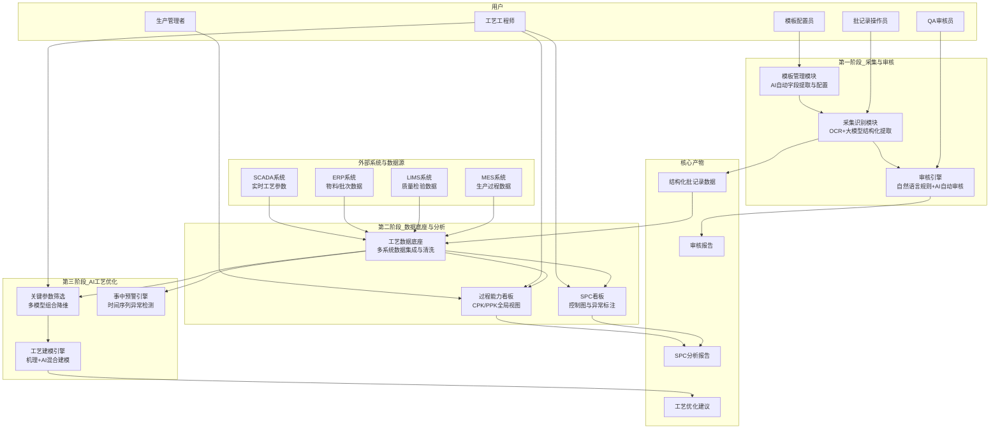
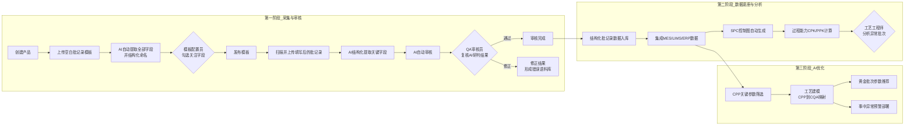
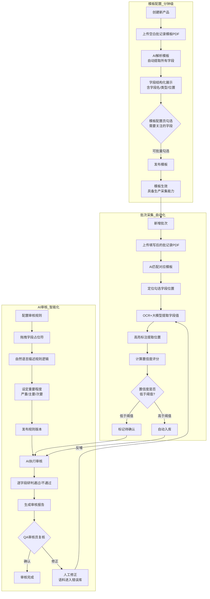
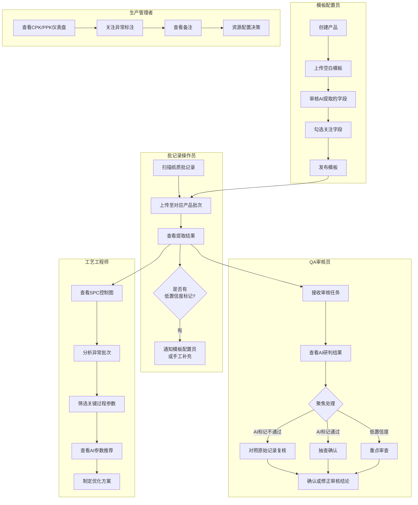
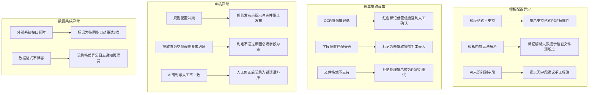

# 工业智能制药 — 纸质转电子与AI工艺优化 需求设计文档

---

## 文档说明

| 项目 | 内容 |
|------|------|
| **文档名称** | 工业智能制药 — 纸质批记录电子化、AI审核与工艺优化 需求设计文档 |
| **版本号** | V1.0 |
| **编写日期** | 2026-05-07 |
| **编写人** | RA-agent（调研分析智能体） |
| **文档密级** | 内部 |
| **来源** | 客户交流会议纪要（工业智能制药方向） |

### 修订记录

| 版本 | 日期 | 修订内容 | 修订人 |
|------|------|---------|--------|
| V1.0 | 2026-05-07 | 初稿，基于客户交流会议纪要梳理 | RA-agent |

---

## 1. 项目背景

### 1.1 行业核心痛点

当前制药工业企业在数字化转型中面临 **"第一步困境"**——纸质批记录的电子化与结构化难以落地，主要表现为：

| 痛点 | 具体表现 | 影响 |
|------|---------|------|
| **纸质记录地位不可替代** | 纸质批记录仍是GMP检查、合规审计中的原始凭证，药监部门高度关注其真实性、完整性和可追溯性 | 不能简单"去纸质化"，必须在纸质与电子之间建立可信桥梁 |
| **传统OCR模板配置周期长** | 传统方式需逐字段手工配置识别模板，一个90页的批记录模板配置和验证需要以月为单位 | 多产品、多工序场景下投入产出比极低，是落地最大瓶颈 |
| **小批量多品种"水土不服"** | 批次小、配方灵活的企业（如CDMO、中药制剂），产品切换频繁，传统数字化方案适配成本高 | 通用方案难以覆盖多样化场景 |
| **合规切换风险高** | 从纸质到电子的切换涉及流程变更、人员培训、系统验证，存在合规风险 | 企业不敢轻易切换 |
| **数据孤岛** | MES、LIMS、ERP等系统数据割裂，无法形成"工艺参数（CPP）→质量指标（CQA）"的完整数据链路 | 无法支撑基于数据的工艺优化决策 |
| **工艺波动缺少预警** | 生产过程波动往往事后才发现，缺乏事中实时监控和异常预警能力 | 批次间一致性差，收率、纯度等关键指标不稳定 |

### 1.2 建设契机

随着大模型及多模态AI技术的成熟，"纸质批记录→AI自动模板配置→结构化提取→智能审核→工艺数据底座→AI工艺优化"的全链路方案已具备技术可行性。本项目旨在分阶段解决上述痛点，从 **"纸质转电子的第一步"** 开始，逐步深入到 **"数据驱动的工艺优化"**。

---

## 2. 建设目标

### 2.1 第一阶段：纸质批记录电子化与AI审核

| 目标 | 说明 | 量化指标 |
|------|------|---------|
| **极速模板配置** | 告别逐字段手工配置，实现"上传空白模板→AI自动提取→人工勾选确认→发布"的分钟级模板配置 | 90页模板配置 ≤ **35分钟** |
| **高准确率结构化提取** | OCR + 大模型结合，对填写后的批记录进行关键字段自动提取和结构化转换 | 提取准确率 ≥ **90%**，置信度可配置阈值 |
| **AI自动审核** | 基于自然语言配置审核规则，AI自动研判通过/不通过，减轻人工逐页核对负担 | 审核规则配置时间 ≤ **5分钟/规则** |
| **纸质与电子可追溯对应** | 每条提取/审核结果可追溯到原始纸质扫描件对应位置 | 溯源准确率 **100%** |

### 2.2 第二阶段：数据底座与工艺分析

| 目标 | 说明 | 量化指标 |
|------|------|---------|
| **工艺数据底座** | 集成MES、LIMS、ERP等系统，形成CPP→CQA的完整数据链路 | 覆盖 ≥ **3个**核心系统 |
| **SPC统计过程控制** | 自动生成I-MR图、Xbar-R图，支持UCL/LCL控制线配置和异常标注 | 支持 ≥ **10个**质量属性同时监控 |
| **过程能力分析** | 自动计算CPK、PPK等指标，全局视图展示各产品/工艺段生产状态 | — |

### 2.3 第三阶段：AI驱动的工艺优化

| 目标 | 说明 | 量化指标 |
|------|------|---------|
| **关键过程参数筛选** | 利用多模型组合（机器学习）从数十个CPP中自动筛选真正影响质量的关键参数 | 参数降维 ≥ **50%** |
| **工艺建模与黄金批次发现** | 建立CPP→CQA的AI预测模型，推荐最优参数组合 | — |
| **事中异常预警** | 基于时间序列模型实时监控关键参数趋势，在波动超出阈值前提前预警 | 预警提前时间 ≥ 拐点发生前 |
| **收率/纯度优化** | 通过机理模型+AI混合建模，找到更优工艺参数区间 | 收率提升 ≥ **10%**，杂质降低 ≥ **30%**（标杆案例参考） |

---

## 3. 用户角色与使用场景

| 角色名称 | 核心职责 | 在系统中的关键动作 |
|---------|---------|------------------|
| **模板配置员** | 负责新产品/新工序的批记录模板配置与发布 | 上传空白模板 → 审核AI自动提取的字段 → 勾选关注字段 → 发布模板 |
| **批记录操作员** | 日常批记录扫描上传 | 扫描纸质批记录 → 上传至对应产品/批次 → 查看提取结果 |
| **QA审核员** | 质量审核，基于AI研判结果进行人工复核 | 查看审核任务 → 聚焦AI标记异常项 → 对照原始记录复核 → 确认审核结论 |
| **工艺工程师** | 工艺分析与优化 | 查看SPC控制图/过程能力 → 分析异常批次 → 筛选关键过程参数 → 制定优化方案 |
| **生产管理者** | 全局生产状态监控 | 查看CPK/PPK仪表盘 → 关注异常标注 → 决策资源配置 |
| **系统管理员** | 系统配置与规则管理 | 配置审核规则（自然语言） → 管理用户权限 → 维护置信度阈值等系统参数 |

---

## 4. 业务范围

### 4.1 本期范围（第一阶段）

| 序号 | 能力模块 | 说明 |
|------|---------|------|
| 1 | **AI模板自动配置** | 上传空白批记录模板，AI自动提取全部字段并结构化命名；用户勾选关注字段后发布生效 |
| 2 | **批次管理与文件上传** | 支持按产品/批次组织批记录上传，自动关联对应模板 |
| 3 | **OCR+AI结构化提取** | 对填写后的批记录扫描件进行高亮定位的结构化字段提取，支持PDF格式输入 |
| 4 | **提取结果置信度提示** | AI对每条提取结果给出置信度评分，低于阈值的自动提示人工确认 |
| 5 | **自然语言审核规则配置** | 通过拖拽字段占位符+自然语言描述，配置审核规则（如范围校验、跨字段比较、必填检查） |
| 6 | **AI自动审核** | 基于配置的审核规则自动研判通过/不通过，输出审核结论及依据 |
| 7 | **原始记录对照溯源** | 审核界面支持点击任意提取字段，定位至原始扫描件对应位置 |
| 8 | **人工复核与修正** | 提取结果和审核结论均支持人工修改，修正记录形成错误语料库用于模型自我迭代 |

### 4.2 本期范围（第二阶段）

| 序号 | 能力模块 | 说明 |
|------|---------|------|
| 9 | **SPC统计过程控制看板** | 按工厂/产线/工艺段/检验项筛选，自动绘制I-MR图、Xbar-R图 |
| 10 | **控制线配置与异常标注** | 支持自定义UCL/LCL，超出控制线的数据点红色标注并支持备注 |
| 11 | **过程能力指数看板** | CPK/PPK自动计算与可视化，面向管理层的全局生产状态视图 |
| 12 | **多系统数据集成** | 集成MES、LIMS、ERP等系统，构建CPP→CQA完整数据链路 |

### 4.3 远期范围（第三阶段）

| 序号 | 能力模块 | 说明 |
|------|---------|------|
| 13 | **关键过程参数智能筛选** | 多机器学习模型组合，从数十个CPP中自动降维筛选核心影响参数 |
| 14 | **数据切片与关键时段识别** | 沿生产过程时间轴切片，AI识别对质量影响最大的工艺时段 |
| 15 | **工艺机理+AI混合建模** | 建立CPP→CQA预测模型，推荐最优参数组合 |
| 16 | **事中异常预警** | 基于时间序列模型（LSTM等）的实时参数趋势监控与提前预警 |
| 17 | **工艺参数推荐** | AI辅助推荐更优的工艺参数区间，支持Doe实验设计空间探索 |

### 4.4 非本期范围

| 序号 | 不在本期内容 | 说明 |
|------|-------------|------|
| 1 | 与DCS/SCADA系统的实时控制联动 | 本期聚焦分析和预警，暂不闭环控制 |
| 2 | 电子批记录（EBR）完整替代纸质 | 本期纸质与电子并行，纸质仍为原始凭证 |
| 3 | 移动端APP | 本期仅支持PC网页端 |
| 4 | GAMP5完整计算机化系统验证（CSV） | 本期提供功能基础，完整CSV由客户配合第三方完成 |

---

## 5. 总体业务架构

本节说明系统的三层能力体系：**采集层→审核层→分析优化层**，以及各层之间的数据流转关系。

**关键节点说明：**

- **第一阶段（采集与审核）** 是系统入口：从纸质批记录出发，通过AI模板配置→结构化提取→智能审核，产出结构化数据和审核报告。这是解决"第一步困境"的核心。
- **第二阶段（数据底座与分析）** 是数据汇聚层：将第一阶段的结构化批记录数据与MES、LIMS、ERP等系统数据集成，构建完整的CPP→CQA数据链路，支撑SPC分析和过程能力监控。
- **第三阶段（AI工艺优化）** 是价值放大层：在数据底座之上，利用AI模型进行关键参数筛选、工艺建模和事中预警，实现从"事后分析"到"事中预警"的跨越。

**产品映射关系：**

| 模块 | 匹配产品 | 覆盖方式 |
|------|---------|---------|
| 模板管理模块 | **齐鲁智聚平台**（智能体+工作流） | ✅ 已有产品覆盖+定制适配 |
| 采集识别模块（OCR） | **智慧云眼-视频AI**（多模态视觉大模型） | ✅ 已有产品覆盖 |
| 采集识别模块（大模型提取） | **齐鲁智聚平台**（大模型推理+智能体） | ✅ 已有产品覆盖 |
| 审核引擎 | **齐鲁智聚平台**（智能体+工作流编排） | 🔧 定制开发 |
| 工艺数据底座 | **齐鲁智聚平台**（数据管理+MaaS） | 🔧 定制开发 |
| SPC看板 | **智能问数**（数据分析与可视化） | ✅ 已有产品覆盖+定制适配 |
| 过程能力看板 | **智能问数**（数据可视化） | ✅ 已有产品覆盖+定制适配 |
| 关键参数筛选/工艺建模/事中预警 | **齐鲁智聚平台**（模型训练+推理） | 🔧 定制开发 |
| 信创部署 | **芯合一体机** | ✅ 已有产品覆盖 |

---

## 6. 业务流程

### 6.1 端到端业务流程（三阶段全景）

本节说明从新产品模板配置到工艺优化建议输出的完整端到端流程。

**关键节点说明：**

- **A3（AI自动提取字段）** ：系统自动识别批记录模板中的所有字段（表头、填写格、签名字段等），转换为结构化字段名。这是与传统OCR方案的最大差异点——无需逐字段手工配置。
- **A7（AI结构化提取）** ：对填写后的扫描件，提取关注字段的实际值，并标注来源位置（页码、坐标）。
- **A9（QA复核）** ：AI审核结果供QA人员重点审查，非全面逐页核对。AI标注"不通过"或"置信度低"的字段需要人工确认。
- **B2（多系统数据集成）** ：构建"工艺参数（来自批记录/MES）→ 质量结果（来自LIMS）"的数据链路，这是后续AI优化的数据基础。
- **C1（CPP筛选）** ：用多模型组合（随机森林+SHAP等）从数十个参数中识别真正影响质量的5-6个关键参数。
- **C4（事中预警）** ：基于时间序列模型实时监测关键参数趋势，当实际值与AI预测值偏差超过阈值时提前报警。

**业务规则：**

- 模板发布后，对应产品/工序的批记录上传才可进行。
- 若AI提取置信度低于系统配置阈值（如 < 80%），自动标记"待人工确认"。
- 人工修正的提取/审核结果将自动进入错误语料库，用于模型迭代优化。
- 第二阶段数据集成的前提是第一阶段的批记录已结构化入库。

### 6.2 核心主流程：模板配置 → 采集 → 审核

本节聚焦第一阶段的核心业务流程，是系统使用频率最高的主线。

**关键节点说明：**

- **T3（AI解析模板）** ：核心亮点。系统自动识别空白模板中的表格结构、字段名称、填写格位置，无需手工逐一标定。以安氏制药案例为参考，90多页模板的完整配置（含识别、审核、发布）仅需 **35分钟**，而传统MES方案需以月为单位。
- **B5（OCR+大模型提取）** ：采用OCR识别+大模型语义理解结合的方式。OCR负责文字识别，大模型负责理解上下文（如区分"理论值"和"实际值"、识别手写数字、理解表格结构）。
- **B7（置信度评分）** ：AI对每个提取字段给出0-100的置信度评分。系统支持配置阈值，低于阈值的自动标记为"待确认"，避免低质量提取结果直接入库。
- **R3（自然语言规则配置）** ：审核规则通过拖拽字段占位符+自然语言描述来配置，例如"实际使用量应在理论用量的±5%范围内"，无需编写代码。
- **R11（错误语料反哺）** ：每次人工修正的结果会形成错误语料库，反哺大模型进行自我迭代，在相似问题上逐渐减少错误。

**业务规则：**

- 模板配置中，未被勾选的字段将不在后续采集和审核中处理。
- 一个产品可有多个模板（对应不同工序），每个模板独立配置。
- 审核规则支持版本管理，新版本发布后立即生效。
- 错误语料库按产品/工序分类管理，确保模型迭代的针对性。

### 6.3 角色参与流程

本节说明不同角色在系统中的参与时机和核心动作。

**关键节点说明：**

- **模板配置员**：仅在引入新产品/新工序时介入，日常运行无需其参与。
- **批记录操作员**：日常高频角色，负责扫描上传和查看提取结果。
- **QA审核员**：工作重心从"逐页全面核对"转变为"聚焦AI标记异常的字段复核"，效率大幅提升。
- **工艺工程师**：基于数据底座进行深度分析，是第三阶段AI优化的主要使用者。
- **生产管理者**：通过CPK/PPK仪表盘获取全局视图，不深入单个字段级别。

---

## 7. 功能需求

### 7.1 AI模板自动配置

**功能目标**：基于齐鲁智聚平台（智能体+多模态大模型）+ 智慧云眼（OCR），实现"上传空白模板→AI自动提取全部字段→人工勾选确认→发布"的分钟级模板配置，彻底替代传统逐字段手工配置。

**使用角色**：模板配置员

**输入**：空白批记录模板的扫描PDF文件

**输出**：已发布的模板（含字段定义、位置标注、字段分类）

**核心规则：**

| 子功能 | 说明 |
|-------|------|
| **自动字段提取** | 上传空白模板后，AI自动识别表格结构、字段名称、填写格位置（包含表头区域和表格内容区域） |
| **字段结构化命名** | AI自动为每个字段赋予结构化名称（如"搅拌桨转速_理论值""切刀温度_实际值"），无需人工命名 |
| **字段勾选确认** | 所有提取的字段以列表形式展示，模板配置员勾选需要关注的字段（支持批量勾选），未勾选字段后续不处理 |
| **字段预览** | 勾选后可在原始模板上高亮预览字段位置 |
| **发布生效** | 勾选确认后点击发布，模板即时生效，具备生产采集能力 |
| **多工序支持** | 一个产品可关联多个模板（对应不同工序），每个模板独立配置 |

### 7.2 批次管理与结构化采集

**功能目标**：基于齐鲁智聚平台（大模型推理）+ 智慧云眼（OCR识别），实现填写后批记录扫描件的自动匹配、高精度结构化字段提取和置信度评估。

**使用角色**：批记录操作员

**输入**：填写后的批记录扫描PDF文件

**输出**：结构化提取结果（含字段值、来源位置、置信度评分）

**核心规则：**

| 子功能 | 说明 |
|-------|------|
| **批次创建与上传** | 按产品创建批次，支持批量上传多个批记录文件 |
| **模板自动匹配** | 系统根据产品关联的模板自动匹配对应工序 |
| **字段定位与提取** | OCR+大模型结合，定位模板中已勾选的字段在填写后扫描件中的位置，提取实际填写值 |
| **高亮标注** | 提取结果页面对应原始扫描件进行高亮标注，绿色框标出已提取字段的位置 |
| **置信度评分** | 每条提取结果附带0-100置信度评分，可配置阈值，低于阈值的自动标记"待人工确认" |
| **人工修正** | 支持对提取结果进行在线修改，修正记录自动进入错误语料库 |
| **多页处理** | 支持多页批记录连续提取，按页码组织结果 |

### 7.3 自然语言审核规则配置

**功能目标**：基于齐鲁智聚平台（智能体+工作流编排），支持通过拖拽字段占位符+自然语言描述的方式配置审核规则，无需编写代码。

**使用角色**：系统管理员/QA审核员

**输入**：审核规则自然语言描述 + 字段占位符选择

**输出**：已发布的审核规则版本

**核心规则：**

| 规则类型 | 示例（自然语言描述） | AI研判逻辑 |
|---------|-------------------|-----------|
| **范围校验** | "{实际使用量}应当在{理论用量}的±5%范围内" | 计算实际值与理论值的偏差百分比，在范围内→通过，否则→不通过 |
| **跨字段比较** | "后道工序的{投料量}应与前道工序的{产出量}一致" | 比较两个字段值，一致→通过，不一致→不通过 |
| **必填检查** | "{操作人签名}字段应当有内容，不能为空" | 检测字段是否有值，有→通过，空→不通过 |
| **数值范围** | "{温度}应当在30~40℃之间" | 检测数值是否在范围内 |

**业务规则：**

- 每个规则支持设定重要程度：严重/主要/次要。
- 规则支持版本管理，发布新版本后立即生效，历史版本保留可追溯。
- 规则可关联到特定产品/工序/模板字段。
- 自然语言描述后的规则逻辑由AI自动解析并执行，无需编写判断代码。

### 7.4 AI自动审核

**功能目标**：基于齐鲁智聚平台（智能体+审核规则引擎），对结构化提取结果自动执行审核研判，输出通过/不通过结论，并支持与原始扫描件对照复核。

**使用角色**：QA审核员（复核AI结果）

**输入**：结构化提取结果 + 已发布的审核规则

**输出**：逐字段审核结论（通过/不通过/待确认） + 不通过原因说明

**核心规则：**

| 子功能 | 说明 |
|-------|------|
| **自动逐字段研判** | AI按照已发布规则，逐字段给出通过/不通过/待确认的研判结论 |
| **不通过原因说明** | 对不通过的字段，AI自动生成原因说明（如"实际值150.83与理论值145.00偏差5.83，超出±5%范围"） |
| **原始记录对照** | 审核界面支持点击任意字段，定位至原始扫描件对应位置，方便QA对照复核 |
| **人工复核聚焦** | QA审核员工作重点从"全面逐页核对"变为"聚焦AI标记不通过/待确认的字段"，大幅提升效率 |
| **审核结论修正** | QA可修改AI审核结论，修正记录进入错误语料库 |
| **审核报告生成** | 审核完成后自动生成审核报告，汇总通过/不通过项及原因说明 |

### 7.5 SPC统计过程控制看板

**功能目标**：基于智能问数（数据分析与可视化），自动生成控制图并标注异常，帮助工艺工程师实时掌握生产过程波动。

**使用角色**：工艺工程师

**输入**：结构化批记录数据 + 质量检验数据

**输出**：I-MR图 / Xbar-R图 + 异常标注

**核心规则：**

| 子功能 | 说明 |
|-------|------|
| **多维筛选** | 按工厂、产线、工艺段、检验项、时间范围等维度筛选数据 |
| **控制图自动生成** | 根据不同检验项的数据特征，自动选择合适的控制图类型（I-MR图或Xbar-R图） |
| **控制线配置** | 支持自定义UCL（上控制限）和LCL（下控制限），也可由系统基于历史数据自动计算 |
| **异常自动标注** | 超出控制线的数据点以红色高亮标注，并在对应批次支持添加备注说明 |
| **批次详情查看** | 点击异常数据点，可下钻查看该批次的详细提取数据和原始记录 |

### 7.6 过程能力指数看板

**功能目标**：基于智能问数（数据分析与可视化），提供全局CPK/PPK视图，面向管理层的生产状态仪表盘。

**使用角色**：生产管理者、工艺工程师

**输入**：结构化批记录数据 + 质量检验数据

**输出**：CPK/PPK指标仪表盘

**核心规则：**

| 子功能 | 说明 |
|-------|------|
| **CPK/PPK自动计算** | 基于历史批次数据，自动计算各产品/工艺段的过程能力指数 |
| **全局仪表盘** | 以可视化方式展示所有产品/工艺段的CPK/PPK状态，支持按颜色标识（绿=能力充足/黄=需关注/红=能力不足） |
| **趋势分析** | 支持查看CPK/PPK随时间的变化趋势 |

### 7.7 工艺数据底座与多系统集成

**功能目标**：基于齐鲁智聚平台（数据管理+MaaS），将批记录结构化数据与MES、LIMS、ERP等系统数据集成，构建完整的CPP→CQA数据链路。

**使用角色**：系统自动执行

**输入**：批记录结构化数据 + MES过程数据 + LIMS检验数据 + ERP物料数据

**输出**：统一数据视图（CPP→CQA完整链路）

**核心规则：**

| 集成对象 | 集成内容 | 用途 |
|---------|---------|------|
| **MES** | 生产过程参数（温度、压力、转速、流量等时间序列数据） | 作为CPP输入数据 |
| **LIMS** | 质量检验结果（含量、纯度、收率、杂质等） | 作为CQA目标数据 |
| **ERP** | 物料批次、供应商、投料量 | 物料追溯 |
| **SCADA** | 实时工艺参数高频采集数据 | 补充MES数据粒度 |

### 7.8 AI工艺优化（第三阶段）

**功能目标**：基于齐鲁智聚平台（模型训练+推理），在数据底座之上利用AI进行关键参数筛选、工艺建模和事中预警。

**使用角色**：工艺工程师

**输入**：CPP-CQA完整数据链路

**输出**：关键参数清单、最优参数推荐、异常预警

**核心规则：**

| 子功能 | 说明 | 技术路径 |
|-------|------|---------|
| **关键过程参数筛选** | 从数十个CPP中自动降维筛选5-6个真正影响CQA的核心参数 | 多机器学习模型组合（随机森林、SHAP等），通过特征重要性排序 |
| **数据切片分析** | 沿生产过程时间轴切片，AI识别对质量影响最大的工艺时段 | 将生产时间均分N段，逐段建模比较预测能力 |
| **工艺建模** | 建立CPP→CQA的预测模型，模拟不同参数组合下的质量结果 | 机理模型+AI混合建模（机理模型固定已知关系，AI学习未知变异） |
| **黄金批次推荐** | 基于模型探索更优的参数组合区间 | 在模型空间内搜索使CQA最优的CPP组合 |
| **事中异常预警** | 实时监控关键参数趋势，提前预警异常波动 | 时间序列模型（LSTM等），比较实际值与AI预测值的偏差 |

---

## 8. 输入输出要求

### 8.1 输入资料

| 序号 | 输入资料 | 格式要求 | 来源 |
|------|---------|---------|------|
| 1 | 空白批记录模板 | PDF（扫描件） | 模板配置员上传 |
| 2 | 填写后的批记录 | PDF（扫描件），建议 ≥300DPI | 批记录操作员扫描上传 |
| 3 | 现有审核规则说明 | 自然语言描述 | QA审核员提供 |
| 4 | MES过程数据 | API接口对接 | MES系统 |
| 5 | LIMS检验数据 | API接口对接 | LIMS系统 |
| 6 | ERP物料数据 | API接口对接 | ERP系统 |

### 8.2 输出结果

| 序号 | 输出结果 | 格式 | 说明 |
|------|---------|------|------|
| 1 | 已发布模板 | 系统内部结构化配置 | 含字段定义、位置标注 |
| 2 | 结构化批记录数据 | 结构化表格（可导出CSV/Excel） | 含字段值、来源位置、置信度 |
| 3 | AI审核报告 | 系统内展示 + 可导出PDF | 含通过/不通过/待确认及原因说明 |
| 4 | SPC控制图 | 系统内交互式图表 | I-MR图/Xbar-R图 + 异常标注 |
| 5 | 过程能力仪表盘 | 系统内可视化看板 | CPK/PPK全局视图 |
| 6 | 关键参数筛选报告 | 系统内展示 + 可导出 | 参数重要性排序及解释 |
| 7 | 工艺优化建议 | 系统内展示 + 可导出 | 推荐参数区间及预期效果 |

---

## 9. 非功能需求

### 9.1 性能需求

| 指标 | 要求 |
|------|------|
| 模板解析速度 | 单页模板字段提取 ≤ **10秒/页** |
| 批记录提取速度 | 单页批记录结构化提取 ≤ **15秒/页** |
| 审核研判速度 | 单批次（30页）审核 ≤ **2分钟** |
| SPC图表渲染 | 筛选条件变更后图表刷新 ≤ **3秒** |
| 数据接口响应 | API接口调用响应时间 ≤ **5秒** |

### 9.2 稳定性需求

| 指标 | 要求 |
|------|------|
| 系统可用性 | ≥ **99.5%**（生产时段） |
| 批量处理 | 单次支持 ≥ **50个**批次并发上传和处理 |
| 异常恢复 | 文件处理中断后支持重试，不丢失数据 |

### 9.3 安全性需求

| 指标 | 要求 |
|------|------|
| 访问控制 | 基于角色的访问控制（RBAC），模板配置/审核/分析权限隔离 |
| 操作审计 | 所有提取结果修改、审核结论修改记录操作日志（含操作人、时间、修改前后值） |
| 数据加密 | 传输使用HTTPS，存储使用AES-256 |
| 数据隔离 | 不同产品/工厂数据逻辑隔离 |
| 信创支持 | 支持国产操作系统（麒麟V10）、国产数据库（达梦DM8）部署 |

### 9.4 可维护性需求

| 指标 | 要求 |
|------|------|
| 模板版本管理 | 支持模板历史版本查看和回滚 |
| 审核规则版本管理 | 支持规则历史版本查看和回滚 |
| 错误语料库 | 区分产品/工序管理，支持查看修正历史 |
| 置信度阈值管理 | 可按产品/工序独立配置置信度阈值 |

### 9.5 合规性需求

| 指标 | 要求 |
|------|------|
| 数据完整性 | 提取和审核过程全程留痕，满足GMP数据完整性（ALCOA+）要求 |
| 电子签名 | 审核结论确认需电子签名 |
| 审计追踪 | 关键操作审计日志保留 ≥ **5年** |

---

## 10. 异常场景

### 10.1 异常处理流程

本节说明各类异常场景的触发条件、处理方式和用户可见反馈。

### 10.2 异常场景清单

| 序号 | 异常场景 | 触发条件 | 系统处理方式 | 用户可见反馈 | 允许重试 |
|------|---------|---------|------------|------------|---------|
| 1 | 模板扫描件模糊 | 模板PDF清晰度不足，AI无法识别表格结构 | 标记解析失败 | 黄色警告"模板清晰度不足，建议≥300DPI重新扫描后重试" | 是 |
| 2 | 模板未识别到字段 | 模板为纯文本无表格结构或样式特殊 | 提示无字段 | 黄色警告"未检测到可提取字段，请确认模板格式或手工标注" | 否（可手工标注） |
| 3 | 批记录填写潦草 | 手写字体过大/过小/连笔，OCR置信度 < 阈值 | 低置信度标记为待人工确认 | 红色标记"识别置信度XX%，请人工确认" | 否（需人工确认） |
| 4 | 字段位置偏移 | 填写内容超出原始模板单元格范围 | 尝试扩大检测区域，仍失败则标记未提取 | 黄色警告"字段XX位置匹配异常，已尝试扩展检测" | 否（需人工录入） |
| 5 | 文件格式不支持 | 上传了非PDF格式的文件 | 拒绝处理 | 红色提示"不支持的文件格式，请转换为PDF后重新上传" | 是 |
| 6 | 规则配置冲突 | 两个规则对同一字段给出了矛盾的判定 | 规则发布前检测并阻止发布 | 红色提示"规则XX与规则YY存在冲突，请检查后重新发布" | 是 |
| 7 | 必填字段为空 | 规则要求必填，但提取结果为空 | AI判定不通过 | 审核报告标注"不通过：必填字段XX为空" | 否（需人工确认） |
| 8 | 外部系统接口超时 | MES/LIMS/ERP接口调用超过5秒无响应 | 自动重试3次，仍失败则标记待同步 | 黄色警告"XX系统数据同步暂未完成，系统将自动重试" | 是（自动） |
| 9 | 置信度阈值不合理 | 阈值设置过高导致大量字段标记待确认，或过低导致错误提取直接入库 | 系统监控标记率，异常时提示 | 系统提示"当前置信度阈值导致XX%字段需人工确认，建议调整阈值" | 是 |

---

## 11. 验收标准

### 11.1 第一阶段验收

| 序号 | 验收项 | 验收标准 | 验证方式 |
|------|-------|---------|---------|
| 1 | 模板自动配置速度 | 90页批记录模板从上传到发布 ≤ **40分钟** | 选取3种不同产品的批记录模板，计时测试 |
| 2 | 字段提取覆盖率 | AI自动提取字段覆盖 ≥ **95%** 的实际填写格 | 人工逐字段核对 |
| 3 | 结构化提取准确率 | 填写规范、字迹清晰的批记录提取准确率 ≥ **90%** | 选取50份批记录，人工核对每个提取字段 |
| 4 | 置信度可用性 | 低置信度（< 80%）标记与实际错误提取的匹配率 ≥ **80%** | 对比AI置信度标记与人工复核结果 |
| 5 | 审核规则配置 | 通过自然语言描述，5分钟内完成一条审核规则的配置和发布 | 选取3种典型规则场景，计时测试 |
| 6 | AI审核准确率 | AI审核研判结果与QA人工审核结论一致率 ≥ **85%** | 选取30份批记录，AI审核与人工审核双盲对比 |
| 7 | 原始记录溯源 | 点击任意提取字段，3秒内定位至原始扫描件对应位置 | 逐字段点击测试 |
| 8 | 人工修正闭环 | 人工修正后，错误语料库正确记录修正前后的值 | 修正5个字段后查看语料库 |

### 11.2 第二阶段验收

| 序号 | 验收项 | 验收标准 | 验证方式 |
|------|-------|---------|---------|
| 9 | SPC控制图生成 | 筛选条件变更后，控制图刷新 ≤ **3秒** | 切换不同筛选条件，计时测试 |
| 10 | 异常标注准确性 | 超出UCL/LCL的数据点 100% 红色标注 | 构造超出控制线的测试数据 |
| 11 | CPK/PPK计算准确性 | 与Minitab/JMP手动计算结果偏差 ≤ **1%** | 选取5组数据，对比计算 |
| 12 | 多系统数据集成 | MES/LIMS/ERP接口数据拉取成功率 ≥ **99%** | 连续运行7天，统计接口成功率 |

### 11.3 第三阶段验收

| 序号 | 验收项 | 验收标准 | 验证方式 |
|------|-------|---------|---------|
| 13 | 关键参数筛选 | 从 ≥ 20个CPP中降维至 ≤ 8个，且筛选结果经工艺专家认可 | 工艺专家评审AI筛选结果 |
| 14 | 工艺模型预测 | CPP→CQA预测模型的R² ≥ **0.7** | 留出测试集评估 |
| 15 | 事中预警时效 | 异常预警时间早于质量指标拐点发生时间 | 基于历史异常批次回测 |

---

## 12. 附录

### 12.1 产品映射关系总表

| 客户需求 | 匹配产品 | 覆盖方式 | 说明 |
|---------|---------|---------|------|
| OCR识别与文字提取 | **智慧云眼-视频AI** | ✅ 已有产品覆盖 | 多模态视觉大模型，支持手写体、印刷体、表格OCR |
| 大模型语义理解与字段提取 | **齐鲁智聚平台** | ✅ 已有产品覆盖 | 大模型推理+智能体，支撑模板解析和结构化提取 |
| 智能审核规则引擎 | **齐鲁智聚平台**（工作流编排） | 🔧 定制开发 | 基于工作流编排实现自然语言规则解析和自动审核 |
| 错误语料库与模型迭代 | **齐鲁智聚平台**（模型训练） | 🔧 定制开发 | 利用修正数据对大模型进行微调 |
| SPC分析看板 | **智能问数** | ✅ 已有产品覆盖+定制适配 | 控制图生成、异常标注、多维筛选 |
| CPK/PPK仪表盘 | **智能问数** | ✅ 已有产品覆盖+定制适配 | 过程能力指数计算与可视化 |
| 多系统数据集成 | **齐鲁智聚平台**（数据管理+MaaS） | 🔧 定制开发 | API网关对接MES/LIMS/ERP |
| 关键参数筛选 | **齐鲁智聚平台**（模型训练） | 🔧 定制开发 | 多模型组合+特征重要性排序 |
| 工艺建模 | **齐鲁智聚平台**（模型训练+推理） | 🔧 定制开发 | 机理模型+AI混合建模 |
| 时间序列异常预警 | **齐鲁智聚平台**（模型推理） | 🔧 定制开发 | LSTM等时序模型部署 |
| 信创环境部署 | **芯合一体机** | ✅ 已有产品覆盖 | 软硬一体，信创适配 |

### 12.2 分阶段实施建议

| 阶段 | 周期估算 | 核心交付 | 定制工作量估算 |
|------|---------|---------|-------------|
| **第一阶段** | 3-4个月 | 模板配置 + 采集识别 + AI审核 | 80-120人天 |
| **第二阶段** | 2-3个月 | 数据底座 + SPC + CPK看板 | 40-60人天 |
| **第三阶段** | 4-6个月 | 关键参数筛选 + 工艺建模 + 事中预警 | 120-180人天 |

### 12.3 核心优势

基于中移齐鲁创新院的产品矩阵，本方案具备以下差异化优势：

1. **极速模板配置**：30-40分钟完成传统方案需数月的模板配置，是方案最大的差异化亮点。
2. **错误自愈机制**：每次人工修正自动进入错误语料库，模型持续自我迭代，越用越准。
3. **自然语言规则**：审核规则用自然语言配置，无需代码，QA人员可直接维护。
4. **全链路可追溯**：每个提取/审核结果可追溯到原始纸质扫描件，满足GMP合规要求。
5. **属地化支撑**：问题响应不超过24小时，相比纯SaaS方案更贴近药企的贴身服务需求。
6. **信创合规**：全栈国产信创，满足药企安全合规要求。

### 12.4 术语表

| 术语 | 说明 |
|------|------|
| **批记录（Batch Record）** | 药品生产过程中记录每批产品生产全过程的文件，是GMP检查的核心原始凭证 |
| **CPP（Critical Process Parameter）** | 关键过程参数，影响产品质量的生产工艺参数（如温度、压力、转速等） |
| **CQA（Critical Quality Attribute）** | 关键质量属性，衡量产品质量的指标（如含量、纯度、收率、杂质等） |
| **SPC（Statistical Process Control）** | 统计过程控制，用统计方法监控生产过程稳定性 |
| **CPK/PPK** | 过程能力指数，衡量生产过程满足质量标准的能力 |
| **I-MR图** | 单值-移动极差控制图，用于连续单值数据的SPC分析 |
| **Xbar-R图** | 均值-极差控制图，用于分组数据的SPC分析 |
| **UCL/LCL** | 上控制限/下控制限，SPC控制图中的判定边界 |
| **OCR** | 光学字符识别，将图片中的文字转化为可编辑文本 |
| **LSTM** | 长短期记忆网络，一种适合处理时间序列数据的神经网络 |
| **ALCOA+** | GMP数据完整性原则：可归属、清晰可读、同步记录、原始、准确 + 完整、一致、持久、可获得 |
| **GAMP5** | 国际制药工程协会发布的自动化系统验证指南 |
| **CDMO** | 合同定制研发生产机构，为药企提供研发和生产外包服务 |

---

> **文档结束**
>
> *本文档基于客户交流会议纪要梳理，结合中移齐鲁创新院产品能力进行方案匹配。第一阶段聚焦"纸质转电子"的第一步困境破解，第二阶段构建数据底座，第三阶段释放AI工艺优化价值。如需进一步细化技术方案或启动POC验证，请联系对应产品接口人。*
