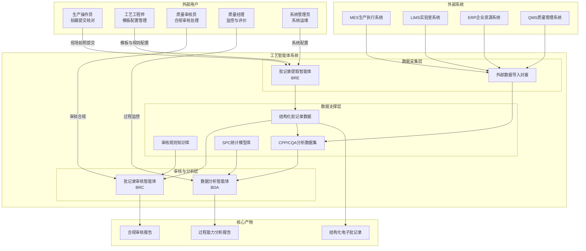
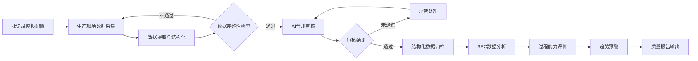
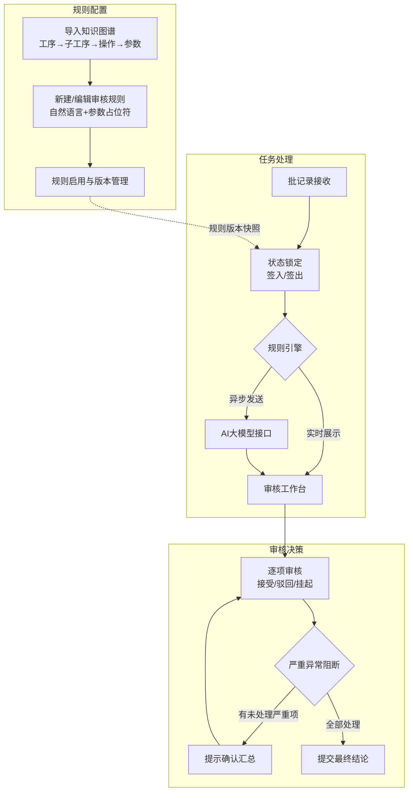
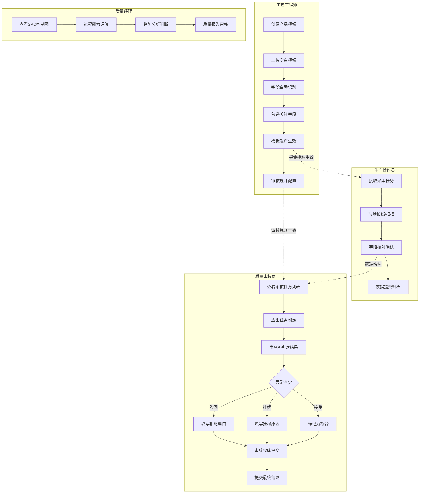

# 工艺智能体 用户需求说明书

> Process Agent User Requirement Specification

---

## 1. 文档说明

| 项目 | 内容 |
|------|------|
| **文档名称** | 工艺智能体用户需求说明书 |
| **英文名称** | Process Agent User Requirement Specification |
| **版本号** | V2.0 |
| **编写日期** | 2026-05-07 |
| **编写人** | RA-agent（调研分析智能体） |
| **文档密级** | 内部 |
| **文档状态** | 待评审 |

### 修订记录

| 版本 | 日期 | 修订内容 | 修订人 |
|------|------|---------|--------|
| V1.0 | 2026-05-07 | 初稿 | RA-agent |
| V2.0 | 2026-05-07 | 补充业务架构图、流程图、异常场景、非功能需求、验收标准等完整章节 | RA-agent |

---

## 2. 项目背景

### 2.1 行业背景

药品生产行业长期面临以下核心问题：

- **纸质批记录数据难以沉淀**：大部分药企仍然依赖纸质批记录，数据散落在手写文档中，无法形成可检索、可分析的结构化数据资产
- **批记录审核效率低、漏审风险高**：审核依赖人工逐项核对，规则多、批次多、时间紧，容易出现漏审、误审和规则执行不一致的问题
- **工艺过程监控滞后**：事后检查为主，缺乏实时的过程监控和趋势预警能力，质量问题和偏差难以及时发现
- **SPC分析门槛高**：统计过程控制的专业要求高，许多企业虽然有数据但缺乏有效的分析工具，CPP/CQA数据的价值未能充分发挥

### 2.2 建设目标

工艺智能体旨在通过AI技术，围绕批记录、关键工艺参数（CPP）、关键质量属性（CQA）和稳定性数据，构建从数据采集到工艺优化的智能化闭环，解决以上行业痛点。

核心指标：

| 目标维度 | 量化指标 |
|---------|---------|
| **采集效率** | 纸质批记录电子化效率提升 ≥ 80%，人工录入成本降低 ≥ 70% |
| **审核效率** | AI预审覆盖所有已配置规则，单批审核时间缩短 ≥ 50% |
| **审核一致性** | 规则执行一致性达 100%，消除人工规则理解偏差 |
| **数据完整性** | 批记录提取数据与原始凭证100%关联，支持审计追溯 |
| **分析效率** | SPC分析从人工操作（天级）缩短为自动化（分钟级） |

---

## 3. 用户角色与使用场景

| 角色 | 核心职责 | 系统关键动作 |
|------|---------|------------|
| **生产操作员** | 生产现场数据采集，纸质批记录拍照、核对、提交 | 模板字段识别确认、智能定位拍照、数据完整性检查 |
| **工艺工程师** | 模板配置、规则管理、批次数据管理 | 产品模板创建与维护、提取规则配置、批次数据管理 |
| **质量审核员** | 批记录合规审核，AI判定结果确认、异常处理 | 审核规则配置、AI校验结果审核、异常判定与结论提交 |
| **质量经理** | 审核结果复核，过程能力监控 | SPC控制图查看、过程能力评价、质量报告审阅 |
| **系统管理员** | 系统配置与维护，权限管理 | 用户角色管理、系统审计日志查看、系统运行监控 |

---

## 4. 业务范围

### 4.1 本期范围

| 序号 | 模块 | 说明 |
|------|------|------|
| 1 | 批记录提取（BRE） | 纸质批记录电子化、模板管理、字段识别、数据采集、人工确认、数据导出与归档 |
| 2 | 批记录审核（BRC） | 基于规则和AI的合规审核、审核工作台、异常处理、规则版本管理、提交拦截 |
| 3 | 数据分析（BDA） | CPP/CQA数据提取、SPC控制图、过程能力指数、稳定性趋势分析、批次对比 |
| 4 | 数据对接 | 外部系统数据导入（CRM、MES、LIMS等），结构化电子数据导出 |

### 4.2 非本期范围

| 序号 | 不在本期内容 | 说明 |
|------|-------------|------|
| 1 | 工艺优化智能体 | 基于AI的工艺参数自动优化、DOE实验设计等功能，后续版本规划 |
| 2 | 配方管理系统 | 配方计算、物料消耗分析等，与现有ERP/PLM配合 |
| 3 | 设备数据实时采集 | 设备SCADA/DCS实时数据的自动采集，后续与IoT平台对接 |
| 4 | 移动端App | 本期仅支持PC网页端管理，移动端拍照采集后续版本规划 |
| 5 | 电子批记录系统（EBR） | 本期聚焦纸质批记录电子化，不替代原生电子批记录系统 |

---

## 5. 总体业务架构

本节说明工艺智能体系统的核心能力模块、用户角色与外部系统之间的整体关系。



**关键节点说明：**

- **批记录提取智能体**（BRE）：位于数据采集层，负责将纸质批记录扫描件转化为结构化数据，是后续所有分析的数据基础
- **批记录审核智能体**（BRC）：位于审核与分析层，基于审核规则和AI能力对批记录进行合规校验
- **数据分析智能体**（BDA）：位于审核与分析层，基于批记录提取数据及外部导入数据进行SPC分析与过程能力评价
- **数据支撑层**：包括结构化批记录数据、审核规则知识库和CPP/CQA分析数据集，为上层业务提供数据资源

**产品映射关系：**

| 模块 | 匹配产品 | 覆盖方式 |
|------|---------|---------|
| AI大模型能力底座 | 齐鲁智聚平台 | ✅ 已有产品覆盖 |
| 文档解析与OCR识别 | 知识助理（多模态文档解析） | ✅ 已有产品覆盖 |
| 模板配置与知识管理 | 知识助理（分级分域知识管理） | ✅ 已有产品覆盖 |
| 数据分析与SPC看板 | 智能问数 | ✅ 已有产品覆盖 + 定制适配 |
| 信创环境部署 | 芯合一体机 | ✅ 已有产品覆盖 |

---

## 6. 业务流程

### 6.1 端到端业务流程图

本节说明从生产数据采集到工艺优化建议的完整业务闭环。



**关键节点说明：**

- **批记录模板配置**：在首次使用新产品前，通过上传空白模板文件完成字段识别和提取规则配置，一次配置持续复用
- **生产现场数据采集**：支持存量纸质批记录批量扫描上传和增量数据智能定位拍照采集
- **数据完整性检查**：自动校验必填字段的完整性和数据格式正确性
- **AI合规审核**：基于预置规则和AI大模型能力，自动判定各项合规项，生成审核结果
- **异常处理**：审核员对AI判定结果进行复核，接受、驳回或挂起异常项，必要时回退至数据修正
- **SPC数据分析**：提取CPP/CQA数据，生成控制图、计算过程能力指数，进行趋势判断

**业务规则：**

- 模板配置完成后，方可进行该产品的批记录采集
- 数据完整性检查通过后，方可进入AI合规审核
- 审核结论通过后，方可完成数据归档
- 数据归档完成后，方可进行SPC分析
- SPC分析数据量不足时，仅支持控制图展示，不计算过程能力指数

### 6.2 核心审核主流程

本节聚焦批记录审核智能体（BRC）的核心处理流程，从规则配置到审核结论提交的完整闭环。



**关键节点说明：**

- **规则配置**：基于上游导入的知识图谱四级结构（工序→子工序→操作活动→参数），在同一工作台内完成审核规则的新增、编辑和启用管理
- **规则版本隔离**：审核员签出任务时记录所有启用规则的版本号，规则后续变更不影响已生成的异常记录，保障审核过程的一致性与可重现性
- **异步规则引擎**：以异步方式将字段名、字段值和规则文本批量发送至大模型接口，自动生成合规判断结果，非阻塞审计员操作
- **审核工作台**：以规则审核结果卡片为核心的数字化核对界面，支持审核员对每条AI校验结论作出接受、驳回或挂起决策
- **提交拦截**：存在未处理的严重级别异常时，系统进行拦截并展示汇总确认页，防止遗漏关键问题

**业务规则：**

- 签入/签出机制防止多人并发操作同一任务，超时自动释放锁定
- 规则版本号隔离机制确保审核过程的可重现性
- 驳回异常项须填写驳回理由，维护审核操作的可追溯性
- 严重级别异常未处理完成前，不允许提交最终审核结论

### 6.3 角色参与流程图

本节说明不同角色在系统中的参与时机和核心动作，以及角色间的数据流转关系。



**关键节点说明：**

- **工艺工程师**：在系统首次配置阶段完成模板配置和规则设置，是系统的"配置者"
- **生产操作员**：在日常生产阶段完成数据采集和提交，是系统的"数据生产者"
- **质量审核员**：在每批次生产完成后完成合规审核，是系统的"质量把关者"
- **质量经理**：在周期性数据分析阶段完成SPC监控和质量评价，是系统的"过程监控者"

---

## 7. 功能需求

### 7.1 批记录模板管理（BRE）

**功能目标**：基于知识助理（多模态文档解析能力），支持产品的模板新建、字段自动提取、关注字段勾选和模板发布，实现采集模板的规范化管理。

**使用角色**：工艺工程师

**输入**：产品空白批记录模板文件（扫描件/拍照件/PDF）

**输出**：可编辑的结构化模板配置，包含字段定义和提取规则

**核心规则：**

| 功能点 | 业务规则 |
|-------|---------|
| 产品模板管理 | 系统应支持对产品及产品模板进行管理，每个产品可关联多个模板 |
| 字段自动提取 | 系统应支持通过自动提取批记录模板内容的方式完成字段识别，无需人工逐项录入 |
| 关注字段勾选 | 系统应支持用户在自动提取的字段列表中勾选需要采集的关键字段，未勾选的字段不进入采集流程 |
| 模板发布生效 | 模板配置完成后须经发布方可生效，生效前可编辑修改，生效后锁定不可再编辑 |
| 全生命周期管理 | 模板应支持新增、编辑、启用/禁用、版本管理等全生命周期管理 |

### 7.2 批次任务与数据采集（BRE）

**功能目标**：基于齐鲁智聚平台（智能体能力），支持面向生产现场的执行端，实现存量数据批量采集和增量数据智能拍照采集。

**使用角色**：生产操作员、工艺工程师

**输入**：纸质批记录扫描件/拍照件、批次任务信息

**输出**：结构化批记录数据（字段-值对照表），关联原始凭证

**核心规则：**

| 功能点 | 业务规则 |
|-------|---------|
| 批次新建 | 系统应支持在管理端或执行端新建批次数据，关联产品模板 |
| 存量批量采集 | 支持基于存量纸质批记录扫描件批量上传完成集中采集 |
| 增量智能采集 | 针对增量数据实现智能定位拍照采集，引导操作员完成准确拍摄 |
| 采集确认机制 | 系统应建立采集与人工确认机制，操作员须逐项核对字段识别结果后方可提交 |
| 数据导出 | 系统应支持按多维度筛选导出结构化电子数据 |
| 电子化归档 | 系统应关联原始扫描件/拍照件完成电子化归档，保障数据的完整性与可调阅性 |

### 7.3 审核规则配置（BRC）

**功能目标**：基于知识助理（分级知识库），支持基于上游导入的知识图谱四级结构，在同一工作台内完成审核规则的新增、编辑、启用/禁用管理。

**使用角色**：质量审核员、工艺工程师

**输入**：知识图谱四级结构（工序→子工序→操作活动→参数）

**输出**：可执行的审核规则（自然语言+参数占位符）

**核心规则：**

| 功能点 | 业务规则 |
|-------|---------|
| 知识图谱导入 | 系统应支持基于导入的知识图谱结构，在同一工作台内完成规则配置 |
| 混合编写规则 | 规则内容支持自然语言与参数占位符混合编写，降低规则配置的编程门槛 |
| 版本管理 | 系统应支持规则的新增、编辑、启用/禁用等全生命周期管理 |
| 版本隔离 | 系统应实现规则版本号隔离机制，规则变更不影响已生成的异常记录 |

### 7.4 AI合规审核（BRC）

**功能目标**：基于齐鲁智聚平台（大模型能力），通过规则引擎以异步方式将字段名、字段值和规则文本批量发送至大模型接口，自动生成合规判断结果。

**使用角色**：系统自动执行、质量审核员

**输入**：批记录提取的结构化数据、审核规则

**输出**：AI合规判断结果（通过/不通过/异常），每条结果含判定依据

**核心规则：**

| 功能点 | 业务规则 |
|-------|---------|
| 异步规则引擎 | 以异步方式处理规则匹配，不阻塞审核员操作，审核进度实时展示 |
| AI判定生成 | 自动将字段名、字段值和规则文本发送至大模型，生成合规判断结果 |
| 规则版本快照 | 审核员签出任务时记录所有启用规则的版本号，确保可重现性 |
| 处理结果标注 | AI判定结果须标注严重程度（严重/主要/次要），供审核员决策 |

### 7.5 审核工作台（BRC）

**功能目标**：提供以规则审核结果卡片为核心的数字化核对工作台，支持审核员对每条AI校验结论作出接受、驳回或挂起决策。

**使用角色**：质量审核员

**输入**：AI合规判断结果、批记录照片

**输出**：审核结论（通过/驳回/挂起），审核记录

**核心规则：**

| 功能点 | 业务规则 |
|-------|---------|
| 卡片式工作台 | 以规则审核结果卡片为核心展示，每条规则对应一张卡片 |
| 三态决策 | 审核员可对每条结论作出接受、驳回或挂起决策 |
| 驳回理由 | 驳回时须填写理由，确保审核操作的可追溯性 |
| 筛选过滤 | 支持按严重程度、判断结论、处理状态进行筛选 |
| 照片预览高亮 | 支持批记录照片弹出层预览，自动高亮规则涉及的字段区域 |
| 签入/签出 | 支持签入/签出机制防止多人并发，超时自动释放锁定 |

### 7.6 提交拦截（BRC）

**功能目标**：在审核员提交最终审核结论前，对存在未处理的严重级别异常进行拦截提示，防止遗漏关键问题。

**使用角色**：质量审核员

**输入**：所有审核结论

**输出**：汇总确认页（含不符合数量、已驳回数量、挂起数量、符合数量）

**核心规则：**

| 功能点 | 业务规则 |
|-------|---------|
| 拦截机制 | 存在未处理的严重级别异常时，系统阻止提交 |
| 汇总展示 | 展示《汇总确认页》含不符合数量、已驳回数量、挂起数量、符合数量 |
| 强制确认 | 审核员须确认汇总信息后，方可提交最终结论 |

### 7.7 SPC数据分析（BDA）

**功能目标**：基于智能问数（数据分析能力），从本平台批记录数据及外部系统导入数据中提取CPP和CQA数值型数据，进行SPC分析和过程能力评价。

**使用角色**：质量经理

**输入**：CPP/CQA数值型数据（本平台提取 + 外部导入）

**输出**：SPC控制图、过程能力指数报告、趋势分析结果

**核心规则：**

| 功能点 | 业务规则 |
|-------|---------|
| 数据源管理 | 支持从本平台批记录数据及外部系统接口导入CPP/CQA数据 |
| 数据来源标注 | 数据来源须在分析界面中明确标注（本平台提取 / 外部导入） |
| 筛选过滤 | 支持按产品/配方、参数名称、批次范围、时间范围筛选 |
| 筛选条件持久化 | 筛选条件须在分析结果页面中持久显示，保障可追溯性 |
| 数据清洗 | 导入或提取前需进行数据清洗，包括空值处理、异常值处理、数据类型校验 |
| 数据质量提示 | 数据清洗处理需对用户给出提示，保障分析过程的透明度 |
| SPC控制图 | 支持单值-移动极差图（I-MR）、均值-极差图（Xbar-R） |
| 控制图参数 | 控制图需要包括中心线（CL）、上控制限（UCL）、下控制限（LCL）；标记超出控制限的点 |
| Nelson判异规则 | 支持8条Nelson判异规则的自动判定，在控制图中标记异常点并给出判断规则提示 |
| 过程能力评价 | 支持Cp、Cpk、Pp、Ppk等指标的计算 |
| 能力指数计算 | Cp/Cpk/Pp/Ppk计算其置信区间，以评估能力指数的可靠性；同时标记目标的上下规格限（USL/LSL），辅助用户进行能力评价 |
| 稳定性分析 | 支持数据正态性检验；支持多批次按采样时间点的稳定性趋势分析和多批次分布趋势分析 |
| 合并分析适用性 | 支持Poolability（合并分析适用性检验），判断不同批次稳定性数据是否可合并分析；支持按批号进行批次对比，展示不同批次之间的差异 |
| 分析结果导出 | 支持将SPC控制图、过程能力指数、分析结果汇总导出为PDF或Excel报告 |

---

## 8. 输入输出要求

### 8.1 输入资料

| 序号 | 输入资料 | 格式要求 | 来源 |
|------|---------|---------|------|
| 1 | 空白批记录模板 | PDF/JPG/PNG/TIFF | 工艺工程师上传 |
| 2 | 已填写的纸质批记录扫描件 | PDF/JPG/PNG | 生产操作员批量扫描或现场拍照 |
| 3 | 外部系统CPP/CQA数据 | JSON/CSV/XML（通过API导入） | MES/LIMS/QMS等 |
| 4 | 知识图谱结构 | JSON/Excel | 上游系统导入 |

### 8.2 输入格式要求

- 单张图片文件大小不超过 **50MB**，PDF文件单文件不超过 **500MB**。
- 扫描件分辨率建议不低于 **300DPI**，以保证OCR识别准确率。
- 批量上传批次文件总数不超过 **100个/批次**。

### 8.3 输出结果

| 序号 | 输出结果 | 格式 | 说明 |
|------|---------|------|------|
| 1 | 结构化批记录数据 | 系统内结构化表格 | 字段-值对照表，关联原始凭证 |
| 2 | 审核结果报告 | 系统内展示 + PDF导出 | 含规则名、判定结果、严重程度、处理状态 |
| 3 | AI合规判断结果 | 系统内展示 | 通过/不通过/异常，含判定依据 |
| 4 | SPC控制图 | 系统内图表 + PDF导出 | 含CL/UCL/LCL、异常点标记、判异规则提示 |
| 5 | 过程能力指数报告 | 系统内展示 + PDF/Excel导出 | Cp/Cpk/Pp/Ppk计算值及置信区间 |
| 6 | 稳定性趋势分析报告 | 系统内展示 + PDF/Excel导出 | 按采样时间点的趋势分析、多批次数分布趋势 |

---

## 9. 非功能需求

### 9.1 性能需求

| 指标 | 要求 |
|------|------|
| 字段识别速度 | 单张批记录模板（标准A4）字段自动识别 ≤ 30秒 |
| 批量采集处理 | 100个批次的数据完整性检查 ≤ 5分钟 |
| AI合规审核响应 | 单个批次全部规则同时发送校验，整体响应时间 ≤ 2分钟 |
| 控制图渲染 | 含100个数据点的SPC控制图渲染 ≤ 3秒 |
| 页面加载速度 | 审核工作台首屏加载 ≤ 3秒 |
| 并发用户数 | 支持 20 个并发用户同时在线操作 |

### 9.2 稳定性需求

| 指标 | 要求 |
|------|------|
| 系统可用性 | 生产期间系统可用性 ≥ 99.5% |
| 数据持久性 | 用户数据持久化存储，不得丢失 |
| 异常恢复 | 系统崩溃后30分钟内恢复 |
| 数据备份 | 操作数据每日自动备份，支持 30 天数据恢复 |

### 9.3 安全性需求

| 指标 | 要求 |
|------|------|
| 访问控制 | 基于角色的访问控制（RBAC），用户仅可访问授权数据和功能 |
| 操作审计 | 所有关键操作（模板配置、规则修改、审核决策、数据导出）记录操作日志 |
| 数据隔离 | 不同产品/批次间数据严格隔离 |
| 审计追溯 | 所有业务操作保留完整审计痕迹，包含操作人、操作时间、操作内容、操作前值、操作后值 |
| 文件安全 | 原始扫描件/拍照件以只读方式归档，不允许修改或删除 |
| 传输安全 | 数据传输使用HTTPS/TLS加密 |

### 9.4 可维护性需求

| 指标 | 要求 |
|------|------|
| 规则模板复用 | 支持审核规则模板的复制、导出、导入 |
| 知识图谱更新 | 支持知识图谱的增量更新，变更不影响已有配置的规则 |
| 日志管理 | 系统运行日志保留 90 天，支持日志查询和导出 |

### 9.5 可审计性需求

| 指标 | 要求 |
|------|------|
| 操作记录 | 记录每次审核操作的时间、操作人、操作内容 |
| 规则版本追溯 | 每次规则变更自动记录版本号，支持历史版本查看 |
| 审核结论追溯 | 审核结论提交后不可删除，仅支持"备注补充"的操作 |

---

## 10. 异常场景

### 10.1 异常处理总图

本节说明系统各类异常场景的触发条件、处理方式和用户可见反馈。

```mermaid
flowchart TB
    subgraph 数据采集异常
        E1[文件格式不支持] --> E1A[提示格式不支持的提示]
        E2[图片清晰度不足] --> E2A[OCR质量较低提示<br/>要求重新拍照]
        E3[模板字段检测失败] --> E3A[提示字段未检测到<br/>允许手动添加]
    end

    subgraph 审核异常
        E4[规则引擎超时] --> E4A[提示超时，支持重试]
        E5[AI接口返回异常] --> E5A[标记未处理<br/>人工介入判断]
        E6[规则内容解析失败] --> E6A[标记该规则不可用<br/>提示更新规则]
    end

    subgraph 数据分析异常
        E7[数据清洗异常] --> E7A[提示异常数据范围]
        E8[控制图计算失败] --> E8A[提示数据不足或数据异常]
        E9[能力指数无法计算] --> E9A[提示所需数据量不足]
    end

    subgraph 操作异常
        E10[签出超时锁定释放] --> E10A[自动释放锁定<br/>提示用户重新签出]
        E11[并发签出冲突] --> E11A[拦截操作<br/>提示已被其他用户锁定]
        E12[审核提交缺少审批] --> E12A[拦截提交<br/>提示汇总确认页]
```

### 10.2 异常场景清单

| 序号 | 异常场景 | 触发条件 | 系统处理方式 | 用户可见反馈 | 是否允许重试 |
|------|---------|---------|------------|------------|------------|
| 1 | 文件格式不支持 | 上传文件格式不为PDF/JPG/PNG/TIFF | 拒绝上传，提示支持格式 | "不支持的文件格式：xxx，上传文件仅支持PDF、JPG、PNG、TIFF" | 是 |
| 2 | OCR识别质量过低 | 扫描件清晰度不足，OCR置信度低于阈值 | 标记低质量区域，继续处理 | "部分区域识别质量较低，建议重新拍照或扫描" | 是 |
| 3 | 模板字段检测失败 | 自动提取过程中某字段未能识别 | 跳过该字段 | "字段xxx未能自动检测，请手动添加" | 否（需手动补充） |
| 4 | 规则引擎超时 | AI规则校验超过2分钟未返回结果 | 标记该批次为"待重试" | "规则引擎超时，系统将在5分钟后自动重试" | 是（自动重试） |
| 5 | AI接口异常 | 大模型接口返回错误或无响应 | 标记为"AI校验失败"，降级为人工审核 | "AI校验异常，请人工逐项审核" | 是 |
| 6 | 规则内容解析失败 | 规则自然语言内容无法被AI解析 | 标记规则为"不可用"状态 | "规则xxx解析失败，请检查规则格式" | 否（需人工修复规则） |
| 7 | 数据清洗异常 | 提取的数值型数据无法通过数据类型校验 | 标记异常数据，从分析集中排除 | "批次xxx的数据项xx存在类型异常，已排除" | 否（需回退至数据修正） |
| 8 | 控制图数据不足 | 某个参数的可用数据点不足统计要求 | 不生成该参数的控制图 | "参数xxx的数据点不足，无法生成控制图" | 否（需要足够数据） |
| 9 | 过程能力无法计算 | CPP/CQA的数据点数量不满足计算要求 | 不计算能力指数 | "数据量不足，无法计算Cp/Cpk/Pp/Ppk，最少需要20个数据点" | 否（需要足够数据） |
| 10 | 签出超时锁定释放 | 审核员签出后超过30分钟无操作 | 自动释放锁定 | "任务已自动释放，请重新签出" | 是 |
| 11 | 并发签出冲突 | 另一用户试图签出已被锁定的任务 | 拦截第二用户操作 | "该任务已被用户xxx锁定中，锁定将超时自动释放" | 择时重试 |
| 12 | 审核提交异常 | 存在未处理的严重级别异常 | 强制停止提交 | "存在x条未处理的严重级别异常，请处理后再提交" | 是 |

---

## 11. 验收标准

### 11.1 功能验收

| 序号 | 验收项 | 验收标准 | 验证方式 |
|------|-------|---------|---------|
| 1 | 模板字段自动提取 | 标准A4空白模板中所有结构化字段自动识别准确率 ≥ 90% | 选取 10 份不同药品的空白模板进行测试，人工核对识别结果 |
| 2 | 字段关注勾选配置 | 用户在提取字段列表中勾选后，采集时仅显示勾选字段 | 选取 2 个模板，勾选部分字段后验证采集界面 |
| 3 | 批次新建与关联模板 | 创建批次时可选择已发布的产品模板，模板字段自动带入 | 创建 3 个不同产品的批次，验证模板关联 |
| 4 | 存量扫描件批量采集 | 批量上传 50 份已填写批记录扫描件，字段识别提交成功率 ≥ 95% | 上传 50 份扫描件，统计采集完成率 |
| 5 | AI合规校验触发 | 规则自动以异步方式批量发送至大模型接口 | 配置 20 条规则，验证发送日志和校验进度 |
| 6 | 审核工作台三态决策 | 接受、驳回、挂起三种操作均正常执行 | 各执行 5 次，验证状态流转正确 |
| 7 | 驳回理由必填 | 驳回操作时未填写理由提示并无法提交 | 执行驳回验证提示 |
| 8 | 提交拦截 | 存在未处理严重异常时，无法提交 | 构造该场景验证拦截 |
| 9 | 规则版本隔离 | 签出后规则变更不影响已签出任务 | 签出后修改规则，验证异常记录不受影响 |
| 10 | SPC控制图生成 | 数据点不少于 25 个时，可生成I-MR和Xbar-R控制图 | 输入 30 个数据点，验证控制图生成 |
| 11 | 过程能力指数计算 | 数据点不少于 20 个时，可计算Cp/Cpk/Pp/Ppk | 输入 25 个数据点，验证指数计算 |
| 12 | 数据分析结果导出 | SPC控制图和能力指数可导出为PDF或Excel | 导出验证文件内容完整性 |

### 11.2 非功能验收

| 序号 | 验收项 | 验收标准 | 验证方式 |
|------|-------|---------|---------|
| 1 | 字段识别性能 | 标准A4模板字段自动识别 ≤ 30秒 | 选取 5 份模板计时测试 |
| 2 | AI规则校验性能 | 单批次 20 条规则校验 ≤ 2分钟 | 配置 20 条规则进行计时 |
| 3 | 并发用户支持 | 20 个用户同时在线操作，页面响应正常无超时 | 使用压测工具模拟并发 |
| 4 | 系统可用性 | 连续运行 72 小时无宕机 | 72 小时稳定性测试 |
| 5 | 操作审计 | 关键操作日志完整，包含时间、操作人、操作内容 | 执行各类关键操作后检查日志 |
| 6 | 规则版本追溯 | 支持查看历史版本规则内容和变更时间 | 修改规则后验证历史版本记录 |
| 7 | 数据备份恢复 | 支持 30 天数据恢复 | 模拟数据丢失并进行恢复测试 |

### 11.3 体验验收

| 序号 | 验收项 | 验收标准 | 验证方式 |
|------|-------|---------|---------|
| 1 | 照片预览 | 点击某字段可弹出批记录图片并高亮该字段区域 | 人工点击验证 |
| 2 | 异常标记视觉 | 异常项有醒目颜色标记，点击可查看详情 | 人工查看验证 |
| 3 | 卡片式审核流程 | 审核工作台布局清晰，规则结果一目了然 | 人工体验验证 |
| 4 | 分析图表可读性 | 控制图显示清晰，异常点可识别，信息完整 | 人工查看验证 |
| 5 | 操作反馈及时 | 每一步操作有明确的加载状态和结果反馈 | 人工操作验证 |

---

## 12. 附录

### 12.1 缩略语与定义

| 缩略语 | 定义 | 说明 |
|-------|------|------|
| URS | User Requirements Specification | 用户需求规格说明书，用于定义用户方对系统的业务、功能、法规、质量及数据完整性要求 |
| BRE | Batch Record Extraction | 批记录提取模块，用于批记录模板管理、字段识别、数据采集、人工确认、数据导出和归档 |
| BRC | Batch Record Compliance | 批记录合规审核模块，用于基于规则和AI能力对批记录进行合规校验与审核辅助 |
| BDA | Batch Data Analysis | 数据分析模块，用于对CPP、CQA、稳定性数据等进行统计分析、趋势判断和过程能力评价 |
| CPP | Critical Process Parameter | 关键工艺参数，对产品质量有显著影响的工艺过程参数 |
| CQA | Critical Quality Attribute | 关键质量属性，与产品安全性、有效性和质量一致性密切相关的质量属性 |
| SPC | Statistical Process Control | 统计过程控制，通过控制图等方法监控过程稳定性 |
| CL | Center Line | 控制图中心线 |
| UCL | Upper Control Limit | 控制上限 |
| LCL | Lower Control Limit | 控制下限 |
| USL | Upper Specification Limit | 规格上限 |
| LSL | Lower Specification Limit | 规格下限 |
| Cp | Process Capability Index | 过程精度指数，用于衡量过程波动相对于规格限的能力 |
| Cpk | Process Capability Index Considering Centering | 考虑过程均值偏移后的过程能力指数 |
| Pp | Process Performance Index | 过程性能指数，基于总体标准差衡量过程表现 |
| PPk | Process Performance Index Considering Centering | 考虑均值偏移后的过程性能指数 |
| Poolability | 合并分析适用性检验 | 判断不同批次稳定性数据是否可合并分析 |
| AI | Artificial Intelligence | 人工智能 |
| OCR | Optical Character Recognition | 光学字符识别，用于从图片或扫描件中识别文字 |

### 12.2 产品映射关系

| 客户需求 | 匹配产品 | 覆盖方式 | 说明 |
|---------|---------|---------|------|
| AI大模型能力底座 | **齐鲁智聚平台** | ✅ 已有产品覆盖 | 提供MaaS平台、智能体开发、工作流编排等核心AI能力 |
| 多模态文档解析与OCR | **知识助理** + **智慧云眼-视频AI** | ✅ 已有产品覆盖 | 多模态文档解析+OCR视觉能力 |
| 模板配置与知识管理 | **知识助理** | ✅ 已有产品覆盖 | 分级分域知识管理、文档解析 |
| SPC数据分析与过程能力 | **智能问数** | ✅ 已有产品覆盖+定制适配 | 对话式数据分析、可视化图表、可定制SPC模块 |
| 信创环境部署 | **芯合一体机** | ✅ 已有产品覆盖 | 软硬一体，支持国产化操作系统和硬件 |
| 会议纪要辅助 | **会议纪要** | ✅ 已有产品覆盖 | 批量分析会议记录等需求场景 |
| 私有化部署 | 多产品支持 | ✅ 多种交付模式 | 可提供私有化、SaaS、一体机等交付方式 |

### 12.3 核心优势

基于中移齐鲁创新院的产品矩阵，本方案具备以下核心优势：

1. **全链路AI能力覆盖**：从底层齐鲁智聚平台的模型训练、模型推理到上层知识助理的多模态文档解析、智能体的工作流编排，再到智能问数的数据分析，形成完整的技术栈。
2. **一站式交付**：齐鲁智聚平台+知识助理+智能问数的组合方案，提供从数据采集、审核合规到统计分析的全流程能力，避免多系统对接的复杂性。
3. **属地化支撑**：依托山东本地团队，需求响应及时，相比主流产品"看得到、摸不到、改不了"的痛点，提供更及时的服务保障。
4. **全栈信创**：从芯合一体机到软件平台，全链路满足国产化信创要求，满足药政客户的合规需求。
5. **定制化灵活**：齐鲁智聚平台的工作流编排和智能体开发能力，可灵活适配不同药企和工艺场景的差异化需求。

### 12.4 交付模式建议

| 交付模式 | 适用场景 | 优势 |
|---------|---------|------|
| **私有化部署** | 对数据安全有严格要求的制药企业 | 数据不出域，安全可控；定制开发灵活 |
| **芯合一体机** | 需要快速交付、开箱即用的场景 | 软硬一体，交付即上线；信创适配 |
| **公有云SaaS** | 轻量化试用或短期项目 | 无需硬件投入，开通即用 |

---

> **文档结束**
>
> *本文档基于《工艺智能体用户需求说明书》V1.0补充完善，结合中移齐鲁创新院产品能力进行需求匹配与方案组织。如需进一步细化技术方案或启动定版评估，请联系对应产品接口人。*
