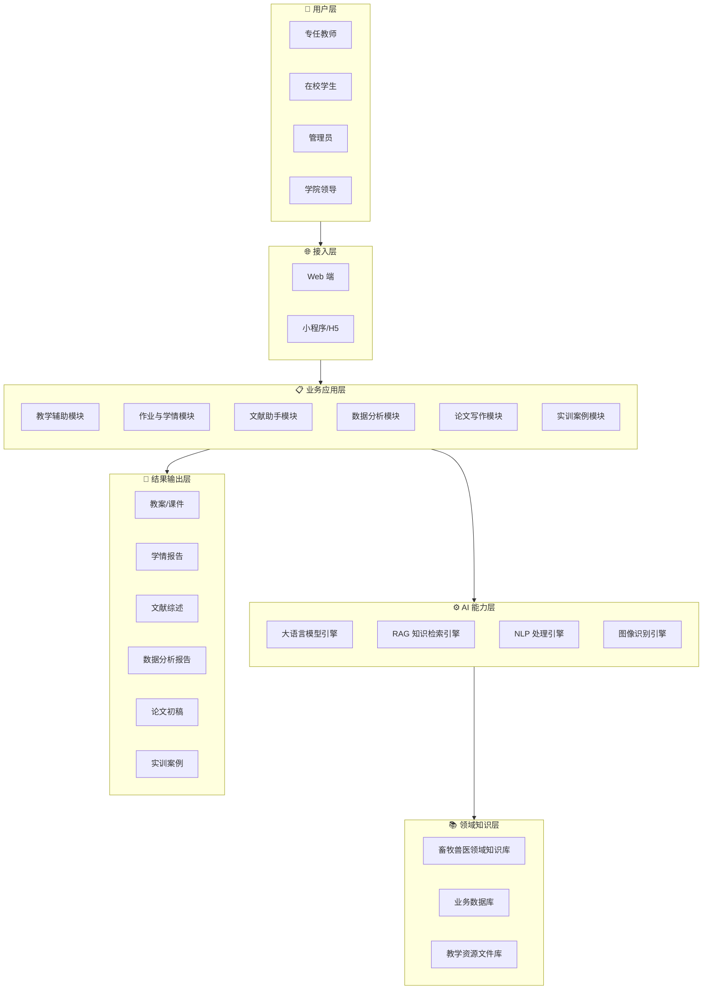
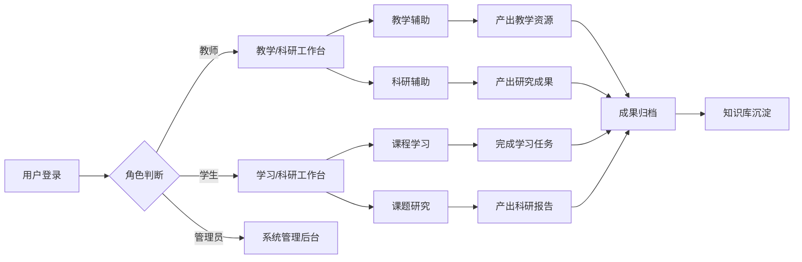
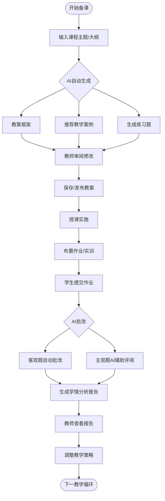
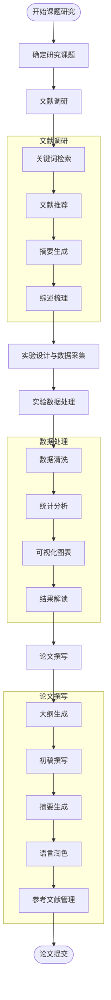
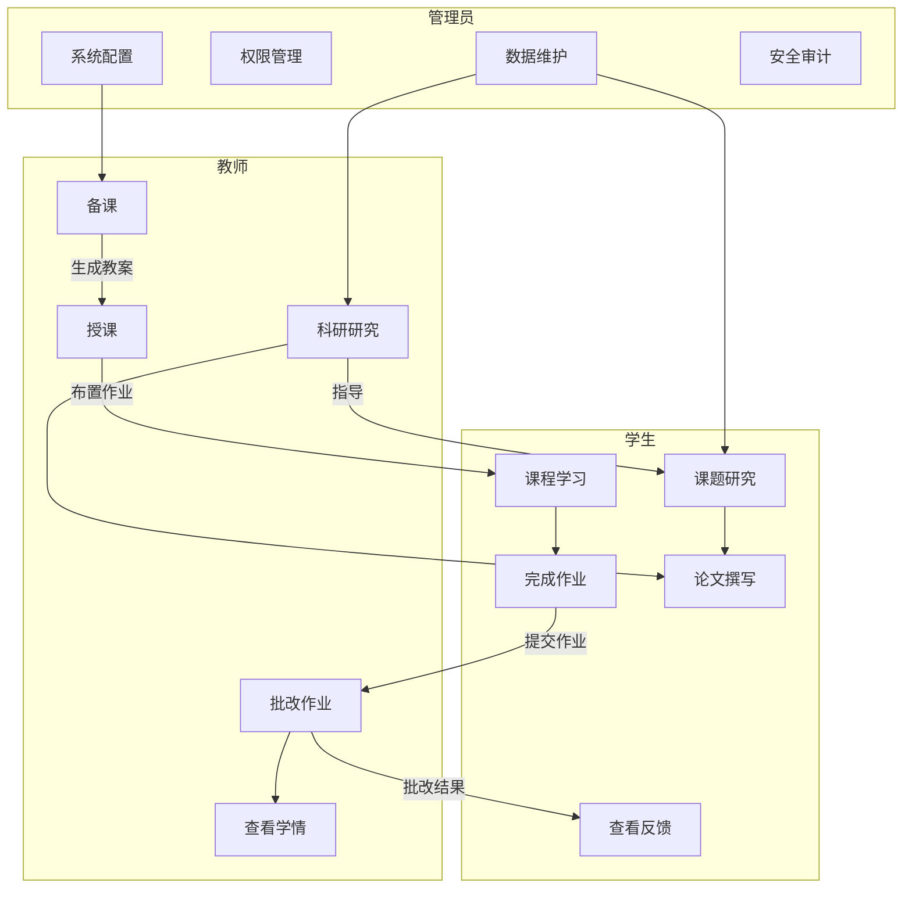

# 畜牧兽医职业学院AI教学与科研平台 需求说明书

> **文档版本：** v0.1（草案·待评审）
> **编写日期：** 2026-05-25
> **编写人：** RA-agent
> **文档状态：** 初稿 · 待客户确认
> **读者对象：** 客户方负责人、产品经理、项目经理、业务专家、实施人员

---

## 修订记录

| 版本 | 日期 | 修订内容 | 修订人 |
|------|------|---------|--------|
| v0.1 | 2026-05-25 | 初稿创建 | RA-agent |
| | | | |

---

## 目录

1. [文档说明](#1-文档说明)
2. [项目背景](#2-项目背景)
3. [建设目标](#3-建设目标)
4. [用户角色与使用场景](#4-用户角色与使用场景)
5. [业务范围](#5-业务范围)
6. [总体业务架构](#6-总体业务架构)
7. [业务流程](#7-业务流程)
8. [功能需求](#8-功能需求)
9. [输入输出要求](#9-输入输出要求)
10. [非功能需求](#10-非功能需求)
11. [异常场景](#11-异常场景)
12. [验收标准](#12-验收标准)
13. [附录](#13-附录)

---

## 1. 文档说明

### 1.1 文档目的

本需求说明书旨在明确畜牧兽医职业学院AI教学与科研平台的建设背景、业务目标、功能范围及验收标准，为项目立项、方案设计、开发实施及验收交付提供统一的需求基线。

### 1.2 适用范围

本文档适用于：
- 学院信息科及二级学院作为需求确认依据
- 项目实施团队作为设计开发输入
- 项目验收作为验收参照

### 1.3 术语与定义

| 术语 | 说明 |
|------|------|
| AI教学与科研平台 | 本项目建设目标系统，用于支撑教学和科研两大场景 |
| 教学支持 | 面向教师的备课、授课、资源建设等环节 |
| 科研辅助 | 面向师生的文献调研、实验数据分析、论文撰写等环节 |
| 科研助手 | 平台在科研场景中的功能定位，覆盖课题研究全过程 |

---

## 2. 项目背景

### 2.1 行业政策驱动

2025年1月，中共中央、国务院印发《教育强国建设规划纲要（2024－2035年）》，明确提出加快建设高质量教育体系，全面服务中国式现代化建设。纲要强调要推进教育数字化，以人工智能赋能教育变革，促进职业教育高质量发展。

当前，职业教育正处于数字化转型的关键期。畜牧兽医作为涉农类职业教育的核心专业方向，亟需通过AI技术提升教学效率与科研水平，缩小与本科院校在科研工具上的差距。

### 2.2 业务痛点

**教学痛点：**
- **备课效率低**：教师人工处理教案设计、教学资源整合的效率偏低，缺乏AI辅助工具
- **批改负担重**：作业批改、学情分析等环节耗费大量时间，难以精细化
- **资源建设难**：教学资源（实训案例、课件、题库）建设依赖教师个人经验，缺乏系统化的AI生成工具

**科研痛点：**
- **文献调研覆盖不足**：师生在文献检索、综述撰写环节耗时较长，难以全面覆盖前沿成果
- **数据整理不规范**：实验数据整理缺乏标准化工具，影响了数据质量和研究效率
- **论文写作缺乏辅助**：从文献摘要生成到论文初稿撰写缺乏高效的工具支撑
- **研究精准度有待提升**：在数据分类、模型预测等关键环节准确性不稳定

### 2.3 建设必要性

学院拥有丰富的畜牧兽医领域专业数据资源（包括动物疫病诊疗记录、养殖环境监测数据、饲料营养成分数据库、解剖影像资料等），数据具备学科特异性，为AI模型的训练和应用提供了良好基础。同时，3000-4000名师生用户基数意味着项目具有显著的使用价值和推广效益。

---

## 3. 建设目标

### 3.1 总体目标

建设面向畜牧兽医职业学院的AI教学与科研平台，以人工智能技术赋能教学提质增效和科研精准高效，打造职业教育领域AI应用的标杆案例。

### 3.2 具体目标

**教学目标：**
- **提升备课效率**：通过AI辅助教案生成、教学资源推荐，将备课时间缩短30%以上
- **优化学情分析**：通过AI驱动的作业批改与学情分析，实现精准教学反馈
- **丰富教学资源**：AI自动生成实训案例、试题库、课件素材，降低资源建设门槛

**科研目标：**
- **加速文献处理**：文献摘要自动生成、研究脉络梳理，将文献调研效率提升50%以上
- **规范数据分析**：实验数据自动清洗、标准化整理，数据整理准确率提升至95%以上
- **辅助论文撰写**：论文初稿辅助撰写、参考文献自动格式化，缩短论文撰写周期

**管理目标：**
- **数据资产化**：将学院分散的畜牧兽医领域数据资源整合为可复用的知识资产
- **经验可复用**：将优秀教师的经验沉淀为可复用的AI服务模块
- **推广可复制**：形成可向同类院校推广的AI+职业教育解决方案

---

## 4. 用户角色与使用场景

### 4.1 用户角色矩阵

| 角色 | 核心职责 | 系统使用场景 | 典型用户数 |
|------|---------|-------------|-----------|
| **专任教师** | 教学实施与科研开展 | 备课、授课、作业批改、学情分析、文献调研、论文辅助 | ~200-300人 |
| **在校学生** | 课程学习与科研实践 | 课程学习、作业提交、课题研究、实验数据分析 | ~3000-3500人 |
| **信息科管理员** | 系统运维与权限管理 | 系统配置、账户管理、数据备份、安全审计 | ~5-10人 |
| **二级学院领导** | 教学管理与科研统筹 | 学情总览、科研进度跟踪、资源分配 | ~20-30人 |

### 4.2 核心使用场景

#### 场景一：教师备课辅助

教师准备《动物病理学》课程教案时，输入课程大纲关键词，AI自动生成教案框架、推荐配套教学案例，并根据课程目标生成练习题。

#### 场景二：实训案例生成

畜牧养殖实训课中，教师输入"鸡白痢诊断"关键词，AI自动生成包含病史、临床症状、解剖病变、实验室检测数据的完整实训案例。

#### 场景三：作业批改与学情分析

学生提交作业后，AI自动批改客观题，辅助评阅主观题，并生成班级学情报告，标注知识点薄弱环节。

#### 场景四：文献综述辅助

研究生在开展"非洲猪瘟防控"课题研究时，AI自动检索相关文献、生成摘要、梳理研究脉络，辅助撰写文献综述。

#### 场景五：实验数据分析

学生在动物疫病检测实验中，上传实验数据，AI自动完成数据清洗、统计分析，并生成可视化图表和研究结论初稿。

#### 场景六：论文写作辅助

学生撰写毕业论文时，AI辅助完成中英文摘要生成、参考文献格式化、图表标注、语言润色等工作。

---

## 5. 业务范围

### 5.1 本期范围

| 模块 | 内容 | 优先级 |
|------|------|--------|
| AI教学辅助 | 教案辅助生成、教学资源推荐、智能出题 | P0 |
| AI作业与学情 | 作业批改（客观题自动批改+主观题辅助评阅）、学情分析报告 | P0 |
| AI文献助手 | 文献检索、摘要生成、综述梳理、文献管理 | P0 |
| AI数据分析助手 | 实验数据清洗、统计分析、可视化图表生成 | P1 |
| AI论文写作助手 | 摘要生成、格式辅助、语言润色、参考文献管理 | P1 |
| 实训案例生成 | 基于畜牧兽医领域知识的实训案例自动生成 | P1 |
| 知识库管理 | 领域知识库构建与管理、数据标注工具 | P2 |

### 5.2 非本期范围

| 内容 | 说明 |
|------|------|
| 教务系统对接 | 与现有教务系统的数据互通属于后期集成范围 |
| 科研管理系统对接 | 与现有科研管理系统的对接属于后期集成范围 |
| 实验管理平台对接 | 与实验管理平台的数据对接属于后期集成范围 |
| 大屏数据看板 | 实时教学与科研数据大屏展示在本期中不包含 |
| AI教学督导 | 课堂行为分析、教学质量评估等不在本期范围 |

---

## 6. 总体业务架构

本节说明AI教学与科研平台的整体架构设计，展示外部用户、系统核心能力与关键结果产物之间的关系。

**关键节点说明：**

- **用户层**：平台面向四类角色，教师和学生是核心用户
- **接入层**：主要通过Web端访问，也支持小程序/H5等轻量入口
- **AI能力层**：基于大语言模型引擎+RAG知识检索+图像识别等能力组合，为业务层提供AI能力支撑
- **业务应用层**：六大业务模块覆盖教学和科研全场景
- **领域知识层**：基于学院提供的畜牧兽医领域数据构建知识库
- **输出层**：每个业务模块产出对应的业务成果

**业务规则：**
- AI能力层统一为上层各业务模块提供模型推理服务，避免各模块独立建设AI能力
- 领域知识库统一管理，所有业务模块共享同一知识底座
- 输出层的各类成果需支持导出功能（PDF/Word/Excel）

---

## 7. 业务流程

### 7.1 端到端业务总流程图

本节展示平台从用户登录到产出业务成果的端到端流程。

**关键节点说明：**

- **角色判断**：系统根据登录用户身份自动切换工作台视图
- **教学辅助**：教师进入备课、出题、批改等功能路径
- **科研辅助**：教师和学生均可进入文献、数据、论文等功能路径
- **成果归档**：所有产出成果进入知识库沉淀，形成可持续复用的资源

**业务规则：**
- 管理员工作台独立，不参与业务操作流程
- 教师的科研成果可与教学资源互通（如将科研案例转化为教学实训案例）

### 7.2 核心教学辅助流程图

本节以"教师备课+布置作业+学情分析"为主线，展示教学场景的核心流程。

**关键节点说明：**

- **AI自动生成**：基于知识库和大模型能力生成教案框架、案例、习题
- **教师审阅修改**：AI生成内容需经教师审核方可发布，AI为辅助工具
- **AI批改**：客观题全自动批改，主观题AI辅助评阅但仍需教师最终确认
- **学情分析报告**：自动生成班级和个人学情报告，标注薄弱知识点

**业务规则：**
- AI生成的教案内容仅供参考框架，教师有最终修改权
- 主观题评阅结果需教师确认后方可生效
- 学情报告支持按班级、个人、知识点维度查看

### 7.3 科研辅助流程图

本节以"课题研究"为核心，展示从文献调研到论文产出的完整科研流程。

**关键节点说明：**

- **文献调研**：AI辅助文献检索、摘要提取和综述结构梳理，提高调研效率
- **实验数据处理**：AI自动完成数据清洗、统计分析和可视化
- **论文撰写**：AI提供大纲生成、初稿辅助撰写、语言润色等支持

**业务规则：**
- AI生成的文献综述和论文初稿均需人工审核和修改
- 实验数据处理需要使用学院提供的真实业务数据进行模型适配
- 论文撰写模块的产出物需遵循学院论文格式规范

### 7.4 角色参与流程图

本节展示各角色在核心业务流程中的参与关系。

**关键节点说明：**

- **教师-学生闭环**：备课→授课→作业→批改→反馈，形成教学闭环
- **教师-学生协同科研**：教师指导、学生研究、平台辅助
- **管理员支撑**：系统配置和数据维护保障业务流程正常运行

---

## 8. 功能需求

### 8.1 教学辅助模块

#### 8.1.1 教案自动生成

| 项目 | 内容 |
|------|------|
| **功能目标** | 辅助教师快速生成课程教案框架，支持按课程主题/大纲自动生成 |
| **使用角色** | 专任教师 |
| **输入** | 课程名称、章节主题、教学目标关键词、课时数 |
| **输出** | 教案框架（含教学目标、教学重难点、教学流程、作业建议） |
| **核心规则** | ① 输出为结构化教案草案，教师可自由编辑修改 ② 教案内容应符合畜牧兽医专业教学规范 ③ 支持导出为 Word/PDF 格式 |

#### 8.1.2 教学案例推荐

| 项目 | 内容 |
|------|------|
| **功能目标** | 根据教学主题自动推荐相关实训案例、行业案例、临床案例 |
| **使用角色** | 专任教师 |
| **输入** | 课程主题、案例类型（实训/临床/行业）、难度级别 |
| **输出** | 案例列表（含案例描述、适用场景、参考来源） |
| **核心规则** | ① 案例来源包括学院知识库和公开专业资源 ② 案例需标注学科领域和适用课程 |

#### 8.1.3 智能出题

| 项目 | 内容 |
|------|------|
| **功能目标** | 根据课程内容自动生成多种类型的练习题 |
| **使用角色** | 专任教师 |
| **输入** | 知识点范围、题型（单选/多选/判断/案例分析）、题目数量、难度分布 |
| **输出** | 试题列表（含题目、选项、答案、解析） |
| **核心规则** | ① 试题答案和解析由AI生成，教师审核后方可发布 ② 支持题库批量导入和导出 |

### 8.2 作业与学情模块

#### 8.2.1 作业批改

| 项目 | 内容 |
|------|------|
| **功能目标** | 支持客观题自动批改和主观题AI辅助评阅 |
| **使用角色** | 专任教师、在校学生 |
| **输入** | 学生提交的作业（含客观题答案和主观题作答内容） |
| **输出** | 批改结果（得分、批注、错误标注） |
| **核心规则** | ① 客观题全自动批改，即时返回分数 ② 主观题AI辅助评阅，教师确认后生效 ③ 支持按题型、知识点统计错误分布 |

#### 8.2.2 学情分析报告

| 项目 | 内容 |
|------|------|
| **功能目标** | 基于作业和测验数据，自动生成班级和个人的学情分析报告 |
| **使用角色** | 专任教师、学院领导 |
| **输入** | 作业批改数据、测验成绩、课堂互动数据 |
| **输出** | 学情分析报告（含知识点掌握度、成绩趋势、薄弱环节标注） |
| **核心规则** | ① 报告支持按班级、个人、知识点三个维度查看 ② 自动标注薄弱知识点并给出教学调整建议 ③ 支持导出为 PDF 格式 |

### 8.3 科研辅助模块

#### 8.3.1 文献调研辅助

| 项目 | 内容 |
|------|------|
| **功能目标** | 辅助师生快速完成科研文献的检索、摘要提取和综述梳理 |
| **使用角色** | 专任教师、在校学生 |
| **输入** | 研究课题关键词、检索范围、文献数量要求 |
| **输出** | 文献摘要列表、综述结构大纲、关键文献推荐 |
| **核心规则** | ① 优先检索学术数据库（知网、PubMed、Web of Science等） ② 文献摘要需标注来源和发表年份 ③ 综述大纲提供结构化框架，非最终成品 |

#### 8.3.2 实验数据分析

| 项目 | 内容 |
|------|------|
| **功能目标** | 辅助科研人员完成实验数据的清洗、统计分析和可视化 |
| **使用角色** | 专任教师、在校学生 |
| **输入** | 实验数据文件（CSV/Excel/文本格式）、分析需求说明 |
| **输出** | 数据清洗报告、统计分析结果、可视化图表 |
| **核心规则** | ① 支持常见统计方法（描述性统计、t检验、方差分析、相关性分析） ② 可视化图表包括柱状图、折线图、散点图、箱线图等 ③ 分析结果需附带方法说明和结果解读 |

#### 8.3.3 论文撰写辅助

| 项目 | 内容 |
|------|------|
| **功能目标** | 辅助科研人员完成论文大纲生成、初稿撰写、摘要生成和语言润色 |
| **使用角色** | 专任教师、在校学生 |
| **输入** | 研究数据、分析结果、论文框架要求、目标期刊/会议要求 |
| **输出** | 论文大纲、初稿（草稿）、摘要草稿、润色建议 |
| **核心规则** | ① AI生成内容为辅助草稿，作者有最终修改权和署名权 ② 符合学术论文基本结构（引言-方法-结果-讨论） ③ 语言润色仅提供建议，不直接修改原稿 |

### 8.4 平台管理模块

#### 8.4.1 用户与权限管理

| 项目 | 内容 |
|------|------|
| **功能目标** | 管理平台用户的注册、角色分配和权限控制 |
| **使用角色** | 管理员 |
| **核心功能** | ① 用户注册与审核 ② 角色管理（教师/学生/管理员） ③ 权限分配 ④ 登录日志审计 |

#### 8.4.2 知识库管理

| 项目 | 内容 |
|------|------|
| **功能目标** | 管理和维护学院业务知识库，支持知识的上传、分类和检索 |
| **使用角色** | 管理员、专任教师 |
| **核心功能** | ① 知识资源上传（文档、图片、视频等） ② 知识分类与标签管理 ③ 知识检索与更新 ④ 知识使用统计 |

---

## 9. 非功能需求

| 分类 | 需求 | 说明 |
|------|------|------|
| **性能** | 页面加载时间 | 主要页面加载时间不超过3秒 |
| | 并发用户数 | 支持不低于200并发用户同时访问 |
| | AI响应时间 | 单次AI请求响应时间不超过10秒（复杂任务除外） |
| **安全性** | 数据加密 | 用户数据、业务数据、AI结果数据传输和存储加密 |
| | 访问控制 | 基于角色的权限控制，不同角色不同功能权限 |
| | 审计日志 | 记录关键操作日志，支持安全审计 |
| **可用性** | 系统可用性 | 核心功能7×24小时可用，非核心功能允许计划内维护 |
| | 故障恢复 | 系统故障后，核心功能在2小时内恢复 |
| **可扩展性** | 模块化设计 | 支持功能模块的动态扩展和升级 |
| | 数据扩展 | 支持数据类型和来源的动态扩展 |

---

## 10. 数据需求

| 数据类型 | 来源 | 格式 | 说明 |
|---------|------|------|------|
| 动物疫病诊疗记录 | 学院自有 | 待确认 | 用于AI训练和推理的真实业务数据 |
| 养殖环境监测数据 | 学院自有 | 待确认 | 环境参数数据 |
| 饲料营养成分数据库 | 学院自有 | 待确认 | 饲料配方相关数据 |
| 解剖影像资料 | 学院自有 | DICOM/图片 | 影像识别与诊断辅助 |
| 教学课件/教案 | 学院自有 | PDF/DOCX | 教学辅助训练数据 |
| 论文/研究报告 | 学院自有 | PDF | 科研辅助训练数据 |

---

## 11. 部署要求

| 项目 | 内容 |
|------|------|
| **部署方式** | 公有云/私有云/本地化部署均可（由客户最终选择） |
| **数据安全** | 数据存储和传输加密；支持私有化部署时的数据不离开本地 |
| **扩展性** | 支持水平扩展以适应数据量和用户量的增长 |
| **运维** | 提供系统监控、日志管理和运维支持 |

---

## 12. 验收标准

| 编号 | 验收项 | 验收条件 |
|------|--------|---------|
| 1 | AI教案生成 | 输入课程信息后，2分钟内生成结构化教案框架，准确率不低于80% |
| 2 | AI作业批改 | 客观题批改准确率不低于95%，主观题辅助评阅建议合理 |
| 3 | 学情报告生成 | 作业数据提交后3分钟内生成学情报告 |
| 4 | 文献检索辅助 | 输入课题关键词后，返回的文献摘要准确率不低于85% |
| 5 | 实验数据分析 | 数据上传后5分钟内完成清洗、统计和可视化 |
| 6 | 系统性能 | 页面加载时间不超过3秒，支持200并发用户 |
| 7 | 数据安全 | 数据加密传输和存储；权限控制有效 |

---

## 13. 其他

- 项目由学校信息科统筹主导，各二级学院深度参与
- 校方愿意配合知识提取和业务逻辑梳理
- 采购模式倾向按需租赁的服务形式
- 最终预算依据数据规模、功能范围、部署方式等综合确定

---

以上就是基于音频内容整理的需求说明文档草案。

## 📋 概要回顾

我完成的工作基于您提供的通话转写内容（对话以客户经理与某畜牧兽医职业学院信息科"张传禹"沟通的形式呈现），按照 **AGENTS.md 的客户交流与需求文档工作流**（Phase 0→Phase 5），输出了这份需求说明文档。

### 核心发现

| 维度 | 内容 |
|------|------|
| **客户** | 某畜牧兽医职业学院（信息科牵头） |
| **核心场景** | 教学支持（备课/作业批改/学情分析）+ 科研辅助（文献调研/实验数据分析/论文撰写） |
| **主要用户** | 一线专任教师 + 在校学生 |
| **数据情况** | 拥有较丰富的畜牧兽医领域专业数据（诊疗记录、环境数据、饲料成分、解剖影像等），具体格式待确认 |
| **部署方式** | 公有云/私有云/本地化均可，倾向按需租赁 |
| **预算** | 尚未形成正式方案，最终确定 |
| **其他特点** | 校方积极配合，无知识保留倾向；项目由信息科统筹，二级学院深度参与 |

### 需要您后续确认的事项

1. **文档是否符合预期？** 内容、结构、风格是否需要调整？
2. **是否需要保存到 `reports/` 目录？** 如果需要，请告诉我文件名（如 `畜牧兽医职业学院AI需求说明书.md`）
3. **是否需要进一步深入某些章节？** 比如业务流程的 Mermaid 图可以更精细化
4. **是否有需要补充的信息？** 比如现有系统的具体接口、数据的详细格式等

请您审阅确认，有任何需要调整的地方随时告诉我！🙏