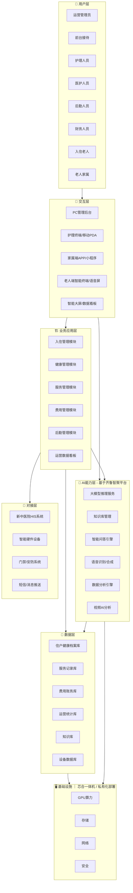
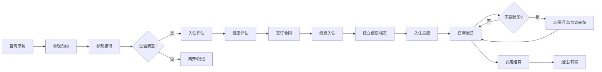
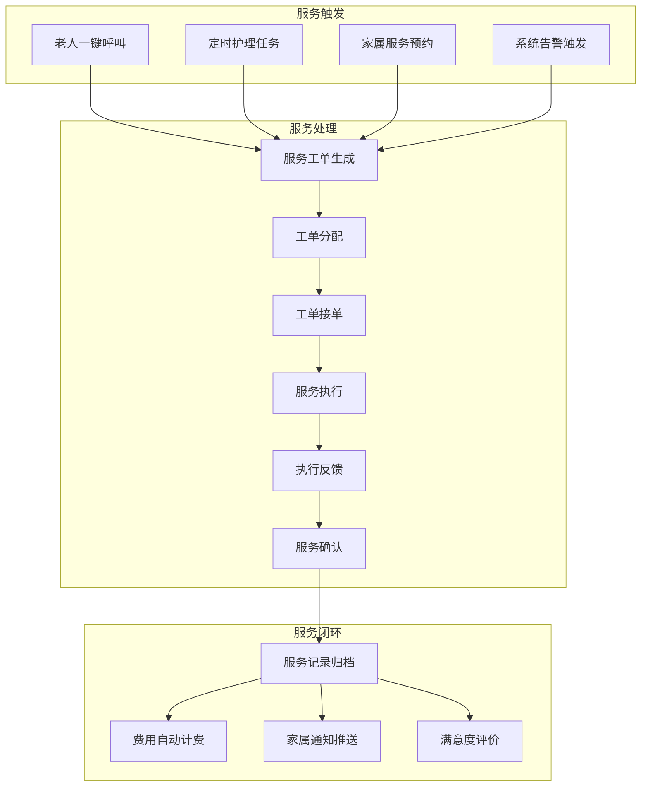
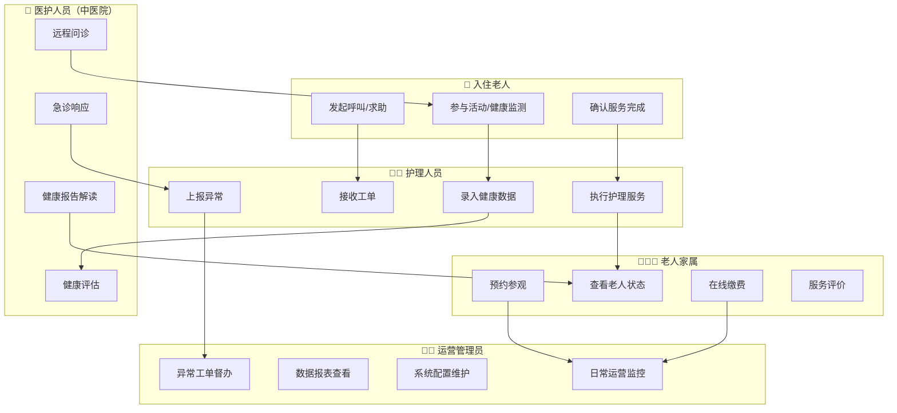
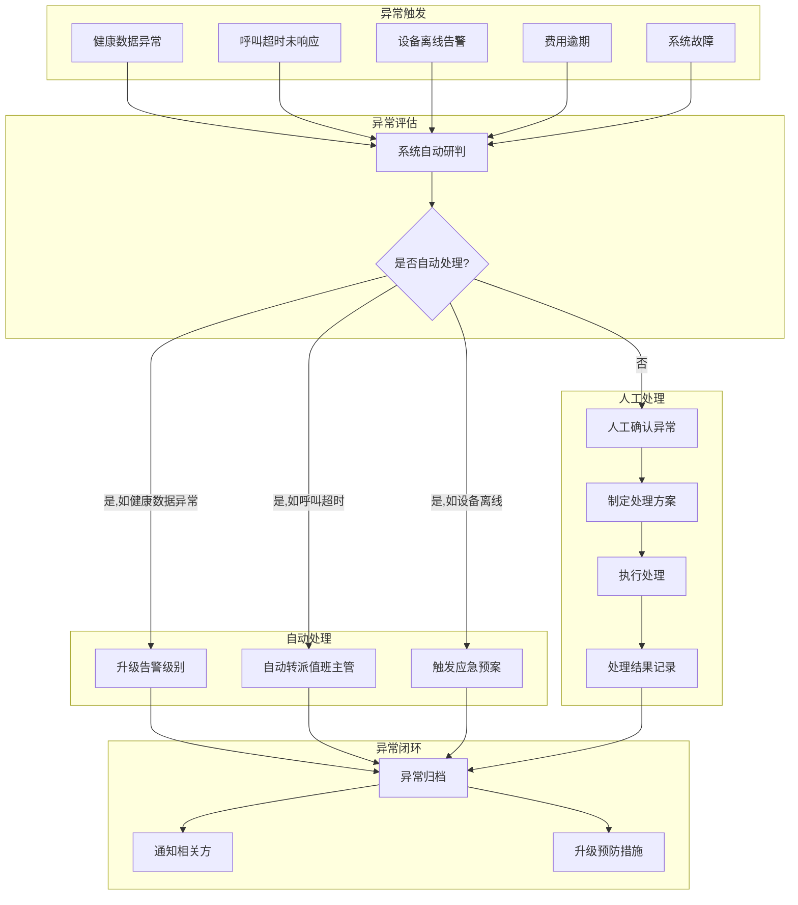

# 莒县公交集团康养示范区 · 智慧康养平台
## 产品需求说明书（PRD）

| 文档信息 | |
|---------|------|
| 文档名称 | 莒县公交集团康养示范区智慧康养平台产品需求说明书 |
| 版 本 号 | V1.0 |
| 编写日期 | 2026-05-26 |
| 编 写 人 | RA-agent |
| 文档性质 | 面向开发团队的正式产品需求文档 |

---

### 修订记录

| 版本 | 日期 | 修订内容 | 修订人 |
|------|------|---------|--------|
| V1.0 | 2026-05-26 | 初稿 | RA-agent |

---

## 1. 项目背景

### 1.1 建设背景

莒县公交集团康养示范区是县政府主导、国企建设、医养一体、智慧赋能的重点民生工程，总投资 **1.5亿元**，与**新中医院一体规划**。项目定位为"高端养老 + 专业护理 + 日间照料 + 智慧康养平台"四位一体的综合性康养社区。

当前老龄化趋势加剧，县域养老服务体系存在以下痛点：

- **信息孤岛严重**：养老、护理、医疗、后勤各系统各自独立，数据不通
- **管理效率低**：入住登记、健康档案、护理排班、收费结算等依赖纸质或Excel，人工成本高
- **服务质量难追踪**：对老人的健康状态、护理过程、服务响应缺乏数字化记录和追溯
- **家属沟通被动**：家属无法实时了解老人状态，沟通依赖电话，体验差
- **医疗对接缺失**：虽有新中医院相邻，但医疗数据无法实时共享，医养协同效率低

### 1.2 建设目标

通过建设智慧康养平台，实现以下目标：

| 目标维度 | 具体目标 |
|---------|---------|
| 🎯 **运营数字化** | 建立统一的数字化管理平台，覆盖从接待咨询、入住登记、服务执行到费用结算的全流程管理 |
| 🏥 **医养一体化** | 打通与新中医院的数据对接，实现健康档案共享、远程问诊、急诊绿色通道 |
| 👴 **服务智慧化** | 通过AI能力赋能养老场景：智能健康监测、异常预警、语音助手、情感陪伴 |
| 👨‍👩‍👧 **家属透明化** | 家属端可实时查看老人状态、服务记录、健康报告，提升信任感 |
| 📊 **决策数据化** | 通过数据看板、运营报表辅助管理层实时掌握运营状况，支撑精准决策 |

---

## 2. 用户角色与使用场景

### 2.1 角色定义

| 角色 | 描述 | 核心操作 |
|------|------|---------|
| **运营管理员** | 平台整体运营管理者 | 系统配置、权限管理、数据看板、运营报表 |
| **前台接待** | 负责来访接待、参观引导、入住办理 | 来访登记、参观预约、入住签约、合同管理 |
| **护理人员** | 一线护理员、护士 | 健康档案录入、护理任务执行、服务记录、异常上报 |
| **医护人员** | 新中医院接入的医生、护士 | 远程问诊、健康评估、医嘱下达、急诊响应 |
| **后勤人员** | 餐饮、保洁、维修、安保 | 食堂排餐、工单处理、巡检打卡 |
| **财务人员** | 负责收费、结算 | 费用核算、账单生成、收费确认、退费处理 |
| **入住老人** | 康养示范区的居民 | 一键呼叫、服务预约、活动报名、语音交互 |
| **老人家属** | 入住老人的子女、亲属 | 查看老人状态、接收通知、在线缴费、远程探视 |
| **系统管理员** | 技术支持人员 | 系统运维、数据备份、日志审计 |

---

## 3. 业务范围

### 3.1 本期建设范围

- **智慧康养管理平台**（运营侧）：入住管理、服务管理、健康管理、费用管理、后勤管理、数据看板
- **智慧康养服务平台**（住户/家属侧）：智能终端交互、家属APP/小程序、语音助手、健康监测
- **智慧康养AI中台**：AI能力底座（大模型推理、知识库、智能问答、数据分析）
- **医养数据对接**：与新中医院HIS系统对接，实现健康档案、远程问诊、急诊协同

### 3.2 非本期范围

- 新中医院内部HIS/EMR系统改造（仅对接，不改造）
- 智能硬件设备（穿戴设备、传感器、智能家居）采购与集成（平台提供接口）
- 建筑施工与硬件装修

---

## 4. 总体业务架构

本节说明智慧康养平台的总体架构，呈现系统层次、核心组件与外部关系。

### 关键组件说明

- **交互层**：提供多端入口，PC管理后台面向运营管理侧，移动端面向一线护理人员，家属端和老人端面向终端用户
- **业务应用层**：覆盖康养社区运营全链路功能模块
- **AI能力层**：基于**中移齐鲁创新院「齐鲁智聚平台」** 构建，提供大模型推理、知识库、智能问答、语音、数据分析等AI能力
- **数据层**：统一数据存储，包含住户健康档案、服务记录、费用账务等核心数据
- **对接层**：与新中医院HIS系统、智能硬件设备等外部系统实现数据互通
- **基础设施**：采用**芯合一体机**私有化部署，满足信创合规和本地化数据安全要求

---

## 5. 业务流程

### 5.1 端到端业务流程图

本节展示从客户咨询到入住运营的完整业务闭环。

**关键节点说明：**

| 节点 | 说明 |
|------|------|
| 入住评估 | 评估老人护理等级，匹配对应房型和护理方案 |
| 健康评估 | 由医护人员进行首次全面体检，录入系统形成健康基线 |
| 入住适应 | 帮助老人适应环境，系统记录适应期内观察数据 |
| 日常运营 | 包含日常护理、餐饮、活动、巡检等常态化服务 |
| 远程问诊/急诊转院 | 通过与新中医院对接，实现线上问诊和急诊绿色通道 |

**业务规则：**

- 入住前必须完成健康评估和合同签订
- 护理等级评估由医护人员完成，系统记录评估结果并自动匹配护理方案
- 费用按月结算，系统自动生成账单
- 健康档案从入住建立持续到退住，数据永久保存

---

### 5.2 核心服务主流程图

本节展示智慧康养平台的核心业务——日常服务流转流程。

**关键节点说明：**

| 节点 | 说明 |
|------|------|
| 服务工单生成 | 系统根据触发源自动生成服务工单，包含服务类型、紧急程度、关联老人信息 |
| 工单分配 | 系统根据护理人员排班和实时位置智能分配工单 |
| 服务执行 | 护理人员在PDA上查看工单详情，到达现场执行服务并记录 |
| 服务确认 | 服务完成后需老人或系统确认（一键呼叫类自动确认） |

**业务规则：**

- 紧急呼叫工单必须在30秒内分配给最近值班人员
- 定时护理任务由系统定时触发自动生成工单
- 所有服务必须有操作时间戳和操作人记录
- 服务完成后自动触发费用计费和家属通知

---

### 5.3 角色参与流程图

本节展示不同角色在核心业务流程中的参与关系和职责边界。

**关键角色协作说明：**

- **老人 ↔ 护理人员**：老人通过智能终端发起服务请求，护理人员通过PDA接收和执行任务
- **护理人员 ↔ 医护人员**：护理人员录入的健康数据作为医护人员的评估依据，医护人员可通过远程问诊介入
- **医护人员 ↔ 家属**：健康报告通过系统自动推送给家属，减少人工沟通成本
- **运营管理员**：作为监督和管理者，通过数据看板掌握整体运营情况

---

### 5.4 异常处理流程图

本节展示系统运行过程中可能出现的异常场景及处理流程。

**关键异常场景说明：**

| 异常类型 | 触发条件 | 处理方式 | 用户可见反馈 |
|---------|---------|---------|------------|
| 健康数据异常 | 老人心率/血压等指标超出阈值 | 自动升级告警，通知值班医护人员 | 护理终端弹窗告警 |
| 呼叫超时未响应 | 呼叫工单30秒内无人接单 | 自动转派主管，系统记录超时 | 老人终端显示"已转派" |
| 设备离线 | 智能设备超过15分钟未上报 | 触发工单通知后勤维修 | 运维后台显示设备状态 |
| 费用逾期 | 账单到期7日未支付 | 系统发送提醒，15日未支付通知管理员 | 家属APP推送通知 |
| 系统故障 | 关键服务不可用 | 触发容灾切换，通知运维 | 用户界面显示"系统维护中" |

---

## 6. 功能需求

### 6.1 入住管理模块

**功能目标：** 覆盖从咨询来访到入住签约的全流程管理，实现客户全生命周期数字化跟踪。

**使用角色：** 前台接待、运营管理员

**输入：** 客户来访信息、参观记录、健康评估报告、合同信息

**输出：** 入住合同、健康档案初始数据、房间分配记录

**核心功能列表：**

| 功能编号 | 功能名称 | 说明 | 基于产品 |
|---------|---------|------|---------|
| FM-01 | 来访登记 | 记录来访客户基本信息、来访目的、意向户型 | — |
| FM-02 | 参观预约管理 | 预约时间安排、接待人员指派、预约提醒 | — |
| FM-03 | 参观接待记录 | 记录参观过程中的关注点、意向反馈 | — |
| FM-04 | 入住评估管理 | 护理等级评估、房间类型推荐、费用预估 | — |
| FM-05 | 合同管理 | 合同模板维护、合同签订、电子签章、合同归档 | — |
| FM-06 | 入住办理 | 房间分配、入住时间登记、入住须知确认 | — |
| FM-07 | 退住管理 | 退住申请、费用清算、房间退房、退住归档 | — |
| FM-08 | 客户线索管理 | 未成交客户跟进、回访计划、转化分析 | **基于齐鲁智聚平台**（数据分析引擎） |

**业务规则：**

- 入住前必须完成健康评估（由中医院医护人员完成）
- 合同签订后系统自动生成房间分配和初始健康档案
- 退住须完成费用清算，欠费不可办理退住

---

### 6.2 健康管理模块

**功能目标：** 建立全生命周期健康档案，实现健康数据的采集、分析、预警和共享。

**使用角色：** 护理人员、医护人员（中医院）、运营管理员

**输入：** 健康档案数据、日常监测数据、问诊记录、医嘱信息

**输出：** 健康报告、预警通知、健康趋势分析

**核心功能列表：**

| 功能编号 | 功能名称 | 说明 | 基于产品 |
|---------|---------|------|---------|
| HM-01 | 健康档案管理 | 基本信息、既往病史、过敏史、用药记录等 | — |
| HM-02 | 日常健康监测 | 对接智能穿戴设备，自动采集心率、血压、血氧等 | — |
| HM-03 | 健康数据录入 | 护理人员手动录入体温、体重、血糖等数据 | — |
| HM-04 | 健康数据看板 | 可视化展示老人健康趋势，支持多维度筛选 | **基于齐鲁智聚平台**（数据分析引擎） |
| HM-05 | 异常预警 | 设定健康阈值，数据异常自动告警（AI研判） | **基于齐鲁智聚平台**（大模型推理） |
| HM-06 | 健康报告生成 | 按周/月/季度自动生成健康报告 | **基于齐鲁智聚平台**（知识库+AI报告） |
| HM-07 | 用药管理 | 用药方案录入、按时提醒、用药记录 | — |
| HM-08 | 医疗对接 | 与新中医院HIS系统共享健康档案 | — |
| HM-09 | 远程问诊 | 老人通过终端与中医院医生视频问诊 | **基于齐鲁智多星**（AI应用门户） |

**业务规则：**

- 健康档案数据永久保存，退住后归档
- 异常预警触发后需医护人员24小时内确认处理
- 健康报告自动推送给家属

---

### 6.3 服务管理模块

**功能目标：** 实现护理服务的全流程数字化管理，从服务触发、工单派发到执行反馈闭环。

**使用角色：** 护理人员、运营管理员、入住老人、老人家属

**输入：** 服务请求（呼叫/预约/定时任务）、护理方案

**输出：** 服务工单、执行记录、服务报告

**核心功能列表：**

| 功能编号 | 功能名称 | 说明 | 基于产品 |
|---------|---------|------|---------|
| SM-01 | 护理方案管理 | 按护理等级配置基础护理计划 | — |
| SM-02 | 服务工单管理 | 工单生成、分配、接单、执行、确认全流程 | — |
| SM-03 | 一键呼叫响应 | 老人终端呼叫 → 系统自动分配最近护理员 | **基于齐鲁智多星**（工作流编排） |
| SM-04 | 服务预约管理 | 家属或老人通过终端预约服务 | — |
| SM-05 | 定时任务管理 | 系统定时触发的护理、巡检、送餐等任务 | — |
| SM-06 | 服务记录查询 | 按老人、日期、服务类型查看历史服务记录 | — |
| SM-07 | 服务质量评价 | 老人/家属对服务的满意度评价 | — |

**业务规则：**

- 紧急呼叫工单30秒内无人接单自动转派主管
- 所有服务必须有操作时间戳和操作人记录
- 服务完成后自动计费并通知家属

---

### 6.4 费用管理模块

**功能目标：** 实现费用配置、计费、账单、收费的全链路管理。

**使用角色：** 财务人员、运营管理员、老人家属

**输入：** 费用配置规则、服务执行记录、入住信息

**输出：** 账单、缴费记录、财务统计报表

**核心功能列表：**

| 功能编号 | 功能名称 | 说明 |
|---------|---------|------|
| CM-01 | 收费标准配置 | 房间费、护理费、餐费、杂费等标准配置 |
| CM-02 | 费用自动计费 | 根据入住时长、服务记录、消费记录自动生成账单 |
| CM-03 | 账单管理 | 月度账单生成、账单查看、账单推送 |
| CM-04 | 在线缴费 | 家属APP/小程序在线支付（微信/支付宝/银行卡） |
| CM-05 | 线下收费确认 | 前台现金/刷卡收费录入确认 |
| CM-06 | 退费管理 | 退住费用清算、预付款退还 |
| CM-07 | 财务统计报表 | 收入统计、欠费统计、财务分析 |

**业务规则：**

- 账单每月1日自动生成，推送至家属端
- 缴费截止日为每月15日，逾期自动催缴
- 欠费超过30天系统锁定部分服务

---

### 6.5 后勤管理模块

**功能目标：** 支撑餐饮、保洁、维修、安保等后勤服务的高效管理。

**使用角色：** 后勤人员、运营管理员

**输入：** 工单请求、巡检计划、设备信息

**输出：** 工单执行记录、巡检报告、设备状态

**核心功能列表：**

| 功能编号 | 功能名称 | 说明 |
|---------|---------|------|
| LM-01 | 食堂管理 | 排餐计划、菜品管理、食谱推送 |
| LM-02 | 维修工单管理 | 报修申请、工单派发、维修反馈 |
| LM-03 | 保洁管理 | 保洁排班、保洁记录、巡检 |
| LM-04 | 巡检管理 | 安全巡检、设备巡检、巡检打卡 |
| LM-05 | 物资管理 | 物资入库、领用、盘点 |

---

### 6.6 运营数据看板模块

**功能目标：** 为管理层提供全局运营数据的可视化展示，支撑数据化决策。

**使用角色：** 运营管理员、高层管理者

**输入：** 各业务模块数据聚合

**输出：** 运营数据看板、统计分析报表

**核心功能列表：**

| 功能编号 | 功能名称 | 说明 | 基于产品 |
|---------|---------|------|---------|
| OD-01 | 入住概况看板 | 入住率、房间状态、老人分布 | **基于齐鲁智聚平台**（数据分析引擎） |
| OD-02 | 服务运营看板 | 工单量、响应时长、满意度统计 | **基于齐鲁智聚平台**（数据分析引擎） |
| OD-03 | 健康态势看板 | 健康异常占比、慢病分布、预警统计 | **基于齐鲁智聚平台**（数据分析引擎） |
| OD-04 | 财务看板 | 收入趋势、欠费统计、现金流 | **基于齐鲁智聚平台**（数据分析引擎） |
| OD-05 | 智能分析报表 | AI辅助的运营分析和趋势预测 | **基于齐鲁智聚平台**（大模型推理） |
| OD-06 | 大屏展示 | 园区数据大屏，用于展示和汇报 | — |

---

### 6.7 AI智能应用模块

**功能目标：** 利用大模型、知识库、语音等AI能力，提升服务效率和用户体验。

**使用角色：** 入住老人、护理人员、运营管理员

**输入：** 用户语音/文字输入、知识库数据、业务数据

**输出：** 智能问答、语音交互、智能推荐、数据分析

**核心功能列表：**

| 功能编号 | 功能名称 | 说明 | 基于产品 |
|---------|---------|------|---------|
| AI-01 | 智能语音助手 | 老人通过语音控制终端、发起服务、提问 | **基于齐鲁智聚平台**（语音识别/合成+大模型推理） |
| AI-02 | 养老知识问答 | 康养政策、健康知识、园区指南智能问答 | **基于齐鲁智聚平台**（知识库+智能问答引擎） |
| AI-03 | 智能健康预警 | 基于健康数据趋势的AI异常预测 | **基于齐鲁智聚平台**（大模型推理） |
| AI-04 | 智能护理建议 | 基于老人健康档案的个性化护理建议 | **基于齐鲁智聚平台**（大模型推理） |
| AI-05 | 智能排班优化 | 基于护理需求预测的人员排班优化 | **基于齐鲁智聚平台**（数据分析引擎） |
| AI-06 | 视频AI安防 | 园区视频监控的跌倒检测、行为识别 | **基于智慧云眼-视频AI** |

**业务规则：**

- 智能语音助手必须支持方言识别（山东方言适配）
- 健康预警的误报率需控制在5%以下
- 视频AI安防数据本地存储，不传云端

---

### 6.8 家属端服务模块

**功能目标：** 为老人家属提供便捷的远程关怀和管理工具，提升家属满意度和信任感。

**使用角色：** 老人家属

**输入：** 系统数据（健康、服务、费用等）

**输出：** 家属端APP/小程序功能界面

**核心功能列表：**

| 功能编号 | 功能名称 | 说明 | 基于产品 |
|---------|---------|------|---------|
| FP-01 | 老人状态查看 | 实时查看老人位置、活动状态、健康数据 | — |
| FP-02 | 健康报告推送 | 系统自动推送周/月健康报告 | — |
| FP-03 | 服务记录查看 | 查看老人的服务工单、执行记录 | — |
| FP-04 | 远程视频探视 | 通过视频终端与老人通话 | **基于齐鲁智多星** |
| FP-05 | 在线缴费 | 查看账单、在线支付、缴费记录 | — |
| FP-06 | 服务预约 | 为老人预约服务（理发、陪同就医等） | — |
| FP-07 | 通知接收 | 接收异常告警、费用提醒、活动通知 | — |
| FP-08 | 服务评价 | 对服务进行满意度评价和反馈 | — |
| FP-09 | 智能问答 | 通过智能客服了解园区信息、政策 | **基于齐鲁智聚平台**（知识库+智能问答引擎） |

---

### 6.9 系统管理模块

**功能目标：** 提供系统基础运维和管理能力。

**使用角色：** 系统管理员

**核心功能列表：**

| 功能编号 | 功能名称 | 说明 |
|---------|---------|------|
| ADM-01 | 用户管理 | 用户创建、角色分配、权限配置 |
| ADM-02 | 组织架构管理 | 部门、岗位、排班管理 |
| ADM-03 | 系统配置 | 系统参数、字典维护、日志配置 |
| ADM-04 | 审计日志 | 操作日志、数据变更记录、审计查询 |
| ADM-05 | 系统监控 | 系统运行状态、服务健康度、性能监控 |
| ADM-06 | 数据备份恢复 | 数据定时备份、数据恢复 |

---

## 7. 输入输出要求

### 7.1 输入资料与格式

| 资料类型 | 输入来源 | 输入格式 | 说明 |
|---------|---------|---------|------|
| 老人基本信息 | 前台录入/家属端填写 | 结构化表单 | 姓名、身份证、联系方式等 |
| 健康档案 | 中医院HIS对接/护理录入 | HL7/FHIR / 结构化数据 | 体检报告、病历、医嘱 |
| 健康监测数据 | 智能穿戴设备 | JSON/API | 心率、血压、血氧等实时数据 |
| 服务工单 | 系统生成/人工创建 | 结构化数据 | 工单编号、类型、状态、时间戳 |
| 来访登记 | 前台录入 | 结构化表单 | 来访人信息、意向、跟踪记录 |
| 合同信息 | 电子签章平台对接 | PDF/结构化数据 | 合同模板、签名、签署日期 |
| 费用标准 | 财务配置 | 结构化表单 | 收费标准、折扣规则、计费周期 |
| 设备数据 | 物联网设备 | MQTT/CoAP | 传感器数据、设备状态、告警信息 |
| 视频流 | 安防摄像头 | RTSP/GB28181 | 实时视频、录像回放 |
| 语音数据 | 智能终端 | PCM/MP3 | 语音指令、通话录音 |

### 7.2 输出结果与形式

| 输出类型 | 输出形式 | 输出目标 | 格式 |
|---------|---------|---------|------|
| 业务数据 | 界面展示/API | PC后台/移动端 | JSON/可视化 |
| 健康报告 | 文档/PDF | 家属端APP/小程序 | PDF/HTML |
| 财务报表 | 文档/Excel | 财务端 | Excel/PDF |
| 运营看板 | 可视化大屏 | 园区大屏/PC | ECharts/HTML |
| 告警通知 | 消息推送 | 家属APP/护理PDA | 推送通知/SMS |
| 智能回答 | 语音/文字 | 老人终端/家属端 | TTS/文本 |
| 操作日志 | 日志文件 | 系统管理后台 | 结构化日志 |
| 数据报表 | Excel/PDF | 运营管理人员 | Excel/PDF |
| API标准接口 | 开放API | 外部系统对接 | RESTful JSON |

---

## 8. 非功能需求

### 8.1 性能要求

| 指标 | 要求 |
|------|------|
| 页面加载速度 | 后台页面 < 2秒，大屏 < 3秒 |
| 并发用户数 | 支持 ≥ 200 用户同时在线 |
| 工单响应延迟 | 呼叫工单生成延迟 < 1秒 |
| 数据查询 | 常规查询 < 1秒，复杂统计 < 5秒 |
| 批量数据导出 | 10万条数据导出 < 30秒 |
| 系统可用性 | ≥ 99.9%（全年计划外停机 < 8.76小时） |

### 8.2 稳定性要求

- 核心服务（呼叫响应、健康监测、费用计费）需支持7×24小时连续运行
- 关键业务采用双机热备架构，主备切换时间 < 30秒
- 数据定时备份，备份周期 ≤ 24小时
- 系统具备自动容错和快速恢复能力

### 8.3 安全性要求

| 维度 | 要求 |
|------|------|
| 数据加密 | 所有用户敏感数据（身份证、健康数据）传输和存储加密 |
| 权限控制 | 基于角色的访问控制（RBAC），最小权限原则 |
| 操作审计 | 所有关键操作记录审计日志，留存≥180天 |
| 数据隔离 | 不同角色数据严格隔离，家属仅可查看关联老人数据 |
| 等保合规 | 满足等级保护二级及以上要求 |
| 信创合规 | 全栈国产化支持，适配国产CPU/OS/数据库 |

### 8.4 可维护性要求

- 系统支持模块化部署，可独立升级单个业务模块
- 提供统一的日志管理和监控告警机制
- API接口标准化，支持第三方系统快速集成
- 系统配置可通过管理后台在线修改，无需停机

### 8.5 可审计性要求

- 所有业务操作记录操作人、操作时间、操作内容
- 健康档案数据修改记录历史版本，支持追溯
- 费用变更记录审批流和变更日志
- 提供审计报表导出功能

---

## 9. 异常场景

详细异常处理流程参考 **5.4 异常处理流程图**。

### 9.1 异常场景清单

| 编号 | 异常场景 | 触发条件 | 系统处理方式 | 用户反馈 | 是否可重试 |
|------|---------|---------|------------|---------|-----------|
| EX-01 | 健康数据异常 | 心率/血压等指标超出阈值 | 自动告警升级，通知值班医护 | 护理终端弹窗，家属APP推送 | N/A |
| EX-02 | 呼叫超时 | 一键呼叫工单30秒无人接单 | 自动转派主管级别 | 老人终端显示"已转派" | 是（老人可再次呼叫） |
| EX-03 | 设备离线 | 智能设备超过15分钟未上报 | 触发维修工单 | 运维后台设备状态变更为离线 | 是（自动重连） |
| EX-04 | 费用逾期 | 账单到期7日未支付 | 发送催缴提醒 | 家属APP推送通知 | 是 |
| EX-05 | 系统故障 | 关键服务不可用 | 触发容灾切换 | 用户界面显示"系统维护中" | 是 |
| EX-06 | 数据同步失败 | HIS对接中断 | 本地缓存+自动重试 | 系统管理员收到告警 | 是 |
| EX-07 | 视频通话中断 | 网络不稳定 | 自动重连，最多重试3次 | 界面提示"网络不稳定" | 是 |

### 9.2 异常处理规则

- 所有异常需记录到异常日志表，支持事后追溯
- 健康类异常（EX-01）优先级最高，需立即响应
- 系统故障（EX-05）时，本地呼叫系统需保持独立运行（断电/断网应急）

---

## 10. 验收标准

### 10.1 功能验收标准

| 验收项 | 验收标准 | 验证方式 |
|--------|---------|---------|
| 入住管理 | 支持来访登记→参观→评估→签约→入住全流程 | 端到端流程演示 |
| 健康档案管理 | 支持创建、编辑、查看健康档案，对接智能设备数据 | 功能演示 |
| 异常预警 | 健康数据异常时自动告警，告警准确率≥95% | 测试用例验证 |
| 服务工单流转 | 从触发到执行完形成完整闭环，工单状态流转正确 | 端到端流程演示 |
| 远程问诊 | 支持老人与医生视频通话，音画同步≤1秒 | 功能演示 |
| 在线缴费 | 支持账单查看、在线支付、交易记录查询 | 功能演示 |
| 家属端 | 支持老人状态查看、健康报告推送、通知接收 | 功能演示 |
| 智能语音助手 | 支持语音发起服务、问答，方言识别准确率≥85% | 测试用例验证 |
| 运营数据看板 | 数据展示准确，图表交互流畅 | 功能演示 |
| 系统管理 | 支持用户、角色、权限管理，审计日志可查 | 功能演示 |

### 10.2 非功能验收标准

| 验收项 | 验收标准 | 验证方式 |
|--------|---------|---------|
| 并发性能 | 200用户同时在线，页面响应≤2秒 | 压力测试 |
| 容灾切换 | 主备切换时间≤30秒 | 故障模拟 |
| 数据安全 | 敏感数据传输加密，支持审计追溯 | 安全扫描+审计测试 |
| 可用性 | 系统可用性≥99.9% | 7×24小时稳定性测试 |

---

## 11. 附录

### 11.1 中移齐鲁创新院产品映射关系表

| 产品需求 | 匹配创新院产品 | 覆盖方式 |
|---------|--------------|---------|
| AI模型推理、智能问答、语音识别/合成 | **齐鲁智聚平台**（大模型服务+智能体开发） | 基于平台构建AI应用 |
| 知识库管理（养老政策、健康知识、园区指南） | **齐鲁智聚平台**（知识库） | 平台能力直接使用 |
| 数据分析引擎（健康趋势、运营看板、智能报表） | **齐鲁智聚平台**（数据分析引擎） | 平台能力直接使用 |
| 工作流编排（服务工单自动分发） | **齐鲁智多星**（AI应用门户-工作流编排） | 基于平台编排 |
| 家属端远程视频探视 | **齐鲁智多星**（AI应用门户） | 基于门户能力 |
| 员工知识问答（内部培训、操作指引） | **知识助理** | 产品直接使用 |
| 视频AI安防（跌倒检测、行为识别） | **智慧云眼-视频AI** | 产品直接使用 |
| 线上远程问诊、会议 | **会议纪要**（语音转写） | 产品能力扩展 |
| AI健康报告生成 | **智能问数**（数据分析+报告生成） | 基于产品能力 |
| 智能语音助手数智人形象 | **数智人** | 产品集成 |
| 私有化部署 | **芯合一体机** | 硬件载体 |

---

### 11.2 医养数据对接方案（新中医院HIS系统）

#### 对接范围

| 数据类别 | 数据内容 | 同步方向 | 同步频率 |
|---------|---------|---------|---------|
| 健康档案 | 姓名、年龄、病史、用药、检查报告 | 双向同步 | 实时/定时 |
| 体检数据 | 体检报告、检验结果 | HIS→平台 | 定时（T+1） |
| 医嘱信息 | 治疗方案、用药处方 | HIS→平台 | 实时 |
| 远程问诊记录 | 问诊时间、医生、诊断结果 | 双向同步 | 实时 |
| 急诊信息 | 急诊通知、转院记录 | HIS→平台 | 实时 |

#### 对接方式

- 建议采用标准HL7 FHIR R4协议或RESTful API方式
- 平台侧提供标准接口适配层，降低HIS系统改造量
- 数据同步采用消息队列（如RabbitMQ/Kafka），保证数据一致性
- 断网时本地缓存，网络恢复后自动补传

---

### 11.3 界面原型说明（文字描述）

> 界面原型详细设计应在UI设计阶段输出，以下为各核心界面原型的功能布局说明。

#### PC管理后台

**1. 首页/运营看板**
- 顶部：关键KPI指标卡片（入住率、今日工单数、告警数、营收）
- 中部左侧：入住趋势折线图
- 中部右侧：服务满意度雷达图
- 底部：异常告警滚动列表

**2. 入住管理**
- 左侧：客户线索列表（可筛选-意向等级/状态）
- 右侧选中行：详情面板（基本信息 + 参观记录 + 跟进记录）
- 工具栏：新建来访、合同管理、入住办理按钮

**3. 健康档案**
- 顶部：老人搜索框（姓名/房间号/ID）
- 中部：Tab切换（基本信息 / 体检数据 / 监测趋势 / 用药记录）
- 健康监测趋势：折线图展示心率/血压/血糖变化

**4. 服务工单**
- 默认视图：工单卡片列表（按紧急程度排序，红色标识紧急）
- 点击卡片：弹出详情弹窗（工单信息 + 操作记录 + 评论）
- 地图视图：工单分布热力图

**5. 费用管理**
- 顶部：收费汇总（本月应收/已收/欠费）
- 中部：费用记录表格（可筛选、导出Excel）
- 底部：催缴记录

**6. 数据大屏**
- 全屏展示，绿色科技风
- 中央：园区3D地图，标记老人位置和紧急事件
- 左侧：运营数据（入住率、服务数据）
- 右侧：健康预警列表

#### 护理移动端（PDA）

**1. 待办工单**
- 列表视图：显示待处理的工单（排序：紧急 > 时间）
- 点击工单：工单详情（老人信息 + 服务内容 + 操作按钮）

**2. 健康录入**
- 快速输入面板：体温、血压、血糖输入框
- 扫一扫：扫描老人手环快速定位

**3. 一键呼叫响应**
- 全屏弹窗：显示呼叫老人信息、位置、紧急等级
- 按钮：接单/转派/已到达

#### 家属端APP/小程序

**1. 首页**
- 顶部：老人头像、姓名、状态（在园/外出/就医）
- 卡片区域：健康数据摘要（心率/血压/步数）
- 快捷入口：远程探视 / 在线缴费 / 服务预约

**2. 健康**
- 健康报告按月展示，可滑动查看
- 点击报告：PDF/HTML详情
- 底部：异常告警记录列表

**3. 服务**
- 服务记录列表（按时间倒序）
- 服务评价（星级 + 文字评价）

**4. 我的**
- 账户信息、缴费记录、通知设置

#### 老人智能终端（语音屏）

**1. 首页大字体模式**
- 时间、日期大字体展示
- 快捷按钮（大图标）：呼叫护理员 / 服务预约 / 天气 / 健康测量

**2. 语音交互**
- 唤醒词：小云小云
- 支持：呼叫护理员、查询餐食、问天气、健康知识问答

---

### 11.4 术语表

| 术语 | 说明 |
|------|------|
| HIS | 医院信息系统（Hospital Information System） |
| HL7 FHIR | 医疗数据交换标准（Fast Healthcare Interoperability Resources） |
| RBAC | 基于角色的访问控制（Role-Based Access Control） |
| PDA | 个人数字助理，此处指护理人员手持终端 |
| RAG | 检索增强生成（Retrieval-Augmented Generation） |
| MaaS | 模型即服务（Model as a Service） |
| TTS | 文本转语音（Text To Speech） |
| RTSP | 实时流传输协议（Real Time Streaming Protocol） |
| GB28181 | 国家标准视频监控联网协议 |

---

> **文档结束**
>
> 本PRD针对开发团队编写，技术架构、接口定义、数据模型等详细设计应在技术设计文档中展开。
> 如有疑问或需要进一步细化，欢迎讨论修改。
