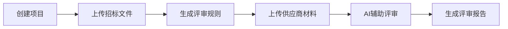

# Requirement Designer

## Overview

本技能用于把原始客户诉求、会议纪要、产品想法或已有方案，整理成面向客户、产品、业务和项目经理可直接阅读的正式需求文档。

核心原则：

- 需求文档先讲业务目标，再讲业务流程，最后讲范围、规则与验收
- 强制使用 Mermaid 图帮助客户“看懂业务，不看代码”
- 文档不写实现细节，不替代技术方案
- 图不是装饰，图是正文的一部分

## When to Use

在以下场景优先使用本技能：

- 用户要求输出“需求说明书”“PRD”“客户需求文档”“业务需求文档”
- 用户给出原始需求、手册、会议纪要，希望整理成正式文档
- 用户希望把复杂系统逻辑讲清楚，但读者主要不是研发
- 用户明确要求加入架构图、流程图、异常流程图
- 用户需要一版可给客户、业务方或项目经理确认的需求稿

以下情况不要用本技能直接替代：

- 需要详细接口、类设计、数据模型、代码改造点时，改用 `tech-doc-designer`
- 只需要一句话总结或简短方案说明时，不必生成完整需求文档

## Audience

默认读者为：

- 客户方负责人
- 产品经理
- 业务专家
- 项目经理
- 实施人员

文风要求：

- 偏正式、可汇报、可评审
- 重点解释“为什么做、做什么、怎么用、验收什么”
- 不展开代码级实现

## Product Context

当项目存在产品上下文配置时，需求文档必须优先基于已有产品能力进行客户需求匹配与方案组织。本机制与具体项目解耦，仅提供“产品匹配”通用范式：**先匹配已有产品，再补充新增能力**。

### 触发条件

- 存在产品配置文件 `assets/product-context.json`（本技能 assets 目录下）
- 用户显式提供了产品能力清单
- 若以上均不满足，本章节不影响技能正常运行，按通用方式出文档

### 产品匹配流程

1. **读取产品上下文配置**：获取产品列表、能力关键词、适用场景、交付模式、核心卖点
2. **关键词匹配**：将客户需求中的关键词与产品能力关键词进行匹配
3. **方案模板匹配**：若产品上下文包含 `solution_templates`，优先用模板做产品组合推荐
4. **覆盖优先**：优先用已有产品覆盖客户需求，仅在已有产品无法覆盖时才建议新增能力
5. **贯穿全文**：匹配结果应体现在业务架构图、功能需求、优势描述等多处

### 文档体现要求

- **业务架构图**：用产品上下文中的产品名作为系统组件名称
- **功能需求**：每个功能模块标注“基于 XX 产品实现”
- **优势描述**：在背景和建设目标中融入产品上下文中的核心卖点
- **范围说明**：明确哪些由已有产品覆盖，哪些需新增定制
- **非功能需求**：引用产品上下文中的交付模式、信创等属性

### 章节目录适配

若使用了产品上下文匹配，建议在附录中增加：

- 产品映射关系表（客户需求 → 匹配产品 → 覆盖方式）

## Required Output

最终输出必须是一份结构完整的需求文档，默认建议包含以下章节：

1. 文档说明
2. 项目背景
3. 建设目标
4. 用户角色与使用场景
5. 业务范围
6. 总体业务架构
7. 业务流程
8. 功能需求
9. 输入输出要求
10. 非功能需求
11. 异常场景
12. 验收标准
13. 附录

如果用户已指定模板，可在不丢失核心信息的前提下适配其模板。

## Required Diagrams

需求文档面向客户、产品、业务，图的重点是“看懂业务，不看代码”。至少包含以下 5 类图：

1. 总体业务架构图
2. 端到端业务流程图
3. 核心评审主流程图
4. 角色参与流程图
5. 异常处理流程图

### Diagram Mapping

固定图种映射关系如下，不要随意变更：

- 架构图：`flowchart`
- 业务流程图：`flowchart`
- 异常流程图：`flowchart`

如需新增图，优先仍用 `flowchart`，保持客户可读性。

## Section Writing Pattern

凡是包含 Mermaid 图的章节，必须按以下顺序组织，不得跳步：

1. 先一句话说明本节目标
2. 放 Mermaid 图
3. 图下面解释关键节点
4. 再列业务规则

推荐写法示例：

~~~markdown
本节说明系统如何从项目创建流转到最终报告输出。

关键节点说明：

- 创建项目：录入项目基础信息
- 生成评审规则：系统根据招标文件形成规则基线
- AI辅助评审：系统对供应商材料进行自动化辅助分析

业务规则：

- 规则生成完成后，方可进入供应商材料评审阶段
- 评审完成后，方可生成最终报告
~~~

## Document Rules

写需求文档时必须遵守以下规则：

- 先写客户关心的业务价值，不要先堆功能点
- 每个核心业务阶段都要写“输入、处理、输出”
- 每个功能模块都要写清“谁来用、解决什么问题、产出什么结果”
- 业务范围必须明确区分“本期包含”和“本期不包含”
- 非功能需求至少覆盖性能、稳定性、安全性、可审计性
- 异常场景必须单列，不要散落在各章节
- 验收标准必须可验证，避免“体验更好”“更加智能”这类空泛表述

## Recommended Chapter Details

### 1. 文档说明

写清：

- 文档名称
- 版本号
- 编写日期
- 编写人
- 修订记录

### 2. 项目背景

重点回答：

- 当前业务痛点是什么
- 为什么现在要建设
- 现有流程的问题是什么

### 3. 建设目标

重点回答：

- 提升什么效率
- 降低什么风险
- 提升什么一致性
- 支撑什么管理动作

### 4. 用户角色与使用场景

至少写清：

- 角色名称
- 核心职责
- 在系统中的关键动作

### 5. 业务范围

强制拆成：

- 本期范围
- 非本期范围

### 6. 总体业务架构

本节必须有架构图，说明：

- 外部用户
- 系统核心能力
- 关键结果产物

### 7. 业务流程

本节至少有两张图：

- 端到端业务流程图
- 核心主流程图

### 8. 功能需求

按模块写，每个模块至少包括：

- 功能目标
- 使用角色
- 输入
- 输出
- 核心规则

### 9. 输入输出要求

集中列出：

- 输入资料
- 输入格式
- 输出结果
- 输出形式

### 10. 非功能需求

建议覆盖：

- 性能
- 稳定性
- 安全性
- 可维护性
- 可审计性

### 11. 异常场景

本节必须有异常流程图，并列出：

- 触发条件
- 系统处理方式
- 用户可见反馈
- 是否允许重试

### 12. 验收标准

必须可检查、可对照、可演示。

## Diagram Quality Rules

所有 Mermaid 图必须满足：

- 图名和章节目标一致
- 节点文案使用业务语言，不要使用代码符号名
- 单图节点数量适中，避免堆满一页
- 主路径清晰，异常路径单独分支表示
- 图下必须解释关键节点，不允许只放图不解释

## Deliverables

本技能默认产出：

- 一份正式需求文档 Markdown
- 文档中的 Mermaid 图代码
- 如用户需要，可再配合 Mermaid 渲染技能输出 SVG

## Common Mistakes

- 把需求文档写成技术设计文档
- 只列功能点，不讲业务目标
- 图很多，但图下没有说明
- 章节顺序混乱，客户读不懂主线
- 验收标准写成空话
- 用代码术语替代业务术语

## Quick Checklist

在交付前至少自检以下内容：

- 是否明确了背景、目标、角色、范围
- 是否包含至少 5 类业务图
- 是否遵守“目标句 -> Mermaid 图 -> 关键节点说明 -> 业务规则”的章节结构
- 是否区分了本期范围与非本期范围
- 是否写明了异常场景与验收标准
