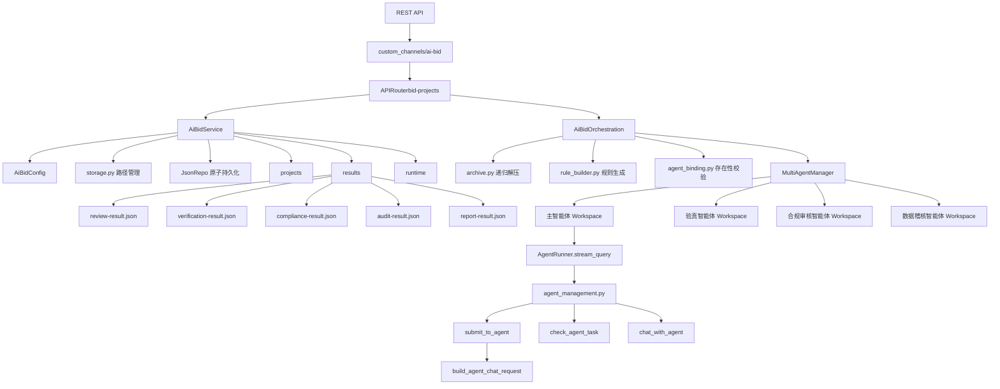
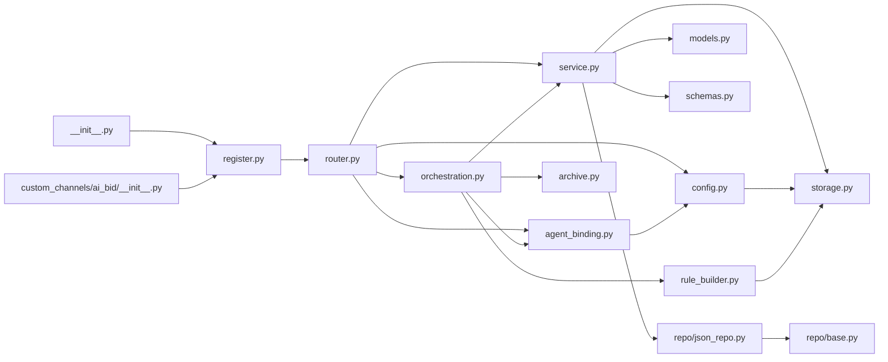
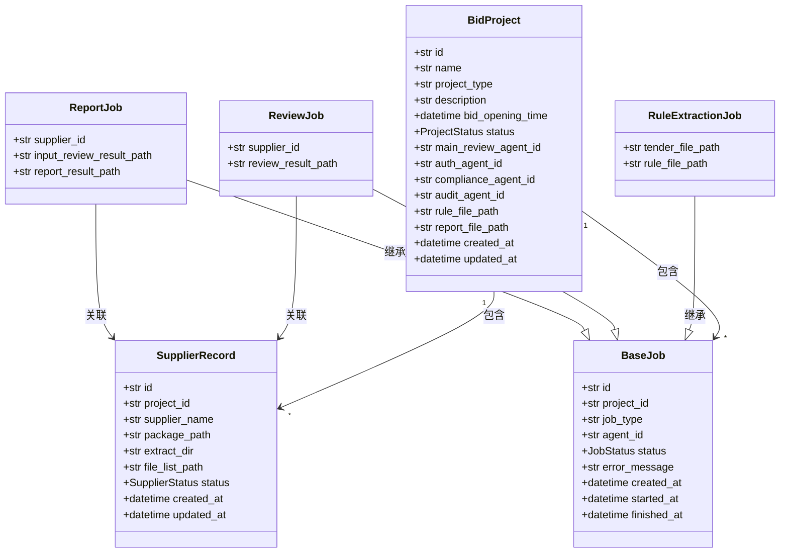
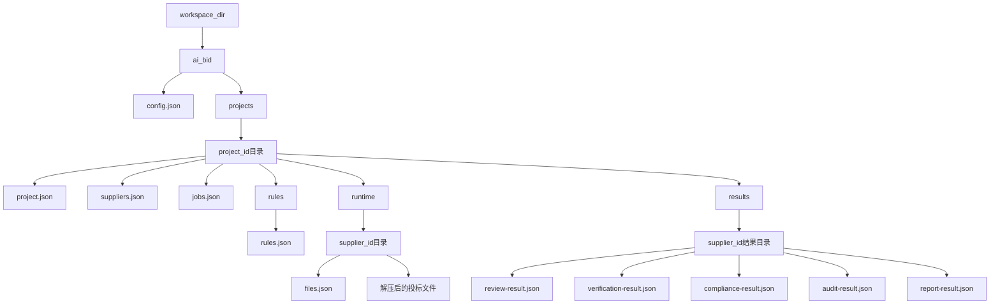
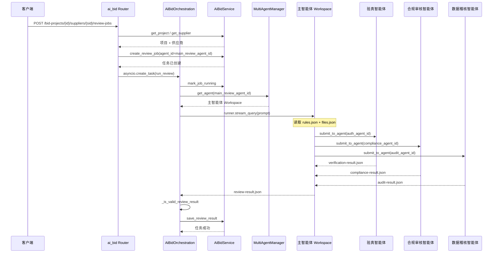
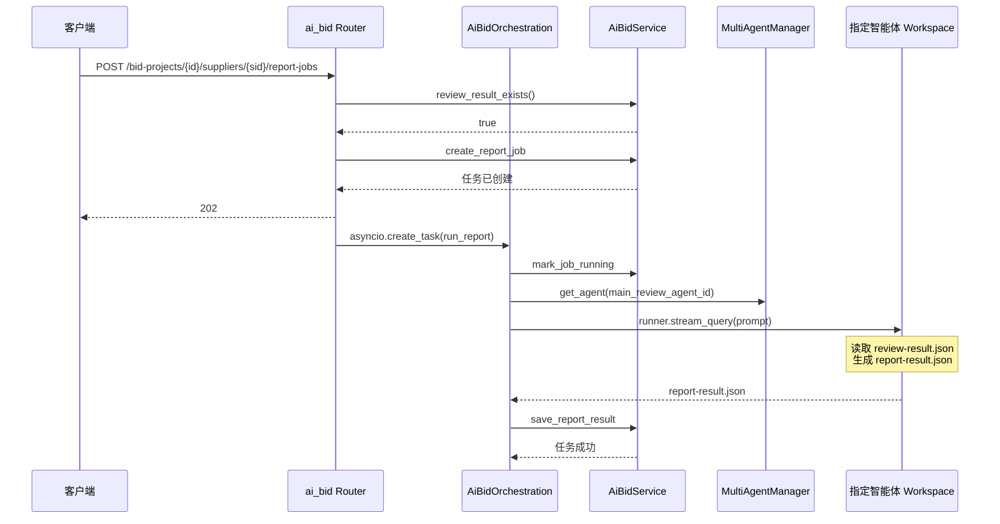
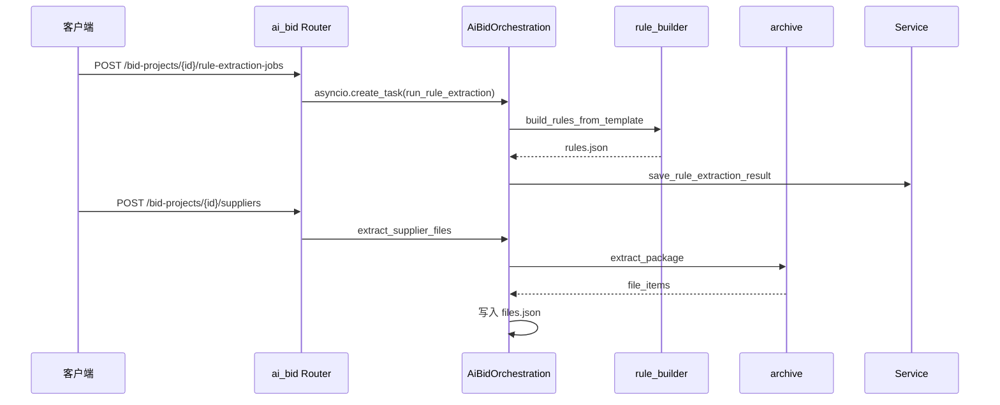
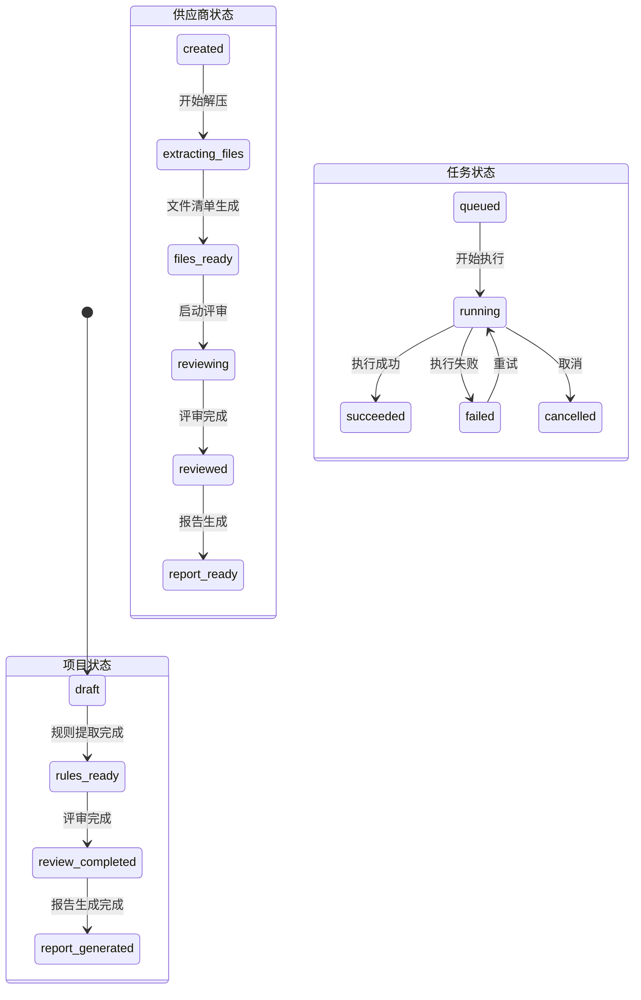
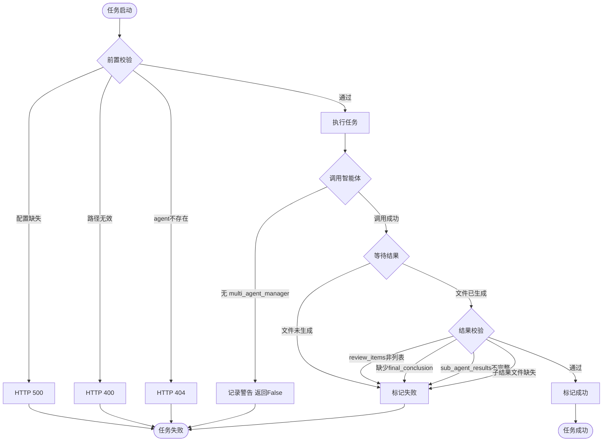

# AI辅助评审系统技术方案

## 1. 文档说明

| 项目 | 内容 |
|------|------|
| 文档目标 | 为研发、测试、架构师提供可直接展开开发的技术方案 |
| 适用版本 | v1.0 |
| 关联需求文档 | AI辅助评审系统需求说明书 |
| 适用系统 | QwenPawPlus 智慧评审系统 |

### 术语说明

| 术语 | 说明 |
|------|------|
| Backend | `src/backend/ai_bid` 业务层，负责项目管理、任务调度、结果校验 |
| qwenpaw | 系统底层智能体运行时，提供 agent 管理、消息流转、跨 agent 调用 |
| 主智能体 | AI辅助评审主智能体，负责并行调度三个子智能体并聚合结果 |
| 子智能体 | 验真、合规审核、数据稽核三个专项智能体 |
| custom_channels | 无侵入路由桥接，不修改 qwenpaw 核心代码 |

---

## 2. 总体架构

本节说明系统的技术分层与模块边界。



关键节点说明：

- 路由层：`custom_channels/ai_bid` 通过 `register_app_routes(app)` 将业务路由挂载到 `/api/agents/{agentId}/bid-projects`
- 业务层：`AiBidService` 负责项目、供应商、任务、结果的持久化和查询；`AiBidOrchestration` 负责任务编排和 agent 调用
- qwenpaw运行时：通过 `MultiAgentManager.get_agent(agent_id)` 定位目标智能体 workspace，再通过 `workspace.runner.stream_query()` 发起调用
- 跨Agent调用：主智能体通过 `submit_to_agent` 提交子任务，通过 `check_agent_task` 轮询，通过 `build_agent_chat_request` 封装请求
- 存储层：所有业务数据落在 `ai_bid/projects/{projectId}` 下

实现规则：

- 不修改 `src/qwenpaw/*` 核心代码
- 通过 `custom_channels` 机制做无侵入路由挂载
- Backend 只调用主智能体，不直接调用子智能体
- 主智能体使用 qwenpaw 内置的跨 agent 工具完成子任务调度

---

## 3. 模块划分

本节说明各模块的职责与依赖关系。



关键节点说明：

- `config.py`：读取 `ai_bid/config.json`，解析四个智能体ID与工作目录
- `agent_binding.py`：校验 agent 是否在 qwenpaw 配置中已注册
- `storage.py`：管理所有业务文件的路径生成
- `models.py`：项目、供应商、任务三类领域模型
- `schemas.py`：接口请求与响应的 Pydantic 模型
- `service.py`：核心业务逻辑，持久化与查询
- `orchestration.py`：任务编排，包括解压、规则生成、agent 调用、结果校验
- `archive.py`：递归解压与文件清单生成
- `rule_builder.py`：从模板生成结构化规则

模块职责与边界：

| 模块 | 核心职责 | 主要依赖 | 是否复用 |
|------|---------|---------|---------|
| `config.py` | 读取业务配置 | `pydantic`、`storage` | 新增 |
| `agent_binding.py` | agent存在性校验 | `qwenpaw.config` | 新增 |
| `storage.py` | 路径管理 | `pathlib` | 新增 |
| `models.py` | 领域模型定义 | `pydantic` | 新增 |
| `schemas.py` | API数据传输模型 | `pydantic` | 新增 |
| `repo/json_repo.py` | JSON原子持久化 | 无 | 新增 |
| `service.py` | 业务CRUD与查询 | `models`、`schemas`、`storage` | 新增 |
| `router.py` | REST接口 | `FastAPI`、`service`、`orchestration` | 新增 |
| `orchestration.py` | 任务编排与agent调用 | `service`、`archive`、`rule_builder`、`qwenpaw` | 新增 |
| `archive.py` | 递归解压与文件清单 | `zipfile`、`tarfile`、`7z` | 新增 |
| `rule_builder.py` | 规则文件生成 | 无 | 新增 |
| `register.py` | 路由注册 | `FastAPI` | 新增 |
| `custom_channels` | 无侵入挂载 | `register` | 新增 |

---

## 4. 配置设计

### 配置文件位置

```
ai_bid/config.json
```

### 配置项

```json
{
  "working_dir": "D:/ai-bid-workspace",
  "main_review_agent_id": "ai-bid-master",
  "auth_agent_id": "ai-bid-auth",
  "compliance_agent_id": "ai-bid-compliance",
  "audit_agent_id": "ai-bid-audit"
}
```

| 配置项 | 类型 | 必填 | 默认值 | 说明 |
|--------|------|------|--------|------|
| `working_dir` | string | 否 | 空（回退默认工作区）| 业务数据目录覆盖项 |
| `main_review_agent_id` | string | 是 | 无 | AI辅助评审主智能体ID |
| `auth_agent_id` | string | 是 | 无 | 验真智能体ID |
| `compliance_agent_id` | string | 是 | 无 | 合规审核智能体ID |
| `audit_agent_id` | string | 是 | 无 | 数据稽核智能体ID |

### 配置错误行为

| 错误场景 | 行为 |
|----------|------|
| config.json 不存在 | 返回 HTTP 500 |
| 必填字段缺失 | 返回 HTTP 500 配置不完整 |
| agent_id 在 qwenpaw 配置中不存在 | 返回 HTTP 404 智能体不存在 |
| working_dir 未配置 | 回退到当前请求 agent 的 workspace_dir |

---

## 5. 数据模型设计

本节说明核心领域模型及其关系。



### 状态枚举

**项目状态 (ProjectStatus)**：
- `draft` - 草稿（初始状态）
- `rules_ready` - 规则就绪
- `review_completed` - 评审完成
- `report_generated` - 报告已生成

**供应商状态 (SupplierStatus)**：
- `created` - 已创建
- `extracting_files` - 文件提取中
- `files_ready` - 文件就绪
- `reviewing` - 评审中
- `reviewed` - 已评审
- `report_ready` - 报告就绪

**任务状态 (JobStatus)**：
- `queued` - 排队中
- `running` - 运行中
- `succeeded` - 成功
- `failed` - 失败
- `cancelled` - 已取消

实现规则：

- 项目创建时持久化四个智能体ID快照
- 供应商创建时自动计算 extract_dir 和 file_list_path
- 所有状态变更通过 Atomic Save 写入 JSON 文件

---

## 6. 文件存储设计

本节说明所有结果产物的目录结构和命名约定。



关键节点说明：

- `ai_bid/config.json`：业务配置入口
- `projects/{project_id}/project.json`：项目元数据，含智能体ID快照
- `rules/rules.json`：结构化评审规则
- `runtime/{supplier_id}/files.json`：供应商文件清单
- `runtime/{supplier_id}/`：供应商解压后的原始投标文件
- `results/{supplier_id}/review-result.json`：聚合评审结果
- `results/{supplier_id}/`下的三个子结果文件

### 文件契约

| 文件 | 格式 | 来源 | 消费方 |
|------|------|------|--------|
| config.json | JSON | 手动创建 | Backend启动时读取 |
| project.json | JSON | Backend创建 | 全链路 |
| rules.json | JSON | rule_builder 生成 | 主智能体 |
| files.json | JSON Array | archive 生成 | 主智能体 |
| verification-result.json | JSON | 验真智能体产出 | 主智能体聚合 |
| compliance-result.json | JSON | 合规审核智能体产出 | 主智能体聚合 |
| audit-result.json | JSON | 数据稽核智能体产出 | 主智能体聚合 |
| review-result.json | JSON | 主智能体聚合输出 | Backend校验 + 报告生成 |
| report-result.json | JSON | 报告生成产出 | 对外交付 |

---

## 7. 接口设计

### 接口概览

| 接口 | Method | URL 模式 | 说明 |
|------|--------|----------|------|
| 创建项目 | POST | `/api/agents/{agentId}/bid-projects` | 创建项目并绑定智能体 |
| 查询项目 | GET | `/api/agents/{agentId}/bid-projects/{projectId}` | 查询项目详情 |
| 规则提取 | POST | `/api/agents/{agentId}/bid-projects/{projectId}/rule-extraction-jobs` | 启动规则提取 |
| 查询规则任务 | GET | `/api/agents/{agentId}/bid-projects/{projectId}/rule-extraction-jobs/{jobId}` | 查询规则任务状态 |
| 查询评审规则 | GET | `/api/agents/{agentId}/bid-projects/{projectId}/review-rules` | 查询评审规则 |
| 登记供应商 | POST | `/api/agents/{agentId}/bid-projects/{projectId}/suppliers` | 登记供应商并解压 |
| 查询文件清单 | GET | `/api/agents/{agentId}/bid-projects/{projectId}/suppliers/{supplierId}/files` | 查询供应商文件清单 |
| 启动评审 | POST | `/api/agents/{agentId}/bid-projects/{projectId}/suppliers/{supplierId}/review-jobs` | 启动AI评审 |
| 查询评审任务 | GET | `/api/agents/{agentId}/bid-projects/{projectId}/suppliers/{supplierId}/review-jobs/{jobId}` | 查询评审任务状态 |
| 评审总览 | GET | `/api/agents/{agentId}/bid-projects/{projectId}/suppliers/{supplierId}/review-summary` | 查询评审总览 |
| 评审详情 | GET | `/api/agents/{agentId}/bid-projects/{projectId}/suppliers/{supplierId}/review-details` | 查询评审详情 |
| 原始评审结果 | GET | `/api/agents/{agentId}/bid-projects/{projectId}/suppliers/{supplierId}/review-result` | 查询原始评审结果 |
| 启动报告 | POST | `/api/agents/{agentId}/bid-projects/{projectId}/suppliers/{supplierId}/report-jobs` | 启动报告生成 |
| 查询报告任务 | GET | `/api/agents/{agentId}/bid-projects/{projectId}/suppliers/{supplierId}/report-jobs/{jobId}` | 查询报告任务状态 |
| 查询报告结果 | GET | `/api/agents/{agentId}/bid-projects/{projectId}/suppliers/{supplierId}/report-result` | 查询报告结果 |

### 关键接口示例

**创建项目**：
- Method: `POST`
- URL: `/api/agents/{agentId}/bid-projects`
- Request:
```json
{
  "name": "2025年XX系统某平台技术服务公开采购项目",
  "project_type": "服务类",
  "description": "项目描述",
  "bid_opening_time": "2025-06-15T14:00:00"
}
```
- Response: `201`
```json
{
  "id": "proj_a1b2c3d4e5",
  "name": "2025年XX系统某平台技术服务公开采购项目",
  "project_type": "服务类",
  "status": "draft",
  "main_review_agent_id": "ai-bid-master",
  "auth_agent_id": "ai-bid-auth",
  "compliance_agent_id": "ai-bid-compliance",
  "audit_agent_id": "ai-bid-audit",
  "created_at": "2025-06-10T08:00:00Z"
}
```

**启动AI评审**：
- Method: `POST`
- URL: `/api/agents/{agentId}/bid-projects/{projectId}/suppliers/{supplierId}/review-jobs`
- Request: `{}`（空请求体）
- Response: `202`
```json
{
  "job_id": "job_review_a1b2c3d4e5",
  "project_id": "proj_a1b2c3d4e5",
  "supplier_id": "supplier_f6g7h8i9j0",
  "status": "queued",
  "job_type": "review",
  "agent_id": "ai-bid-master",
  "created_at": "2025-06-10T09:00:00Z"
}
```
- 错误场景：
  - `404`：项目或供应商不存在
  - `409`：规则尚未生成或供应商文件尚未准备完成

**查询评审总览**：
- Method: `GET`
- URL: `/api/agents/{agentId}/bid-projects/{projectId}/suppliers/{supplierId}/review-summary`
- Response: `200`
```json
{
  "project_name": "2025年XX系统技术服务公开采购项目",
  "supplier_name": "XX科技有限公司",
  "final_conclusion": "通过",
  "review_time": "2025-06-10T10:30:00",
  "item_count": 15
}
```
- 错误场景：
  - `404`：评审结果不存在

---

## 8. 核心时序设计

### 8.1 主链路时序图

本节说明后端如何发起主评审任务，并由主智能体协调多个子智能体完成聚合结果。



关键节点说明：

- Router：接收请求，检查前置条件，创建任务记录，异步启动编排
- Orchestration：通过 `MultiAgentManager.get_agent(main_review_agent_id)` 获取主智能体 workspace
- 主智能体：通过 `submit_to_agent` 并行发起三个子任务，再通过 `check_agent_task` 轮询
- Backend校验：调用 `_is_valid_review_result()` 检查 `sub_agent_results` 和三个子结果文件存在性

实现规则：

- 主智能体调用通过 `workspace.runner.stream_query(request_payload)` 发起
- request_payload 格式为 `{"input": prompt, "session_id": "ai-bid:{agent_id}", "user_id": "ai_bid_system"}`
- prompt 中明确传入三个子 agent_id、三个子结果路径、主结果路径
- 主智能体必须等到三个子结果完成后再生成聚合结果
- Backend校验三子结果路径引用和文件存在性

### 8.2 报告生成时序图

本节说明评审结果到报告产出的链路。



实现规则：

- 报告生成前置条件：review-result.json 必须存在
- report-result.json 至少包含 final_conclusion、issues、report_items
- 生成成功更新项目状态为 `report_generated`

### 8.3 规则提取与解压时序图

本节说明规则生成和供应商文件处理的并行链路。



实现规则：

- 规则提取由 Backend 本地执行，不调用智能体
- 供应商解压支持目录和压缩包两种输入
- 递归解压最大嵌套深度为8层
- 支持 zip、rar（需7z）、7z（需7z）、tar 格式

---

## 9. 主子智能体契约设计

### 主智能体职责

- 接收 Backend 传入的评审上下文（规则路径、文件清单路径、输出路径、子智能体ID）
- 并行发起三个子智能体任务（使用 `submit_to_agent`）
- 轮询三个子任务状态（使用 `check_agent_task`）
- 读取三个子结果
- 聚合为统一 `review-result.json`
- 输出到指定路径

### 子智能体职责

| 子智能体 | 职责 | 输出文件 | 输出内容要求 |
|----------|------|---------|-------------|
| 验真智能体 | 材料真伪、主体一致性 | verification-result.json | agent_role、conclusion、issues、evidence、summary |
| 合规审核智能体 | 资格条件、否决项、符合性 | compliance-result.json | agent_role、conclusion、issues、evidence、summary |
| 数据稽核智能体 | 报价、金额、数量一致性 | audit-result.json | agent_role、conclusion、issues、evidence、summary |

### 调用输入

主智能体接收的 prompt 包含以下信息：
- `rules_file_path`：评审规则文件路径
- `files_manifest_path`：供应商文件清单路径
- `supplier_name`：供应商名称
- `auth_agent_id`、`compliance_agent_id`、`audit_agent_id`：三个子智能体ID
- 三个子结果输出路径
- 主结果输出路径

### 聚合规则

主智能体必须：
1. 先并行启动三个子智能体
2. 等待三个都完成（使用 `check_agent_task` 轮询）
3. 读取三个子结果 JSON
4. 合并为统一结果
5. 输出到指定路径

### 主结果契约

```json
{
  "project_name": "string",
  "supplier_name": "string",
  "review_time": "string",
  "final_conclusion": "string",
  "review_items": [],
  "sub_agent_results": {
    "verification_result_path": "string",
    "compliance_result_path": "string",
    "audit_result_path": "string"
  },
  "issues": [],
  "confidence": "string"
}
```

### 失败策略

- 单个子智能体失败：主智能体在 issues 中标记失败原因
- 主智能体在 `final_conclusion` 中输出 `需复核`
- Backend 校验时子结果文件缺失：任务标记为 `failed`

---

## 10. 状态流转设计

本节说明项目和任务的状态流转规则。



关键节点说明：

- 项目状态驱动下游操作：只有 `rules_ready` 后才能启动评审
- 供应商状态驱动评审前置：只有 `files_ready` 后才能启动评审
- 任务支持从 `failed` 回到 `running`（重试）

实现规则：

- 状态变更通过 `mark_job_running`、`mark_job_failed` 等方法统一管理
- 每次状态变更记录时间戳
- JSON 持久化使用原子写入（临时文件 + rename）

---

## 11. 校验与异常处理

本节说明系统如何保证数据完整性和处理异常。



关键节点说明：

- 前置校验层：配置、文件、agent 三重检查
- 智能体调用层：支持自定义 hook 和默认 MultiAgentManager 两种路径
- 结果校验层：检查 JSON 结构、必填字段、子结果引用和文件存在性

### 校验规则清单

| 校验点 | 校验方式 | 失败行为 |
|--------|---------|---------|
| config.json 存在 | 文件存在性 | HTTP 500 |
| 四个 agent_id 在 qwenpaw 中已注册 | agent_exists() | HTTP 404 |
| 文件路径存在 | Path.exists() | HTTP 400 |
| review-result.json 包含 project_name | JSON字段检查 | failed |
| review-result.json 包含 final_conclusion | JSON字段检查 | failed |
| review-items 是 list | 类型检查 | failed |
| sub_agent_results 是 dict | 类型检查 | failed |
| sub_agent_results 包含三个子路径 | 键检查 | failed |
| 三个子结果文件实际存在 | 文件存在性 | failed |
| review-result.json 为合法 JSON | JSON解析 | failed |

### 异常处理

| 异常类型 | 处理方式 | HTTP状态码 | 是否重试 |
|----------|---------|-----------|---------|
| 配置缺失 | 返回错误 | 500 | 否 |
| Agent不存在 | 返回错误 | 404 | 否 |
| 路径无效 | 返回错误 | 400 | 否 |
| multi_agent_manager未初始化 | 记录警告 | - | 否 |
| 智能体执行失败 | 标记failed | - | 是 |
| 结果JSON不合法 | 标记failed | - | 是 |
| 子结果缺失 | 标记failed | - | 是 |

---

## 12. 测试方案

### 单元测试范围

| 模块 | 测试文件 | 覆盖范围 |
|------|---------|---------|
| config | test_config.py | 配置读取、工作目录解析、默认值回退 |
| models | test_service.py | 项目创建、智能体快照持久化 |
| schemas | test_router.py、test_service.py | 请求/响应序列化 |
| service | test_service.py | 项目CRUD、供应商管理、任务状态流转 |
| orchestration | test_orchestration.py | 解压、规则生成、评审调用、结果校验 |
| archive | test_archive.py | 递归解压、文件清单生成 |
| rule_builder | test_rule_builder.py | 模板解析、结构化规则输出 |
| agent_binding | test_agent_binding.py | agent存在性校验、四智能体缺失检测 |
| router | test_router.py | 接口链路、前置条件校验、409错误 |

### 集成测试范围

- 项目创建到规则提取完整链路
- 供应商登记到解压到文件清单生成链路
- 评审任务创建到结果保存完整链路
- 报告生成依赖校验链路

### 联调测试场景

- 真实 agent 调用（需部署四个业务智能体）
- 主智能体 prompt 驱动三子智能体
- 三子结果聚合与校验

### 回归测试重点

- 配置解析正确性
- 路径生成不变性
- 状态流转一致性
- 异常场景错误返回

### 验收测试建议

- 执行 `pytest tests/unit/backend/ai_bid -q`
- 预期：所有测试通过（当前 20 passed）
- 接口 smoketest：创建项目 -> 登记供应商 -> 启动评审 -> 查询结果

---

## 13. 部署与运维说明

### 配置准备

1. 在 qwenpaw 中创建四个智能体并获取 `agent_id`
2. 在目标 agent 的 workspace_dir 下创建 `ai_bid/config.json`
3. 填入四个 agent_id 和可选的 `working_dir`

### 前置依赖

- Python 3.10+
- FastAPI
- Pydantic v2
- qwenpaw 运行时已启动
- 智能体已通过 qwenpaw app 接口预创建
- 7z 命令行工具（用于解压 rar/7z）

### 路由挂载方式

通过 `custom_channels/ai_bid/__init__.py` 中的 `register_app_routes` 将路由自动挂载到：

```
/api/agents/{agentId}/bid-projects
```

### 日志定位

- 模块日志名：`backend.ai_bid.orchestration`
- 关键日志点：agent调用、结果校验、状态变更

### 常见问题排查

| 问题 | 排查方向 |
|------|---------|
| 配置不完整 | 检查 config.json 是否存在且必填字段齐全 |
| 智能体不存在 | 检查 agent_id 是否在 qwenpaw 配置中已注册 |
| 文件路径不存在 | 检查传入路径是否为有效文件 |
| 规则尚未生成 | 先完成规则提取任务后再启动评审 |
| 文件尚未准备完成 | 等待供应商文件解压完成后再启动评审 |
| 评审结果尚未生成 | 先完成评审任务后再启动报告生成 |
| multi_agent_manager 未初始化 | 检查 qwenpaw 运行时状态 |

---

## 14. 改造清单与研发任务建议

### 已完成的改造

| 文件 | 改动类型 | 说明 |
|------|---------|------|
| `src/backend/ai_bid/config.py` | 新增 | 四智能体配置模型 |
| `src/backend/ai_bid/models.py` | 新增 | 项目/供应商/任务领域模型 |
| `src/backend/ai_bid/schemas.py` | 新增 | API 请求响应模型 |
| `src/backend/ai_bid/storage.py` | 新增 | 路径管理与文件契约 |
| `src/backend/ai_bid/service.py` | 新增 | 业务CRUD服务 |
| `src/backend/ai_bid/orchestration.py` | 新增 | 任务编排与智能体调用 |
| `src/backend/ai_bid/router.py` | 新增 | REST 接口路由 |
| `src/backend/ai_bid/register.py` | 新增 | 路由注册入口 |
| `src/backend/ai_bid/archive.py` | 新增 | 递归解压与文件清单 |
| `src/backend/ai_bid/rule_builder.py` | 新增 | 规则模板解析 |
| `src/backend/ai_bid/agent_binding.py` | 新增 | agent存在性校验 |
| `src/backend/ai_bid/__init__.py` | 新增 | 包入口 |
| `src/backend/__init__.py` | 新增 | Backend包入口 |
| `custom_channels/ai_bid/__init__.py` | 新增 | 无侵入路由桥接 |

### 不需要修改的部分

- `src/qwenpaw/*` - 核心运行时，完全不修改
- `src/qwenpaw/agents/tools/agent_management.py` - 跨agent调用工具，复用现有能力
- `src/qwenpaw/app/multi_agent_manager.py` - Agent管理，复用现有能力
- `src/qwenpaw/app/runner/runner.py` - 消息处理，复用现有能力
- `src/qwenpaw/app/_app.py` - 动态路由，复用现有能力

### 后续研发任务建议

1. **主智能体 prompt 精细化**：将当前 `orchestration.py` 中的主智能体 prompt 适配为生产级编排指令
2. **子智能体契约实现**：确保三个子智能体按约定格式输出子结果 JSON
3. **真实 agent 联调**：用真实 agent_id 完成端到端联调
4. **监控与告警**：增加任务超时监控和失败告警
5. **结果查询扩展**：支持按项目查询所有供应商评审结果
6. **错误重试机制**：支持对失败子任务的自动重试
