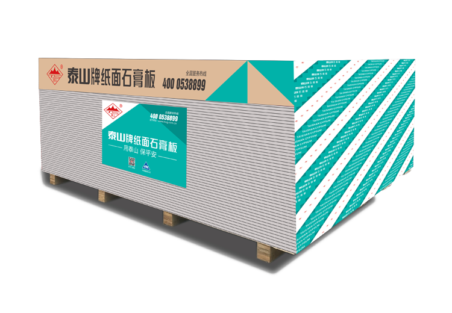
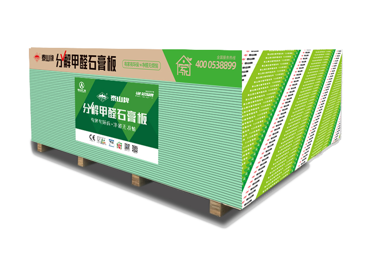
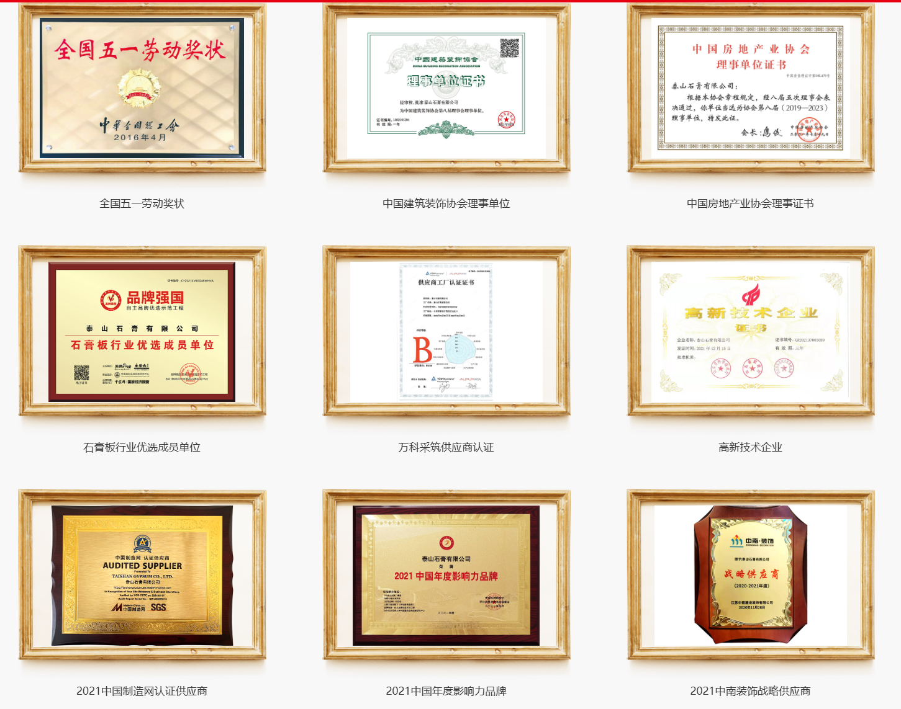

# 泰山石膏产品介绍文案生成技能

## 文档概述

本技能专为泰山石膏企业化工材料类产品提供文案生成服务。所有文案需配合本地图片素材使用，确保视觉呈现与文字内容高度匹配。

## 结果输出要求

最终交付结果必须按“两段式”输出：

1. 先输出自然语言执行总结，说明本次文案生成了什么、主交付物是什么
2. 再单独输出一个 JSON 结构化结果，便于后端提取业务结果

最终结果只保留后续可转为 PDF 的 HTML 文件，不需要 Markdown 文件。

### 必须满足

- JSON 顶层 `result_type` 固定为 ProductCopy&#x20;
- 返回 `title`、`name`、`entry_file`
- 返回 `product_info`、`display_content`、`basic_info`
- `display_content` 中只记录最终交付的 HTML 文件
- 不返回 `markdown_path`
- 不要求单独返回 `assets_dir`

### 推荐返回结构

```json
{
  "result_type": "ProductCopy ",
  "title": "纸面石膏板产品详情页",
  "name": "纸面石膏板产品详情页-工程渠道版",
  "product_info": {
    "solution_name": "纸面石膏板工程渠道产品详情页方案",
    "product_name": "泰山纸面石膏板",
    "scenario": "工程渠道产品详情介绍",
    "industry": "建材制造",
    "description": "面向工程客户的纸面石膏板产品介绍文案与详情页内容。",
    "version": "v1.0",
    "target_users": "经销商、工程客户、设计选材人员",
    "key_features": "轻质高强、防火性能稳定、施工便捷、适用场景广",
    "deployment": "HTML"
  },
  "display_content": [
    {
      "file_type": "html",
      "file_name": "paper-faced-gypsum-board-product-page-20260327.html",
      "file_id": "copywriting-paper-faced-gypsum-board-product-page-20260327",
      "file_url": "",
      "file_path": "output/html/paper-faced-gypsum-board-product-page-20260327.html"
    }
  ],
  "basic_info": {
    "name": "纸面石膏板产品详情页-工程渠道版",
    "product_name": "泰山纸面石膏板",
    "scene": "产品详情页文案",
    "creator_name": "copywriting-zh-pro",
    "created_at": "2026-03-27T00:00:00Z",
    "result_type": "copywriting"
  }
}
```

### 字段填写要求

- 自然语言总结与 JSON 必须同时出现，且顺序固定为“先总结，后 JSON”
- `display_content` 记录所有最终交付的 HTML 文件；若只有一个主 HTML，也必须创建一条记录
- `display_content.file_type` 固定填写 `html`
- `display_content.file_path` 填写实际 HTML 文件落地路径
- `file_url` 如当次执行未生成可访问地址，可留空字符串
- `basic_info.result_type` 固定填写 `copywriting`

### 输出约束

- 不要只返回一大段最终正文而缺少结构化 JSON
- 不要生成 Markdown 文件，也不要在结果中返回 Markdown 路径
- 不要生成 `preview_url`、`download_url`
- 不要直接拼装 `message.metadata`
- 不要新增未约定的顶层字段

### 核心能力

- 产品详情页文案
- 朋友圈/社媒推广文案
- 产品对比表
- 案例包装文案
- 企业介绍文案

***

## 一、图片素材索引

### 1.1 素材位置说明

所有图片素材均存储在 `assets/taishan-gypsum/` 目录下，**统一使用英文别名引用**，避免中文编码问题。

完整的图片素材映射关系请参阅：

- **`references/taishan-gypsum-assets.md`** - 中文文件名与英文别名对照表

### 1.2 素材分类速查

| 类别   | 素材数量 | 用途             |
| ---- | ---- | -------------- |
| 产品图片 | 16 张 | 各产品单独展示        |
| 企业素材 | 2 张  | 公司简介、荣誉资质      |
| 案例素材 | 5 张  | 大兴机场、冬奥场馆、雄安站等 |

### 1.3 图片引用格式

**Markdown 格式：**

```markdown

```

**HTML 格式：**

```html

```

### 1.4 使用优先级

1. **产品文案** → 优先使用对应产品图片（英文名见 `references/taishan-gypsum-assets.md`）
2. **企业介绍** → 使用 `company-profile.png` 或 `honors-and-qualifications.png`
3. **案例展示** → 根据项目类型选择 `case-*.png` 系列图片

***

## 二、文案生成规范

### 2.1 文案结构模板

#### 标准产品介绍结构

```
【标题】
- 突出核心卖点或解决的主要问题
- 字数控制在 15-25 字

【产品图】
- 使用对应的英文别名图片
- 路径：assets/taishan-gypsum/[产品英文名].png

【核心卖点】(3-5 条)
- 每条 10-20 字
- 用数据或场景支撑

【产品详情】
- 规格参数
- 适用场景
- 施工要点

【信任背书】
- 企业资质
- 经典案例
- 用户评价

【行动号召】
- 明确的下一步动作
- 降低决策门槛
```

### 2.2 文案风格指南

#### B2B 专业风格（推荐默认）

- 语言：专业但不晦涩
- 重点：性能参数、施工效率、成本控制
- 适用：经销商、工程商、设计师渠道

#### 终端用户风格

- 语言：通俗易懂、场景化
- 重点：健康环保、美观耐用、省心省力
- 适用：家装用户、小型工装

#### 政府项目风格

- 语言：正式规范、突出资质
- 重点：国家标准、大型案例、企业实力
- 适用：招投标、政府采购

***

## 三、文案生成工作流

### 3.1 标准流程

```
1. 确认产品类型
   ↓
2. 查阅 references/taishan-gypsum-assets.md 获取对应图片英文名
   ↓
3. 确定目标受众
   ↓
4. 选择文案风格
   ↓
5. 撰写核心卖点
   ↓
6. 补充产品详情
   ↓
7. 添加信任背书
   ↓
8. 设计行动号召
   ↓
9. 审核优化
```

### 3.2 快速生成模板

#### 模板 A：产品详情页

```markdown
# [产品名称]


## 核心优势
- [卖点 1]
- [卖点 2]
- [卖点 3]

## 产品规格
| 参数项 | 数值 |
|-------|------|
| 规格 | |
| 厚度 | |
| 防火等级 | |
| 环保等级 | |

## 适用场景
- [场景 1]
- [场景 2]
- [场景 3]

## 经典案例

[案例名称] - [简要说明]

## 立即咨询
[联系方式/行动号召]
```

#### 模板 B：朋友圈/社媒推广

```markdown
【标题：痛点/利益点】

[产品图]

还在为 [问题] 发愁？

泰山石膏 [产品名称] 帮你解决！

✅ [卖点 1]
✅ [卖点 2]
✅ [卖点 3]

[案例背书]

📩 私信获取详细方案
```

#### 模板 C：产品对比表

```markdown
| 对比项 | 泰山石膏 | 普通产品 |
|-------|---------|---------|
| [参数 1] | [优势值] | [普通值] |
| [参数 2] | [优势值] | [普通值] |
| [参数 3] | [优势值] | [普通值] |


```

***

## 四、产品文案示例

### 4.1 纸面石膏板示例

```markdown
# 泰山纸面石膏板 - 轻质高强的墙面专家



## 为什么选择泰山纸面石膏板？

- **轻质高强** - 密度仅 0.65g/cm³，承重能力却达 120kg/m²
- **施工便捷** - 可锯可钉可刨，工期缩短 40%
- **防火性能** - A 级防火，遇火释放结晶水，延缓火势蔓延
- **环保健康** - 无放射性，甲醛释放量≤0.01mg/m³

## 产品规格

| 参数项 | 数值 |
|-------|------|
| 标准规格 | 1200×2400mm / 1200×3000mm |
| 厚度 | 9.5mm / 12mm / 15mm |
| 防火等级 | A 级不燃 |
| 环保等级 | E0 级 |
| 含水率 | ≤3% |

## 适用场景

- ✅ 住宅室内隔墙、吊顶
- ✅ 办公楼、商业空间装修
- ✅ 学校、医院等公共建筑
- ✅ 厂房、仓库等工业建筑

## 经典案例


**北京大兴国际机场** - 年旅客吞吐量 1 亿人次的超级枢纽，选用泰山石膏板系统

## 立即获取报价方案

📞 400-XXX-XXXX
💬 微信咨询：taishan-gypsum
📧 邮箱：sales@taishan-gypsum.com
```

### 4.2 分解甲醛石膏板示例

```markdown
# 会"呼吸"的石膏板 - 24 小时持续分解甲醛



## 装修后最怕什么？甲醛超标！

泰山分解甲醛石膏板，让墙面变成空气净化器

### 核心技术
- **纳米光触媒技术** - 在光照条件下持续分解甲醛
- **长效净化** - 一次安装，10 年有效
- **安全可靠** - 分解产物为水和二氧化碳，无二次污染

### 实测数据
| 检测项目 | 24 小时净化率 | 检测标准 |
|---------|-------------|---------|
| 甲醛净化 | 85.6% | JC/T 1074-2021 |
| 甲醛持续净化 | 78.3% | 72 小时持续测试 |
| 抗菌率 | 99.2% | GB/T 21866-2008 |

### 适用人群
- 👶 有婴幼儿的家庭
- 👴 有老人的家庭
- 🤰 孕妇家庭
- 🏥 医院、养老院等敏感场所

### 权威认证


### 限时优惠
本月订购，享 85 折 + 免费上门测量

📩 立即预约：400-XXX-XXXX
```

***

## 五、输出规范

### 5.1 输出目录

所有生成的文案保存在 `output/` 目录下：

```
output/
├── html/           # HTML 格式文案
└── resources/      # 相关资源文件
```

- 最终交付只保留 `output/html/` 下的 HTML 文件
- 结构化结果中的 `entry_file` 与 `display_content` 仅指向 HTML 文件

### 5.2 文件命名规范

```
[产品英文名]-[文案类型]-[日期].html
```

**文案类型标识：**

- `product-page` - 产品详情页
- `social-post` - 社媒推广
- `comparison` - 产品对比
- `case-study` - 案例展示
- `company-intro` - 企业介绍
- `promotion` - 活动促销

**示例：**

- `paper-faced-gypsum-board-product-page-20260323.html`

详细输出规范请参阅 `output/README.md`

***

## 六、常见问题处理

### 6.1 图片素材缺失

如遇到图片素材缺失：

1. 查阅 `references/taishan-gypsum-assets.md` 确认是否有别名映射
2. 优先使用同系列其他产品图片
3. 使用 `company-profile.png` 作为通用企业图
4. 标注"图片待补充"，后续更新

### 6.2 产品信息不完整

如产品信息不完整：

1. 标注"参数待确认"
2. 使用"详询客服"替代具体数值
3. 优先突出已知优势点

### 6.3 多产品组合文案

当需要展示多个产品时：

1. 使用产品对比表形式
2. 每个产品配对应图片
3. 突出组合优势（如：石膏板 + 龙骨 + 辅材 一站式解决方案）

***

## 七、文案质量检查清单

在发布前，请确认：

- [ ] 产品名称准确无误
- [ ] 图片素材已正确引用（使用英文别名）
- [ ] 核心卖点清晰突出（3-5 条）
- [ ] 产品规格参数完整
- [ ] 适用场景描述具体
- [ ] 信任背书充分（案例/资质/数据）
- [ ] 行动号召明确
- [ ] 联系方式准确
- [ ] 无错别字和语法错误
- [ ] 文案风格与目标受众匹配

***

## 九、文案生成提示词模板

```
请为泰山石膏的 [产品名称] 撰写产品介绍文案

要求：
1. 目标受众：[经销商/终端用户/政府项目]
2. 文案风格：[专业 B2B/通俗易懂/正式规范]
3. 使用场景：[产品详情页/朋友圈推广/招投标书]
4. 核心卖点：[列出 3-5 个卖点]
5. 配图要求：查阅 references/taishan-gypsum-assets.md 获取对应图片英文名
6. 字数要求：[300 字/500 字/800 字]
7. 是否需要案例背书：[是/否]
8. 是否需要行动号召：[是/否]
```

***

## 十、AI 生成原则

### ⚠️ 数据真实性要求

**作为 AI 助手，生成文案时必须遵守以下原则：**

1. **基于用户提供的数据生成** - 所有产品参数、性能指标、案例信息等必须来自用户提供的真实资料
2. **禁止捏造数据** - 不得自行编造、推测或虚构任何数据、证书、案例
3. **不确定时标注** - 如用户未提供具体数据，使用占位符（如 `[待补充]`）或提示用户补充
4. **不夸大宣传** - 避免使用无依据的绝对化用语（最佳、第一、顶级等）

**示例：**

- ✅ 正确：用户提供"防火等级 A 级" → 写入文案
- ❌ 错误：用户未提供 → AI 自行编写"防火等级 A 级"

***

## 十一、相关文档

***

**版本**: 0.1.1
**更新日期**: 2026-03-23
**适用范围**: 泰山石膏企业化工材料类产品文案生成
