# AI辅助评审系统 技术方案文档

---

## 1. 文档说明

### 1.1 文档目标

本文档为"AI辅助评审系统"的研发级技术设计方案，面向后端研发、前端研发、测试研发、架构师及运维实施人员。文档基于《AI辅助评审系统_需求分析文档》（V1.0，RA-agent，2026-05-07），将业务需求细化为可开发的模块划分、接口契约、数据模型、时序设计、状态流转、异常处理及部署方案。

### 1.2 适用版本

| 项目 | 内容 |
|------|------|
| **文档版本** | V1.0 |
| **编写日期** | 2026-05-08 |
| **编写人** | sda-agent（方案设计智能体） |
| **关联需求文档** | AI辅助评审系统_需求分析文档 V1.0 |

### 1.3 术语说明

| 术语 | 说明 |
|------|------|
| **评审项目（Project）** | 一次完整的招投标评审活动 |
| **供应商（Supplier）** | 参与投标的企业 |
| **评审规则（ReviewRule）** | 从招标文件解析出的结构化评分规则 |
| **初评** | 资格性/符合性刚性审查 |
| **客观评审项** | 可量化评分的评审项（业绩、资质、人员等） |
| **主观评审项** | 需专家判断的评审项（技术方案、服务方案等） |
| **关键信息提取** | 从投标文件中提取结构化数据字段 |
| **验真** | 对接外部系统核验关键信息真实性 |
| **文件分块** | 将投标文件按章节语义拆分为结构化片段 |
| **齐鲁智聚平台** | 中移齐鲁创新院 AI 基础平台，提供大模型推理、智能体开发、工作流编排能力 |
| **知识助理** | 企业级智能知识库产品，提供多模态文档解析、分级分域知识管理 |
| **智慧云眼** | 视频 AI 产品，提供 OCR 识别及多模态视觉能力 |
| **智能问数** | 对话式数据分析工具，提供数据对比、可视化分析 |
| **芯合一体机** | 内置大模型平台的智算服务器，开箱即用 |

### 1.4 产品技术映射表

| 技术需求 | 匹配产品 | 复用/新增 | 对接方式 |
|---------|---------|----------|---------|
| 大模型推理、智能体开发、工作流编排 | **齐鲁智聚平台** | ✅ 复用 | 平台 API / SDK |
| 多模态文档解析（PDF/Word/PPT/Excel） | **知识助理** | ✅ 复用 | REST API |
| OCR 识别（扫描件文字识别） | **智慧云眼** | ✅ 复用 | REST API（视觉大模型接口） |
| 评审规则知识库管理 | **知识助理** | ✅ 复用 | 知识库分级分域 + REST API |
| 文件分块与语义理解 | **齐鲁智聚平台**（智能体 + 大模型） | 🔧 定制开发 | 智能体工作流编排 |
| 关键信息结构化提取 | **齐鲁智聚平台**（智能体 + RAG） | 🔧 定制开发 | 智能体 + 工作流 |
| 客观分自动计算 | **齐鲁智聚平台**（工作流引擎） | 🔧 定制开发 | 工作流编排 |
| 主观分辅助评审 | **齐鲁智聚平台**（智能体）+ **智能问数** | 🔧 定制开发 | 智能体生成 + 智能问数对比 |
| 多供应商数据横向对比 | **智能问数** | ✅ 复用+适配 | API 对接 |
| 验真系统数据对接 | **齐鲁智聚平台**（API 网关） | 🔧 定制开发 | REST API 接口对接 |
| 信创环境部署 | **芯合一体机** | ✅ 复用 | 软硬一体交付 |
| 评审报告导出 | **齐鲁智聚平台**（智能体） | 🔧 定制开发 | 智能体生成 PDF/Word |

---

## 2. 总体架构

### 2.1 技术架构图

本节说明系统的分层架构、外部系统关系及产品能力映射。

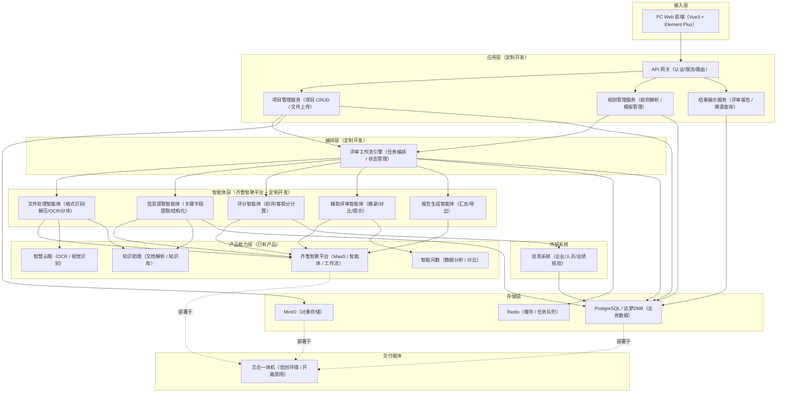

**关键节点说明：**

- **接入层**：PC Web 前端，信创浏览器兼容（Chrome/Edge/麒麟浏览器）
- **应用层**：三个微服务，全部定制开发，负责业务逻辑和用户交互
- **编排层**：评审工作流引擎，管理评审全生命周期状态流转和任务调度
- **智能体层**：五个智能体，运行于齐鲁智聚平台，部分复用产品能力部分定制开发
- **产品能力层**：齐鲁智聚平台（核心底座）、知识助理（文档解析）、智慧云眼（OCR）、智能问数（对比分析）
- **存储层**：PostgreSQL 主库（信创可选达梦 DM8），MinIO 文件存储，Redis 缓存/队列
- **外部系统**：仅对接验真系统，通过 REST API 交互
- **交付载体**：推荐芯合一体机交付，满足信创要求

### 2.2 部署拓扑

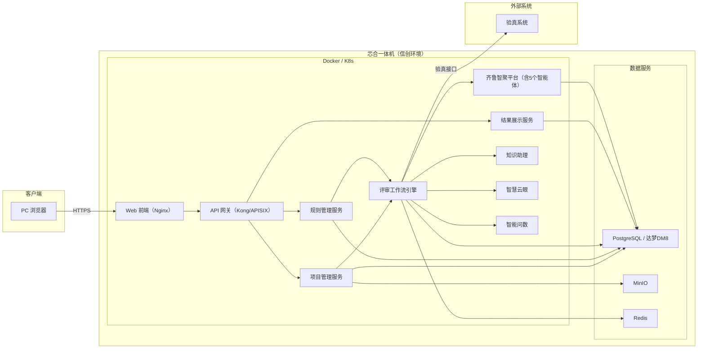

**实现规则：**

- Web 前端通过 Nginx 反向代理到 API 网关，所有请求经网关认证和路由
- 微服务之间通过 REST API 同步调用，评审流程通过 Redis 消息队列异步驱动
- 齐鲁智聚平台作为核心 AI 底座，所有智能体在其上运行，通过内部 API 调用
- 数据库采用主从架构（一体机内单机部署亦可），MinIO 存储投标文件和中间产物
- 验真系统为唯一外部依赖，通过专线或 VPN 连通

---

## 3. 模块划分

### 3.1 模块关系图

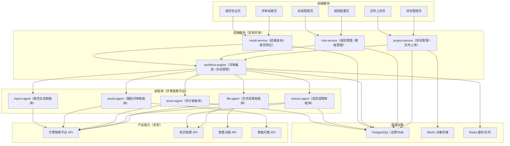

**模块职责：**

| 模块 | 类型 | 职责 | 复用/新增 |
|------|------|------|----------|
| **项目管理页** | 前端 | 项目创建、列表、详情 | 新增 |
| **规则配置页** | 前端 | 规则审核、调整、确认 | 新增 |
| **文件上传页** | 前端 | 批量上传、进度展示 | 新增 |
| **评审结果页** | 前端 | 结果查看、横向对比、溯源 | 新增 |
| **报告导出页** | 前端 | 报告预览、导出 | 新增 |
| **系统管理页** | 前端 | 用户管理、模板管理 | 新增 |
| **project-service** | 后端 | 项目CRUD、文件上传管理、触发评审流程 | 新增 |
| **rule-service** | 后端 | 规则解析、模板管理、规则确认 | 新增 |
| **workflow-engine** | 后端 | 评审任务编排、状态管理、智能体调度 | 新增 |
| **result-service** | 后端 | 评审结果查询、报告导出、溯源定位 | 新增 |
| **file-agent** | 智能体 | 格式识别、解压、OCR、文件分块 | 定制开发（基于齐鲁智聚平台） |
| **extract-agent** | 智能体 | 关键信息提取、结构化存储 | 定制开发（基于齐鲁智聚平台） |
| **score-agent** | 智能体 | 初评匹配、客观分计算、验真对接 | 定制开发（基于齐鲁智聚平台） |
| **assist-agent** | 智能体 | 主观辅助信息生成、对比视图 | 定制开发（基于齐鲁智聚平台） |
| **report-agent** | 智能体 | 评审报告汇总、PDF/Word 导出 | 定制开发（基于齐鲁智聚平台） |
| **齐鲁智聚平台** | 产品能力 | MaaS、智能体运行、工作流引擎 | 复用 |
| **知识助理** | 产品能力 | 多模态文档解析、知识库 | 复用 |
| **智慧云眼** | 产品能力 | OCR 识别 | 复用 |
| **智能问数** | 产品能力 | 数据分析与对比 | 复用+适配 |

---

## 4. 配置设计

### 4.1 配置文件位置

| 服务 | 配置文件 | 说明 |
|------|---------|------|
| project-service | `config/project-service.yaml` | 项目管理服务配置 |
| rule-service | `config/rule-service.yaml` | 规则管理服务配置 |
| workflow-engine | `config/workflow-engine.yaml` | 工作流引擎配置 |
| result-service | `config/result-service.yaml` | 结果展示服务配置 |
| Web 前端 | `.env.production` | 前端环境变量 |

### 4.2 核心配置项

```yaml
# config/workflow-engine.yaml
server:
  port: 8082
  host: "0.0.0.0"

database:
  type: "postgresql"          # postgresql | dameng
  host: "${DB_HOST:127.0.0.1}"
  port: "${DB_PORT:5432}"
  name: "${DB_NAME:review_system}"
  user: "${DB_USER:review_app}"
  password: "${DB_PASSWORD}"
  pool_size: 20
  ssl_mode: "require"         # 传输加密

redis:
  host: "${REDIS_HOST:127.0.0.1}"
  port: "${REDIS_PORT:6379}"
  password: "${REDIS_PASSWORD}"
  db: 0
  queue_prefix: "review:task:"
  task_timeout: 3600           # 任务超时（秒）

minio:
  endpoint: "${MINIO_ENDPOINT:127.0.0.1:9000}"
  access_key: "${MINIO_ACCESS_KEY}"
  secret_key: "${MINIO_SECRET_KEY}"
  bucket: "review-files"
  use_ssl: true
  max_file_size: 209715200     # 200MB（单文件限制）
  max_archive_size: 2147483648 # 2GB（压缩包限制）

qlzj_platform:                 # 齐鲁智聚平台
  base_url: "${QLZJ_BASE_URL}"
  api_key: "${QLZJ_API_KEY}"
  model_name: "${QLZJ_MODEL_NAME:default}"
  timeout: 300                 # 大模型调用超时（秒）

knowledge_assistant:           # 知识助理
  base_url: "${ZSZL_BASE_URL}"
  api_key: "${ZSZL_API_KEY}"
  timeout: 120

smart_cloud_eye:               # 智慧云眼
  base_url: "${ZHY_BASE_URL}"
  api_key: "${ZHY_API_KEY}"
  ocr_engine: "multimodal_vlm" # 多模态视觉大模型
  timeout: 180

smart_query:                   # 智能问数
  base_url: "${ZNWS_BASE_URL}"
  api_key: "${ZNWS_API_KEY}"
  timeout: 60

verification_system:           # 验真系统
  base_url: "${YZ_BASE_URL}"
  api_key: "${YZ_API_KEY}"
  timeout: 10                  # 单次请求超时（秒）
  retry_max: 3
  retry_backoff: "exponential" # 指数退避

file_processing:
  ocr_dpi_threshold: 300       # OCR 建议最低分辨率
  ocr_quality_warn_threshold: 0.7  # 识别质量低于 70% 告警
  chunk_size: 2000             # 文件分块 token 数
  supported_formats:
    - "pdf"
    - "doc"
    - "docx"
    - "jpg"
    - "jpeg"
    - "png"
    - "zip"
    - "rar"
  encoding_fix: true           # 自动编码修复

review:
  max_suppliers: 20            # 单项目最大供应商数
  max_concurrent_extract: 3    # 并发信息提取数
  score_precision: 2           # 评分精度（小数位数）
```

**配置必须遵循的安全规则：**

- 所有密钥（api_key、password）通过环境变量注入，禁止写入配置文件
- 数据库密码必须使用 AES-256 加密存储于密钥管理服务
- 传输层强制 HTTPS/TLS，不提供 HTTP 降级选项
- 配置文件中的超时时间均需结合实际网络条件调优

---

## 5. 数据模型设计

### 5.1 核心实体类图

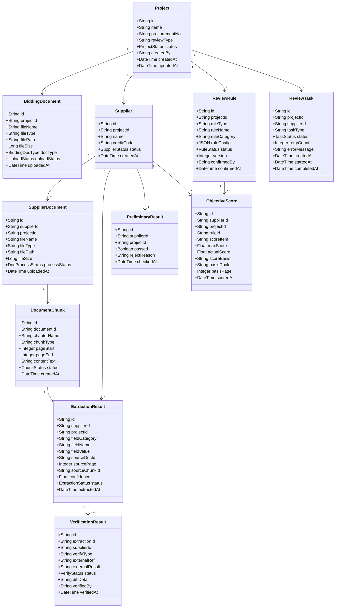

### 5.2 关键字段说明

**Project（评审项目）：**

| 字段 | 类型 | 说明 |
|------|------|------|
| id | UUID | 主键 |
| name | VARCHAR(200) | 项目名称 |
| procurementNo | VARCHAR(100) | 采购编号，唯一 |
| reviewType | VARCHAR(50) | 评审类型（公开招标/邀请招标等） |
| status | ENUM | DRAFT→RULE_PARSING→RULE_CONFIRMED→FILE_UPLOADING→PROCESSING→COMPLETED |
| createdBy | VARCHAR(100) | 创建人（采购经办人） |

**ReviewRule（评审规则）：**

| 字段 | 类型 | 说明 |
|------|------|------|
| ruleType | ENUM | PRELIMINARY（初评）/ OBJECTIVE（客观）/ SUBJECTIVE（主观） |
| ruleCategory | VARCHAR(100) | 规则分类（资质/人员/业绩/报价/技术方案/服务方案） |
| ruleConfig | JSONB | 规则详细配置（评分标准、阈值、匹配关键词等） |
| version | INTEGER | 版本号，支持规则版本管理 |
| status | ENUM | DRAFT→PENDING_CONFIRM→CONFIRMED→DEPRECATED |

**ExtractionResult（提取结果）：**

| 字段 | 类型 | 说明 |
|------|------|------|
| fieldCategory | VARCHAR(100) | 字段分类（企业资质/人员信息/业绩信息/报价信息/技术方案/服务方案） |
| fieldName | VARCHAR(200) | 字段名（如"企业名称""合同金额"） |
| fieldValue | TEXT | 字段值 |
| sourceDocId | UUID | 来源文件 ID |
| sourcePage | INTEGER | 来源页码 |
| confidence | FLOAT | 提取置信度（0-1） |
| status | ENUM | EXTRACTED→VERIFIED→MANUAL_CORRECTED |

**ReviewTask（评审任务）：**

| 字段 | 类型 | 说明 |
|------|------|------|
| taskType | ENUM | FILE_PROCESS / EXTRACT / SCORE / ASSIST / REPORT / VERIFY |
| status | ENUM | PENDING→RUNNING→COMPLETED→FAILED→RETRYING |
| retryCount | INTEGER | 重试次数（最多3次） |
| errorMessage | TEXT | 失败原因 |

---

## 6. 文件存储设计

### 6.1 文件流转图

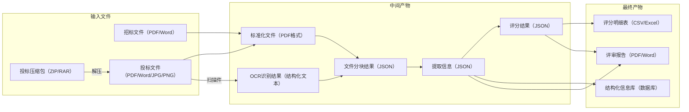

### 6.2 目录结构

```
minio://review-files/
├── projects/
│   └── {projectId}/
│       ├── bidding/                        # 招标文件
│       │   └── {uuid}.{ext}
│       ├── suppliers/
│       │   └── {supplierId}/
│       │       ├── original/               # 原始投标文件
│       │       │   └── {uuid}.{ext}
│       │       ├── normalized/             # 标准化后文件（PDF）
│       │       │   └── {uuid}.pdf
│       │       ├── chunks/                 # 分块结果
│       │       │   └── {supplierId}_chunks.json
│       │       └── extraction/             # 提取结果
│       │           └── {supplierId}_extraction.json
│       ├── scores/                         # 评分中间结果
│       │   └── {supplierId}_scores.json
│       └── reports/                        # 最终报告
│           ├── {projectId}_report.pdf
│           └── {projectId}_report.docx
└── templates/                              # 规则模板
    └── {templateId}.json
```

### 6.3 命名约定

| 文件类型 | 命名规则 | 示例 |
|---------|---------|------|
| 招标文件 | `{uuid}.{ext}` | `a1b2c3d4.pdf` |
| 供应商原始文件 | `{uuid}.{ext}` | `e5f6g7h8.docx` |
| 标准化文件 | `{uuid}.pdf` | `e5f6g7h8.pdf` |
| 分块结果 | `{supplierId}_chunks.json` | `sup_001_chunks.json` |
| 提取结果 | `{supplierId}_extraction.json` | `sup_001_extraction.json` |
| 评分结果 | `{supplierId}_scores.json` | `sup_001_scores.json` |
| 评审报告 | `{projectId}_report.{ext}` | `proj_001_report.pdf` |

---

## 7. 接口设计

### 7.1 接口总览

| 序号 | 接口名称 | Method | URL |
|------|---------|--------|-----|
| 1 | 创建评审项目 | POST | `/api/v1/projects` |
| 2 | 获取项目列表 | GET | `/api/v1/projects` |
| 3 | 获取项目详情 | GET | `/api/v1/projects/{id}` |
| 4 | 上传招标文件 | POST | `/api/v1/projects/{id}/bidding-docs` |
| 5 | 解析评审规则 | POST | `/api/v1/projects/{id}/rules/parse` |
| 6 | 确认评审规则 | PUT | `/api/v1/projects/{id}/rules/{ruleId}/confirm` |
| 7 | 上传投标文件 | POST | `/api/v1/projects/{id}/suppliers/{supplierId}/documents` |
| 8 | 发起评审 | POST | `/api/v1/projects/{id}/review/start` |
| 9 | 获取评审进度 | GET | `/api/v1/projects/{id}/review/progress` |
| 10 | 获取客观评分结果 | GET | `/api/v1/projects/{id}/scores/objective` |
| 11 | 获取主观辅助信息 | GET | `/api/v1/projects/{id}/assist/subjective` |
| 12 | 获取横向对比视图 | GET | `/api/v1/projects/{id}/compare` |
| 13 | 获取验真结果 | GET | `/api/v1/projects/{id}/verification` |
| 14 | 获取提取信息溯源 | GET | `/api/v1/extractions/{id}/source` |
| 15 | 导出评审报告 | GET | `/api/v1/projects/{id}/report/export` |
| 16 | 重试失败任务 | POST | `/api/v1/tasks/{taskId}/retry` |

### 7.2 核心接口详情

#### 7.2.1 创建评审项目

```
POST /api/v1/projects
```

**请求参数：**

```json
{
  "name": "2026年度IT设备采购评审",
  "procurementNo": "SD-2026-IT-001",
  "reviewType": "public_bidding",
  "description": "2026年度IT设备集中采购项目评审"
}
```

**返回结构：**

```json
{
  "code": 0,
  "data": {
    "id": "proj_a1b2c3d4",
    "name": "2026年度IT设备采购评审",
    "procurementNo": "SD-2026-IT-001",
    "reviewType": "public_bidding",
    "status": "DRAFT",
    "createdBy": "zhangsan",
    "createdAt": "2026-05-08T10:00:00+08:00",
    "updatedAt": "2026-05-08T10:00:00+08:00"
  },
  "message": "ok"
}
```

**错误码：**

| 错误码 | 说明 |
|--------|------|
| 40001 | 采购编号已存在 |
| 40002 | 参数校验失败 |
| 40100 | 未认证 |
| 40300 | 无权限 |

---

#### 7.2.2 上传投标文件

```
POST /api/v1/projects/{projectId}/suppliers/{supplierId}/documents
Content-Type: multipart/form-data
```

**请求参数：**

| 参数 | 类型 | 必填 | 说明 |
|------|------|------|------|
| files | File[] | 是 | 投标文件数组（支持批量） |
| fileType | string | 否 | 文件类型提示（bidding/qualification/technical/price） |

**调用时机：** 规则确认后

**返回结构：**

```json
{
  "code": 0,
  "data": {
    "supplierId": "sup_e5f6g7h8",
    "uploadedFiles": [
      {
        "id": "doc_i9j0k1l2",
        "fileName": "技术方案.pdf",
        "fileSize": 15728640,
        "status": "UPLOADED",
        "uploadedAt": "2026-05-08T10:05:00+08:00"
      }
    ],
    "totalCount": 2
  },
  "message": "ok"
}
```

**错误码：**

| 错误码 | 说明 |
|--------|------|
| 40010 | 文件格式不支持 |
| 40011 | 文件大小超过限制（单个≤200MB，压缩包≤2GB） |
| 40012 | 供应商不存在或不属于该项目 |
| 40013 | 项目状态不允许上传（规则未确认） |

---

#### 7.2.3 发起评审

```
POST /api/v1/projects/{projectId}/review/start
```

**调用时机：** 所有供应商投标文件上传完成后

**返回结构：**

```json
{
  "code": 0,
  "data": {
    "projectId": "proj_a1b2c3d4",
    "taskBatchId": "batch_q7r8s9t0",
    "supplierCount": 5,
    "estimatedDuration": 900,
    "tasks": [
      {
        "taskId": "task_u1v2w3x4",
        "supplierId": "sup_e5f6g7h8",
        "taskType": "FILE_PROCESS",
        "status": "PENDING"
      }
    ],
    "startedAt": "2026-05-08T10:10:00+08:00"
  },
  "message": "评审已发起"
}
```

**错误码：**

| 错误码 | 说明 |
|--------|------|
| 40020 | 项目状态不允许发起评审 |
| 40021 | 无供应商投标文件 |
| 40022 | 已有评审任务正在执行 |

---

#### 7.2.4 获取评审进度

```
GET /api/v1/projects/{projectId}/review/progress
```

**返回结构：**

```json
{
  "code": 0,
  "data": {
    "projectId": "proj_a1b2c3d4",
    "status": "PROCESSING",
    "supplierProgress": [
      {
        "supplierId": "sup_e5f6g7h8",
        "supplierName": "XX科技有限公司",
        "currentStage": "EXTRACTING",
        "progress": 0.6,
        "stages": {
          "FILE_PROCESS": "COMPLETED",
          "EXTRACT": "RUNNING",
          "SCORE": "PENDING",
          "VERIFY": "PENDING",
          "ASSIST": "PENDING"
        }
      }
    ],
    "overallProgress": 0.45,
    "elapsedSeconds": 320,
    "estimatedRemainingSeconds": 480
  },
  "message": "ok"
}
```

---

#### 7.2.5 获取客观评分结果

```
GET /api/v1/projects/{projectId}/scores/objective?supplierId={supplierId}
```

**返回结构：**

```json
{
  "code": 0,
  "data": {
    "suppliers": [
      {
        "supplierId": "sup_e5f6g7h8",
        "supplierName": "XX科技有限公司",
        "preliminary": {
          "passed": true,
          "checkItems": [
            { "item": "有效营业执照", "passed": true },
            { "item": "资质等级满足要求", "passed": true }
          ]
        },
        "scores": [
          {
            "category": "业绩评分",
            "maxScore": 8.0,
            "actualScore": 8.0,
            "items": [
              {
                "itemName": "同类项目合同数量",
                "standard": "每份同类合同得2分，满分8分",
                "maxScore": 8.0,
                "actualScore": 8.0,
                "basis": "提供4份同类项目合同",
                "basisDocId": "doc_i9j0k1l2",
                "basisPage": 15
              }
            ]
          }
        ],
        "totalObjectiveScore": 18.0
      }
    ]
  },
  "message": "ok"
}
```

---

#### 7.2.6 获取横向对比视图

```
GET /api/v1/projects/{projectId}/compare?dimension={dimension}
```

**查询参数：** `dimension` = `technical_solution | service_solution | qualification | personnel | performance`

**返回结构：**

```json
{
  "code": 0,
  "data": {
    "dimension": "technical_solution",
    "dimensionLabel": "技术方案",
    "suppliers": [
      {
        "supplierId": "sup_e5f6g7h8",
        "supplierName": "XX科技有限公司",
        "fields": [
          { "fieldName": "核心技术", "value": "采用微服务架构..." },
          { "fieldName": "技术路线", "value": "Java + Python..." }
        ]
      }
    ],
    "reviewHints": [
      "关注技术路线的先进性和可落地性",
      "对比实施步骤的合理性和风险控制"
    ]
  },
  "message": "ok"
}
```

---

#### 7.2.7 导出评审报告

```
GET /api/v1/projects/{projectId}/report/export?format={format}
```

**查询参数：** `format` = `pdf | docx`

**返回：** 文件流（`Content-Type: application/pdf` 或 `application/vnd.openxmlformats-officedocument.wordprocessingml.document`）

**错误码：**

| 错误码 | 说明 |
|--------|------|
| 40030 | 评审尚未完成，无法导出报告 |
| 50010 | 报告生成失败 |

---

#### 7.2.8 获取提取信息溯源

```
GET /api/v1/extractions/{extractionId}/source
```

**返回结构：**

```json
{
  "code": 0,
  "data": {
    "extractionId": "ext_c5d6e7f8",
    "fieldName": "合同金额",
    "fieldValue": "500万元",
    "confidence": 0.95,
    "source": {
      "documentId": "doc_i9j0k1l2",
      "documentName": "业绩证明文件.pdf",
      "pageNumber": 15,
      "chunkId": "chunk_001",
      "highlightText": "...合同金额为人民币500万元整...",
      "previewUrl": "/api/v1/files/doc_i9j0k1l2/preview?page=15&highlight=合同金额"
    }
  },
  "message": "ok"
}
```

### 7.3 统一错误响应格式

所有接口遵循统一错误格式：

```json
{
  "code": 40001,
  "error": {
    "code": "DUPLICATE_PROCUREMENT_NO",
    "message": "采购编号已存在",
    "details": {
      "field": "procurementNo",
      "value": "SD-2026-IT-001"
    }
  }
}
```

**HTTP 状态码映射：**

| HTTP 状态码 | 场景 |
|------------|------|
| 200 | 成功 |
| 201 | 创建成功 |
| 400 | 客户端参数错误 |
| 401 | 未认证 |
| 403 | 无权限 |
| 404 | 资源不存在 |
| 409 | 状态冲突（如重复发起评审） |
| 422 | 业务校验失败 |
| 500 | 服务器内部错误 |
| 503 | 依赖服务不可用（如验真系统） |

---

## 8. 核心时序设计

### 8.1 主链路：完整评审流程时序

本节说明从发起评审到报告生成的主链路时序。

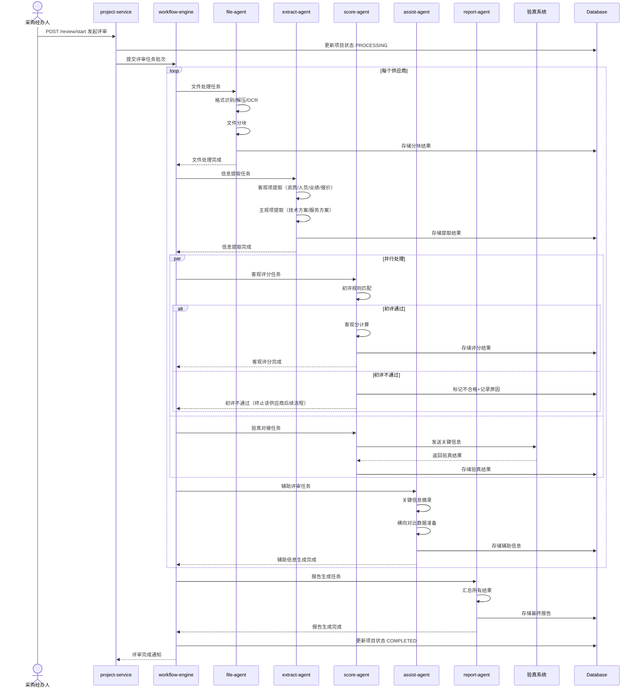

**关键节点说明：**

- **workflow-engine**：评审流程总控制器，管理任务编排和状态流转
- **file-agent**：文件处理，含格式识别、解压、OCR、分块，全部完成后才能进入提取
- **extract-agent**：客观项和主观项并行提取，结果入 DB 后才能触发后续
- **score-agent**：初评→客观分计算，验真对接与评分并行执行
- **assist-agent**：主观辅助信息，依赖提取结果
- **report-agent**：所有供应商处理完成后汇总生成最终报告

**实现规则：**

- 文件处理失败（如文件损坏）→ 标记该文件为失败，继续处理其他文件
- 初评不通过 → 标记该供应商为不合格，跳过客观分计算和辅助信息生成
- 任一 Agent 连续失败 3 次 → 标记任务失败，人工介入
- 验真超时 → 标记为"待验真"，外部系统恢复后自动重试
- 所有供应商处理完成（含失败处理）→ 进入报告生成

### 8.2 辅助链路：规则解析流程时序

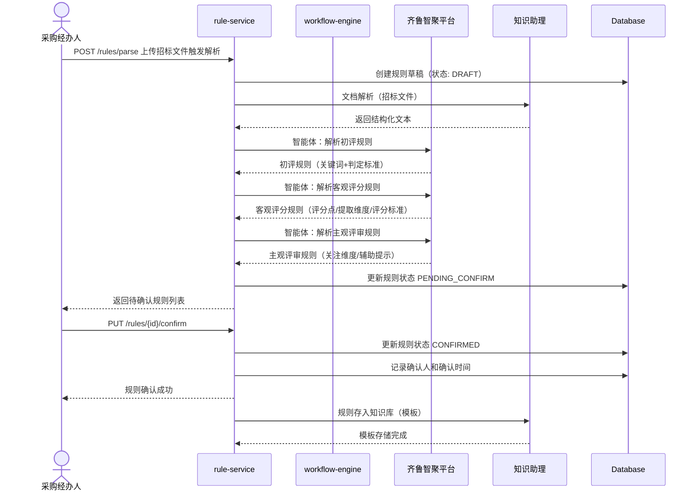

### 8.3 辅助链路：验真失败重试流程时序

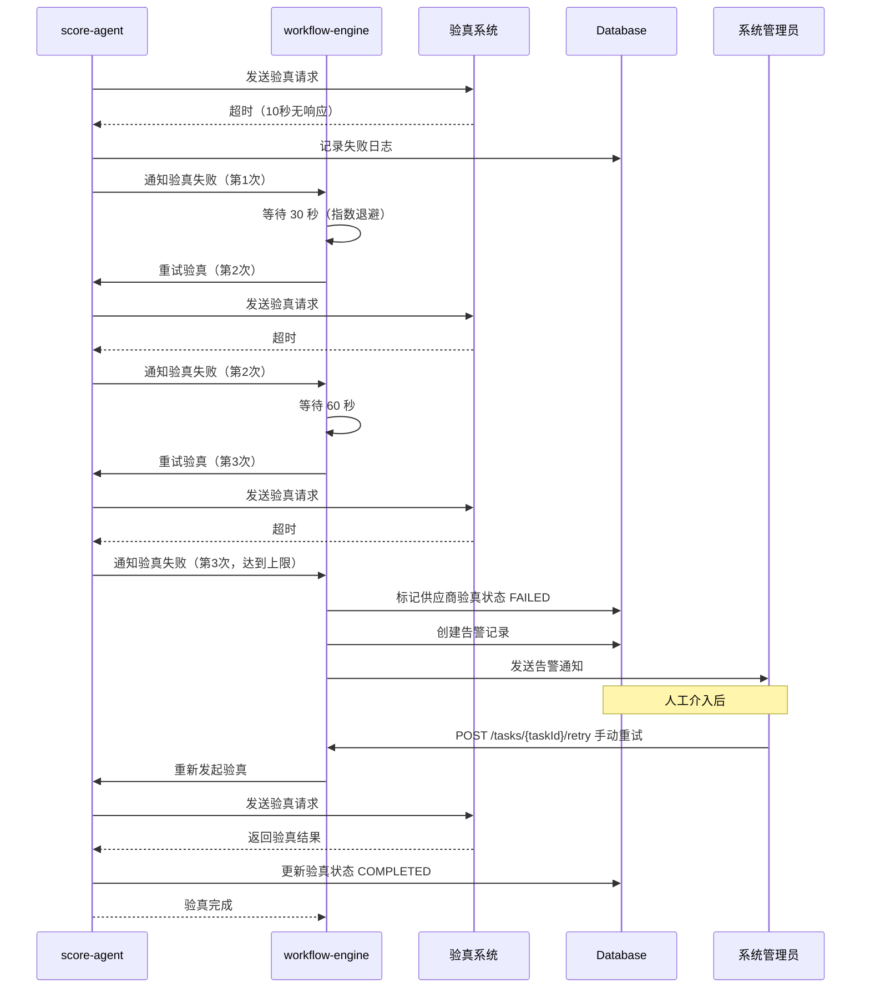

---

## 9. 主子智能体契约设计

### 9.1 主智能体：workflow-engine

**职责：** 评审流程总控制器，管理评审生命周期和任务编排

| 子智能体 | 输入 | 输出 | 失败策略 |
|---------|------|------|---------|
| file-agent | 供应商文件列表（MinIO 路径） | 文件分块结果（JSON） | 标记文件失败，继续处理其余文件 |
| extract-agent | 文件分块结果 + 评审规则 | 结构化提取结果（JSON） | 重试 3 次，失败标记为缺失 |
| score-agent | 提取结果 + 客观评审规则 | 客观分 + 初评结果 | 重试 3 次，失败标记为待人工处理 |
| assist-agent | 提取结果 + 主观评审规则 + 多供应商数据 | 辅助评审视图数据 | 重试 3 次，失败降级为基础摘录 |
| report-agent | 所有评分结果 + 验真结果 + 辅助信息 | 评审报告文件 | 重试 3 次，失败通知人工 |

### 9.2 子智能体契约：file-agent

```
# 输入契约
{
  supplierId: string;
  projectId: string;
  files: Array<{
    documentId: string;
    filePath: string;       // MinIO 路径
    fileName: string;
    fileType: string;       // pdf|doc|docx|jpg|png
    isScanned: boolean;
  }>;
  biddingDocChapters: Array<{
    chapterName: string;    // 招标文件章节名
    keywords: string[];     // 匹配关键词
  }>;
}

# 输出契约
{
  supplierId: string;
  chunks: Array<{
    chunkId: string;
    documentId: string;
    chapterName: string;
    chunkType: string;      // qualification|personnel|performance|technical|price|unmatched
    pageStart: number;
    pageEnd: number;
    contentText: string;
    confidence: number;
  }>;
  unmatchedChunks: Array<{
    documentId: string;
    pageStart: number;
    pageEnd: number;
    reason: string;
  }>;
  errors: Array<{
    documentId: string;
    errorType: string;      // FORMAT_NOT_SUPPORTED|FILE_CORRUPTED|OCR_QUALITY_LOW
    message: string;
  }>;
}

# 调用方式
REST API: POST {workflow-engine}/internal/tasks/file-process
```

### 9.3 聚合规则

- workflow-engine 必须等待所有子智能体任务完成后，才能触发 report-agent
- 子智能体输出结构必须经过 workflow-engine 校验：字段完整性、数据格式、必填字段非空
- 校验失败 → 标记为 FAILED，触发重试或人工介入
- 各供应商独立处理，互不影响（初评不通过除外）

---

## 10. 状态流转设计

### 10.1 项目状态流转

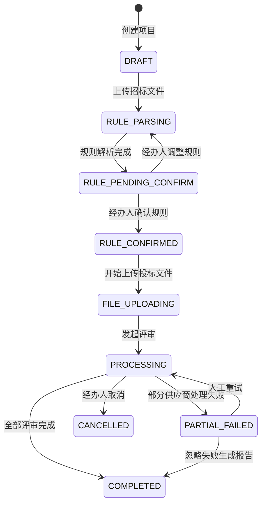

### 10.2 评审任务状态流转

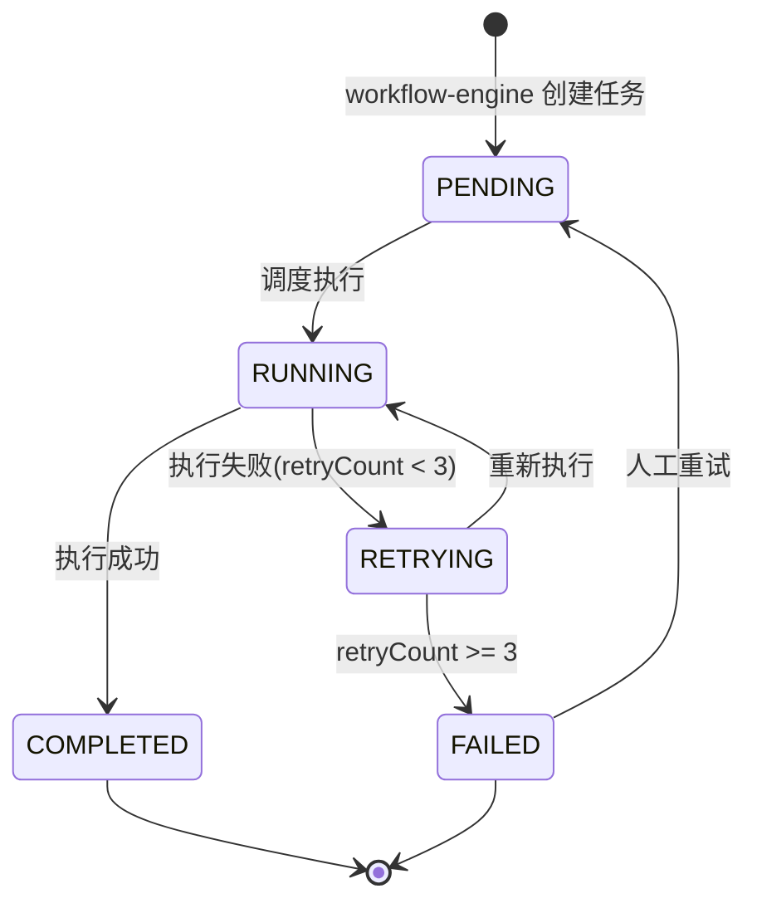

### 10.3 供应商评审状态流转

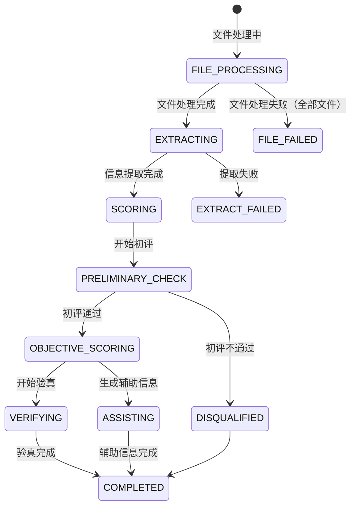

---

## 11. 校验与异常处理

### 11.1 异常分支流程图

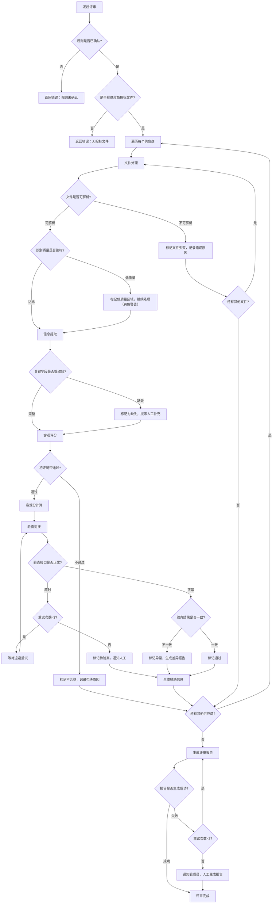

### 11.2 异常场景处理表

| 异常场景 | 触发条件 | 系统处理 | 用户反馈 | 重试 |
|---------|---------|---------|---------|------|
| 文件格式不支持 | 上传格式不在支持列表 | 拒绝上传 | 红色提示"不支持的文件格式" | 是 |
| 文件超过大小限制 | 单文件>200MB 或压缩包>2GB | 拒绝上传 | 红色提示大小限制 | 是 |
| 文件损坏 | 无法打开或解析 | 标记为解析失败 | 黄色警告 | 是 |
| OCR 识别质量过低 | 扫描件清晰度不足 | 标记低质量区域 | 黄色警告 | 否 |
| 关键信息未检测到 | 未提取到必填字段 | 标记为缺失 | 黄色警告 | 否 |
| 文件分块匹配失败 | 无法匹配到章节 | 标记为未识别章节 | 黄色警告 | 否 |
| 规则参数缺失 | 评审项规则未配置 | 阻止评分计算 | 红色提示 | 是 |
| 验真接口超时 | 请求超时10秒 | 自动重试3次 | 黄色警告 | 是（自动+手动） |
| 验真系统不可用 | 连续3次失败 | 暂停该供应商验真 | 红色提示 | 是（恢复后自动） |
| 验真信息不一致 | 返回结果不匹配 | 标记异常+差异报告 | 红色标记 | 否 |

---

## 12. 测试方案

### 12.1 单元测试范围

| 模块 | 测试重点 | 覆盖要求 |
|------|---------|---------|
| project-service | 项目 CRUD、文件上传校验、状态流转 | ≥ 80% 行覆盖率 |
| rule-service | 规则解析、模板管理、规则确认 | ≥ 80% 行覆盖率 |
| workflow-engine | 任务调度、状态管理、重试逻辑 | ≥ 85% 行覆盖率 |
| result-service | 结果查询、报告导出、溯源定位 | ≥ 80% 行覆盖率 |
| 智能体 mock 测试 | 各智能体输入/输出契约 | 100% 契约覆盖 |

### 12.2 集成测试场景

| 场景 | 说明 |
|------|------|
| 完整评审流程 | 从创建项目到报告导出的全链路测试 |
| 规则解析流程 | 上传招标文件→AI 解析→人工确认 |
| 批量文件上传 | 5 个供应商同时上传，含压缩包、扫描件 |
| 验真对接 | 模拟验真系统正常/超时/异常三种场景 |
| 异常重试 | 模拟文件损坏、提取失败、验真超时后的重试 |

### 12.3 联调测试与性能测试

联调测试按需求文档第 11 章验收标准执行，核心指标：规则解析准确率≥90%、分块准确率≥85%、提取准确率≥90%、客观分一致率≥95%、初评准确率≥98%。

性能测试核心指标：200 页 PDF≤5 分钟、单供应商客观分≤30 秒、50 并发用户正常、72 小时可用性≥99.5%。

### 12.4 安全测试

| 测试项 | 验证方式 |
|--------|---------|
| HTTPS/TLS 传输加密 | 安全扫描工具验证 |
| RBAC 权限隔离 | 不同角色账号登录测试 |
| 文件上传安全 | 上传非白名单格式/超限文件 |
| SQL 注入防护 | SQLMap 扫描 |
| 操作审计日志 | 执行关键操作后检查日志完整性 |

---

## 13. 部署与运维说明

### 13.1 部署方案

**推荐方案：芯合一体机（标准版）**

| 配置项 | 规格 |
|--------|------|
| GPU | 信创型昇腾 300I DUO x4 或通用型 RTX 4090 x2 |
| CPU | 32C |
| 内存 | 64GB+ |
| 硬盘 | 1TB SSD |
| 操作系统 | 麒麟 V10 / UOS |
| 数据库 | 达梦 DM8（信创）/ PostgreSQL 15 |
| 中间件 | Nginx + Kong/APISIX API 网关 |

| 交付模式 | 适用场景 | 优势 | 劣势 |
|---------|---------|------|------|
| 芯合一体机 | 快速交付、开箱即用 | 软硬一体、信创适配 | 硬件成本较高 |
| 私有化部署 | 数据安全要求严格 | 数据不出域、安全可控 | 部署周期较长 |
| 公有云 SaaS | 轻量化、快速试用 | 无需硬件、开通即用 | 数据在外域 |

### 13.2 部署步骤

```bash
# 1. 环境准备
# - 安装 Docker / K8s
# - 配置 Nvidia 驱动（GPU 环境）
# - 配置网络（内网互通、外网白名单）

# 2. 数据库初始化
psql -h $DB_HOST -U $DB_USER -d $DB_NAME -f init_schema.sql

# 3. MinIO 初始化
mc mb minio/review-files

# 4. 启动基础服务
docker-compose up -d postgres redis minio

# 5. 启动产品能力层（按产品文档安装）
# - 齐鲁智聚平台、知识助理、智慧云眼、智能问数

# 6. 启动应用服务
docker-compose up -d project-service rule-service workflow-engine result-service

# 7. 启动前端
docker-compose up -d web-frontend

# 8. 配置 API 网关路由

# 9. 健康检查
curl https://{host}/api/v1/health
```

### 13.3 监控告警

| 告警项 | 触发条件 | 通知方式 |
|--------|---------|---------|
| 服务不可用 | 健康检查连续 3 次失败 | 邮件+站内信 |
| 验真接口异常 | 连续 3 次超时 | 邮件+站内信 |
| 文件处理失败率过高 | 1 小时内 > 20% | 邮件 |
| 磁盘使用率过高 | > 85% | 邮件 |
| 评审任务超时 | 单任务 > 1 小时 | 站内信 |

### 13.4 常见问题排查

| 问题 | 排查步骤 |
|------|---------|
| 文件上传失败 | 检查 MinIO 服务状态、文件大小、网络连通性 |
| OCR 识别质量差 | 检查扫描件分辨率（建议≥300DPI）、智慧云眼服务状态 |
| 规则解析不准确 | 检查招标文件格式、齐鲁智聚平台模型状态、人工调整 |
| 验真接口超时 | 检查网络连通性、验真系统服务状态、等待自动重试 |
| 报告导出乱码 | 检查字体文件安装、报告模板编码 |

---

## 14. 改造清单与研发任务建议

### 14.1 文件改造清单

| 类型 | 模块/文件 | 说明 |
|------|----------|------|
| 🆕 新增 | `project-service/` | 项目管理微服务（完整新建） |
| 🆕 新增 | `rule-service/` | 规则管理微服务（完整新建） |
| 🆕 新增 | `workflow-engine/` | 工作流引擎（完整新建） |
| 🆕 新增 | `result-service/` | 结果展示微服务（完整新建） |
| 🆕 新增 | `web-frontend/` | PC Web 前端（完整新建） |
| 🆕 新增 | `agents/file-agent/` | 文件处理智能体（基于齐鲁智聚平台定制） |
| 🆕 新增 | `agents/extract-agent/` | 信息提取智能体（基于齐鲁智聚平台定制） |
| 🆕 新增 | `agents/score-agent/` | 评分智能体（基于齐鲁智聚平台定制） |
| 🆕 新增 | `agents/assist-agent/` | 辅助评审智能体（基于齐鲁智聚平台定制） |
| 🆕 新增 | `agents/report-agent/` | 报告生成智能体（基于齐鲁智聚平台定制） |
| 🆕 新增 | `db/migrations/` | 数据库迁移脚本 |
| 🆕 新增 | `config/` | 各服务配置文件 |
| 🔄 适配 | 齐鲁智聚平台 | 配置智能体运行环境、API 密钥 |
| 🔄 适配 | 知识助理 | 配置评审规则知识库、文档解析接口 |
| 🔄 适配 | 智慧云眼 | 配置 OCR 接口调用 |
| 🔄 适配 | 智能问数 | 配置数据对比分析接口 |

### 14.2 研发任务建议

**阶段一：基础设施与数据层（预估 10 人天）**

| 序号 | 任务 | 说明 | 人天 | 依赖 |
|------|------|------|------|------|
| T1.1 | 数据库设计与迁移脚本 | PostgreSQL/达梦 DM8 表结构、索引、迁移 | 3 | 无 |
| T1.2 | MinIO 存储配置 | 对象存储搭建、Bucket 规划 | 1 | 无 |
| T1.3 | Redis 配置 | 队列配置、缓存策略 | 1 | 无 |
| T1.4 | 项目骨架搭建 | 微服务项目框架、公共库 | 3 | 无 |
| T1.5 | CI/CD 流水线 | 代码仓库、构建、部署流水线 | 2 | T1.4 |

**阶段二：产品能力对接层（预估 12 人天）**

| 序号 | 任务 | 说明 | 人天 | 依赖 |
|------|------|------|------|------|
| T2.1 | 齐鲁智聚平台 API 对接 | 模型推理、智能体运行接口封装 | 3 | T1.4 |
| T2.2 | 知识助理 API 对接 | 文档解析、知识库管理接口封装 | 3 | T1.4 |
| T2.3 | 智慧云眼 API 对接 | OCR 识别接口封装 | 2 | T1.4 |
| T2.4 | 智能问数 API 对接 | 数据分析对比接口封装 | 2 | T1.4 |
| T2.5 | 验真系统接口对接 | 数据发送、结果接收接口封装 | 2 | T1.4 |

**阶段三：核心业务层（预估 25 人天）**

| 序号 | 任务 | 说明 | 人天 | 依赖 |
|------|------|------|------|------|
| T3.1 | rule-service 规则管理 | 规则解析、模板管理、规则确认 | 5 | T2.1, T2.2 |
| T3.2 | project-service 项目管理 | 项目 CRUD、文件上传、批量处理 | 5 | T1.2, T1.1 |
| T3.3 | file-agent 文件处理智能体 | 格式识别、解压、OCR、分块 | 5 | T2.1-T2.3 |
| T3.4 | extract-agent 信息提取智能体 | 关键字段提取、结构化存储 | 4 | T3.3 |
| T3.5 | score-agent 评分智能体 | 初评、客观分计算、验真对接 | 4 | T3.4, T2.5 |
| T3.6 | assist-agent 辅助评审智能体 | 摘录生成、对比视图 | 2 | T3.4, T2.4 |

**阶段四：编排与展示层（预估 18 人天）**

| 序号 | 任务 | 说明 | 人天 | 依赖 |
|------|------|------|------|------|
| T4.1 | workflow-engine 工作流引擎 | 任务编排、状态管理、重试 | 5 | T3.1-T3.6 |
| T4.2 | report-agent 报告生成智能体 | 结果汇总、PDF/Word 导出 | 3 | T4.1 |
| T4.3 | result-service 结果展示 | 查询接口、溯源定位 | 3 | T4.1, T4.2 |
| T4.4 | Web 前端开发 | 管理页、配置页、上传页、结果页 | 5 | T4.3 |
| T4.5 | 集成测试与联调 | 全链路测试、性能测试、安全测试 | 2 | T4.1-T4.4 |

**阶段五：部署与交付（预估 8 人天）**

| 序号 | 任务 | 说明 | 人天 | 依赖 |
|------|------|------|------|------|
| T5.1 | 信创环境适配 | 麒麟 V10 + 达梦 DM8 适配 | 3 | T4.5 |
| T5.2 | 芯合一体机部署 | 软硬一体部署、配置 | 2 | T5.1 |
| T5.3 | 验收测试 | 功能验收、非功能验收 | 2 | T5.2 |
| T5.4 | 文档交付 | 部署文档、运维手册、用户手册 | 1 | T5.3 |

**总预估工期：** 约 73 人天（不含产品采购和部署周期）

### 14.3 风险与应对

| 风险 | 影响 | 概率 | 应对措施 |
|------|------|------|---------|
| 大模型提取准确率不达标 | 高 | 中 | 提前多轮 prompt 优化；设计人工补充兜底机制 |
| OCR 识别质量受扫描件质量影响 | 中 | 高 | 前端上传时提示最低分辨率要求；低质量区域标记人工复核 |
| 验真系统接口不稳定 | 中 | 中 | 自动重试+手动重试；验真结果不影响客观分计算 |
| 信创环境兼容性问题 | 高 | 中 | 开发阶段即使用信创环境测试；芯合一体机已做信创适配 |
| 评审规则模板多样性 | 中 | 中 | 知识助理模板管理；支持人工调整规则参数 |
| 供应商文件格式不统一 | 低 | 高 | 支持主流格式自动识别；未知格式提示人工处理 |

---

> **文档结束**
>
> *本文档基于《AI辅助评审系统 需求分析文档》(V1.0, RA-agent) 生成，研发团队可据此文档直接开展开发工作。如需进一步细化特定模块或接口，请联系 sda-agent。*
