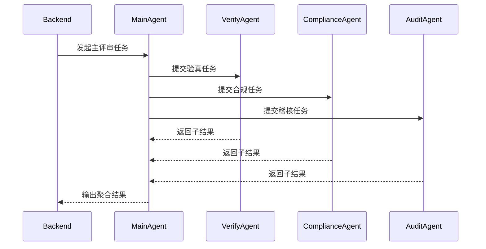

# Tech Doc Designer

## Overview

本技能用于把需求说明、现有实现思路、源码现状和架构约束，整理成研发、测试、架构师可直接展开开发与联调的技术文档。

核心原则：

- 技术文档必须达到“研发拿到后可以开发”的粒度
- 强制使用 Mermaid 图讲清系统边界、模块关系、时序、状态和文件流转
- 每个关键章节都要同时说明“为什么这样设计”和“具体怎么落地”
- 文档要覆盖接口、模型、数据流、异常、测试，而不是只写架构口号

## When to Use

在以下场景优先使用本技能：

- 用户要求输出“技术方案”“技术设计文档”“研发可开发文档”
- 需要把需求文档进一步细化成开发设计
- 需要明确接口、数据模型、文件结构、状态流转
- 需要把多模块、多智能体、多任务链路讲清楚
- 用户明确要求 Mermaid 架构图、类图、时序图、状态图、流程图

以下情况不要直接用本技能代替：

- 只需要客户可读的业务需求稿时，改用 `requirement-designer`
- 只需要零散接口说明或临时代码注释时，不必生成完整技术方案

## Audience

默认读者为：

- 后端研发
- 前端研发
- 测试研发
- 架构师
- 技术负责人
- 运维与实施支持

文风要求：

- 技术准确
- 结构稳定
- 可直接分解任务
- 避免空泛描述

## Product Context

当项目存在产品上下文配置时，技术方案的架构设计必须优先基于已有产品能力进行技术映射。本机制与具体项目解耦，仅提供“产品技术映射”通用范式：**先复用已有产品能力，再定义新增模块边界**。

### 触发条件

- 存在产品配置文件 `assets/product-context.json`（本技能 assets 目录下）
- 用户显式提供了产品能力清单
- 若以上均不满足，本章节不影响技能正常运行，按通用方式出技术方案

### 产品技术映射流程

1. **读取产品上下文配置**：获取产品列表、能力关键词、API/接口属性、交付模式
2. **能力映射**：将技术需求映射到已有产品能力，明确复用和新增的边界
3. **方案模板映射**：若产品上下文包含 `solution_templates`，优先用模板确定核心产品组合
4. **架构标注**：在技术架构图中标注已有产品组件位置
5. **接口对接**：若已有产品提供 API，在接口设计中说明对接方式

### 文档体现要求

- **技术架构图**：标注已有产品组件与新增模块的边界
- **模块划分**：区分“复用产品能力”和“新增开发模块”
- **接口设计**：若对接已有产品 API，写出对接方式和接口契约
- **部署方案**：优先推荐产品上下文中已有的交付模式
- **配置设计**：如需对接已有产品的配置项，写清对接参数
- **改造清单**：明确标注哪些文件是新增，哪些是对已有产品的扩展

### 章节目录适配

若使用了产品上下文映射，建议在技术方案中增加：

- 产品技术映射表（技术需求 → 匹配产品 → 复用/新增 → 对接方式）

## Required Output

最终输出必须是一份研发可执行的技术文档，默认建议包含以下章节：

1. 文档说明
2. 总体架构
3. 模块划分
4. 配置设计
5. 数据模型设计
6. 文件存储设计
7. 接口设计
8. 核心时序设计
9. 主子模块或主子智能体契约设计
10. 状态流转设计
11. 校验与异常处理
12. 测试方案
13. 部署与运维说明
14. 改造清单或研发任务建议

若用户已提供模板，可在保持技术完整性的前提下适配。

## Required Diagrams

技术文档面向研发、测试、架构师，图的重点是“能开发”。至少包含以下 8 类图：

1. 技术架构图
2. 模块关系图
3. 类图
4. 主链路时序图
5. 辅助链路时序图
6. 状态流转图
7. 文件关系图或文件流转图
8. 异常分支流程图

### Diagram Mapping

固定图种映射关系如下，不要随意变更：

- 技术架构图：`flowchart`
- 类图：`classDiagram`
- 时序图：`sequenceDiagram`
- 状态图：`stateDiagram-v2`
- 文件关系图：`flowchart` 或 `classDiagram`

如果不确定某张图用什么类型，优先选择最利于研发理解的固定映射，不要自创表达方式。

## Section Writing Pattern

凡是包含 Mermaid 图的章节，必须按以下顺序组织，不得跳步：

1. 先一句话说明本节目标
2. 放 Mermaid 图
3. 图下面解释关键节点
4. 再列实现规则

推荐写法示例：

~~~markdown
本节说明后端如何发起主评审任务，并由主智能体协调多个子智能体完成聚合结果。

关键节点说明：

- Backend：准备输入并触发主链路
- MainAgent：编排子任务并汇总
- 子智能体：分别负责专项判断

实现规则：

- 主智能体必须等待三个子结果完成后再生成聚合结果
- Backend 必须校验聚合结果结构与子结果引用
~~~

## Document Rules

写技术文档时必须遵守以下规则：

- 每个设计点都要落到明确模块、文件、接口或数据结构
- 每个关键链路都要给出输入、处理、输出
- 每个异步任务都要说明状态流转与失败策略
- 每个结果文件都要说明来源、路径和契约
- 每个接口都要写请求、响应、错误场景
- 需要开发的内容必须明确到“哪个模块负责什么”
- 文档中提到的路径、模块、类名、接口名要尽量基于真实现状，不要凭空命名

## Recommended Chapter Details

### 1. 文档说明

写清：

- 文档目标
- 适用版本
- 术语说明
- 关联需求文档

### 2. 总体架构

本节必须有技术架构图，说明：

- 外部入口
- 应用层
- 编排层
- 智能体层
- 存储层
- 输出层

### 3. 模块划分

本节必须有模块关系图，写清：

- 模块职责
- 模块边界
- 模块依赖
- 哪些可复用，哪些需新增

### 4. 配置设计

至少说明：

- 配置文件位置
- 配置项
- 默认值
- 是否必填
- 配置错误时行为

### 5. 数据模型设计

本节必须有类图，至少说明：

- 核心实体
- 关键字段
- 实体关系
- 状态字段

### 6. 文件存储设计

本节必须有文件关系图或文件流转图，至少说明：

- 输入文件
- 中间产物
- 最终产物
- 目录结构
- 命名约定

### 7. 接口设计

每个接口至少包括：

- 接口名称
- Method
- URL
- 请求参数
- 返回结构
- 错误码
- 调用时机

### 8. 核心时序设计

本节必须至少包含两张时序图：

- 主链路时序图
- 辅助链路时序图

主链路一般是最核心的业务链；辅助链路可选规则生成、报告生成、重试处理等。

### 9. 主子模块或主子智能体契约设计

本节重点写：

- 主模块职责
- 子模块职责
- 调用输入
- 调用输出
- 聚合规则
- 失败策略

### 10. 状态流转设计

本节必须有状态图，至少说明：

- 项目状态
- 任务状态
- 子任务状态
- 失败/重试/终止逻辑

### 11. 校验与异常处理

本节必须有异常流程图，至少说明：

- 缺少输入
- 下游失败
- 输出不合法
- 校验失败
- 是否重试
- 如何落日志

### 12. 测试方案

至少说明：

- 单元测试范围
- 集成测试范围
- 联调测试场景
- 回归测试重点
- 验收测试建议

### 13. 部署与运维说明

至少说明：

- 配置准备
- 前置依赖
- 日志定位
- 常见问题排查

### 14. 改造清单或研发任务建议

至少说明：

- 改哪些文件
- 新增哪些文件
- 哪些逻辑复用
- 哪些逻辑需要替换

## Diagram Quality Rules

所有 Mermaid 图必须满足：

- 图名和章节目标一致
- 节点命名反映真实技术角色，不要用模糊占位词
- 一张图只表达一个主问题
- 时序图必须有清晰方向和返回关系
- 类图必须体现核心关系，不要把所有字段都堆进去
- 状态图必须包含开始态、结束态或终止态
- 图下必须解释关键节点，不允许只给图不给说明

## Development Readiness Rules

只有同时满足以下条件，技术文档才算达到“研发可开发”：

- 已说明系统边界和职责划分
- 已说明真实配置项和运行前提
- 已说明接口契约
- 已说明核心模型和状态
- 已说明文件产物和目录关系
- 已说明主链路时序
- 已说明异常处理和测试方案
- 已给出改造清单或任务拆解建议

## Deliverables

本技能默认产出：

- 一份研发可执行的技术文档 Markdown
- 文档中的 Mermaid 图代码
- 如用户需要，可再配合 Mermaid 渲染技能输出 SVG

## Common Mistakes

- 把技术文档写成纯需求文档
- 只有概念图，没有接口和模型
- 图很多，但没有实现规则
- 接口设计缺少错误场景
- 没有状态图，导致研发无法落任务状态
- 没有文件关系图，导致产物路径不清晰
- 没有测试章节，研发做完难以验收

## Quick Checklist

在交付前至少自检以下内容：

- 是否包含至少 8 类技术图
- 是否遵守“目标句 -> Mermaid 图 -> 关键节点说明 -> 实现规则”的章节结构
- 是否写清模块、接口、模型、时序、状态、文件、异常、测试
- 是否达到“研发拿到后可以开发”的粒度
- 是否给出了明确改造清单或任务建议
