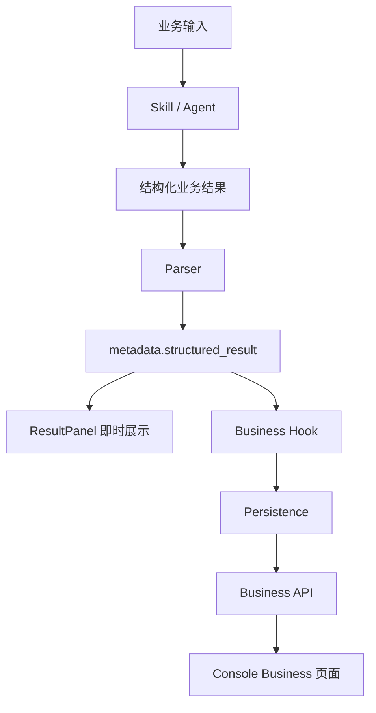

# 新业务场景开发参考

> 优先标准：新增或改造业务场景时，先读取 `business-workbench-agent-standard.md`。本文档补充场景判定与工程落点，不能替代 Workbench + Agent 完整交付链路。

## 1. 适用范围

当需求不只是普通页面、普通接口或单个工具，而是一个完整业务应用时，必须按“新业务场景”处理。

典型场景：

- 电诈笔录智能辅助
- 执法文书分析
- 合同风险审查
- 政企项目研判
- 客户商机分析
- 案件材料归纳
- 报告生成与历史沉淀

## 2. 判定标准

满足以下任一条件，应默认进入新业务场景开发流程：

1. 有明确业务对象，例如笔录、合同、案件、项目、商机、报告
2. 需要结构化分析结果
3. 需要 ResultPanel 展示
4. 需要历史列表、详情页、保存状态
5. 需要 Skill / Agent 参与业务推理
6. 需要 parser 将模型输出转为项目事件
7. 需要 hook 做业务后处理
8. 需要 persistence 沉淀业务资产

## 3. 标准架构



## 4. 标准工程落点

后端：

```text
src/backend/scenes/<scene>/
  manifest.py
  router.py
  service.py
  repository.py
  persistence.py
  dependencies.py
  exceptions.py
  schemas/
  parsers/
  hooks/
```

前端：

```text
console/src/business/<scene>/
  manifest.ts
  pages/
    Results/
    ResultDetail/
  workbench/
    <Scene>WorkbenchPage.tsx

console/src/pages/Chat/result-panel/<Scene>Report.tsx
console/src/api/modules/<scene>Result.ts
console/src/api/types/<scene>.ts
```

技能与 Agent：

```text
.qwenpaw/workspaces/<agent_id>/
  agent.json
  skill.json
  skills/<scene>-question-guide/SKILL.md
  skills/<scene>-extract-report/SKILL.md

AgentProfileConfig.output_binding.final_output_parser_import_path
```

业务专属 Skill 默认放在工作区 Agent 下。只有被明确设计成跨业务、跨 Agent 复用的产品内置技能，才放入 `src/qwenpaw/agents/skills/`。

## 5. 必须回答的问题

任何新业务场景方案必须显式回答：

- 是否是新业务场景
- 参考哪个已有场景，优先参考 `marketing` / `fae`
- scene id 是什么
- 是否需要 Console business 模块
- 是否需要后端 scene 模块
- 是否需要 Skill / Agent
- 是否需要 parser
- 是否需要 hook
- 是否需要 persistence
- 是否需要 ResultPanel renderer
- 是否需要 ResultWorkbench 业务页注册
- 是否复用现有 `StructuredResultEvent`
- 是否需要历史列表页和详情页
- 保存后业务列表如何刷新
- 如何测试和验收

## 6. 禁止事项

- 不要只新增孤立 Skill 来承载完整业务场景
- 不要让模型直接返回一段 JSON 就结束
- 不要绕过 parser 注入 `metadata.structured_result`
- 不要绕过 hook / persistence 做业务沉淀
- 不要随意新增不兼容的结果展示协议
- 不要每个新场景都修改一次 `react_agent.py`
- 不要把业务专属 Skill 放到全局技能目录，导致后续场景边界混乱
